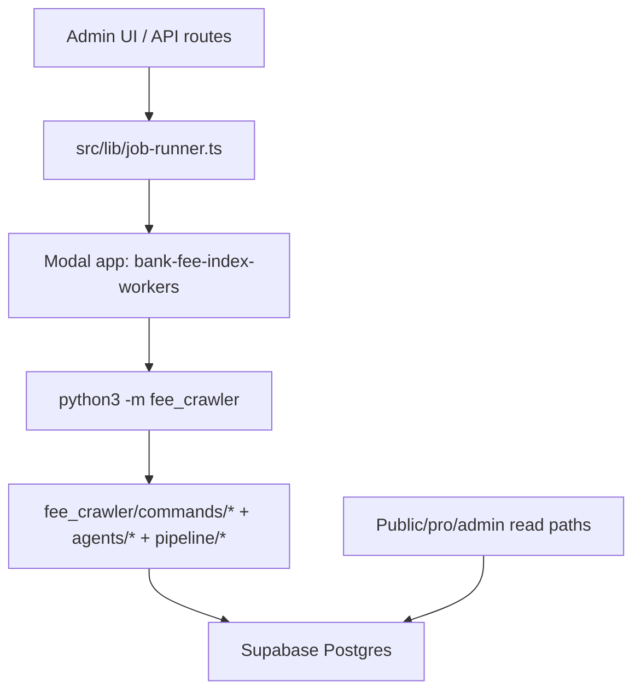

# FeeSchedule Hub Codebase Audit: Current vs Legacy

Date: 2026-08-12
Repo: `/Users/jgmbp/Desktop/feeschedule-hub`
Branch audited: `main` at `d5f3198`

Post-audit note: this document is a baseline snapshot of what was live before
the cleanup. The current working tree has since removed the tracked Python
crawler/Modal runtime, deleted the old TypeScript job runner, and rewired launch
actions to visible `agent_runs`. See
`docs/audits/legacy-retirement-status-2026-08-12.md` for current state.

## Current Working Tree Summary

This audit is no longer the live-state source of truth. It remains useful as
evidence for why the cleanup was necessary.

Current working tree status:

- Runtime `src/` no longer has Modal endpoint calls, `spawnJob`, `ops_jobs`, or
  `python -m fee_crawler` execution references.
- The tracked `fee_crawler/` Python runtime is removed.
- Admin starts now create `agent_runs`, `agent_run_steps`, and
  `agent_run_events`.
- The forward migration links provider/report lineage to `agent_run_id` and
  drops `ops_jobs`.
- `EXECUTION_BACKEND=agentic_v1` runs a deterministic TypeScript ledger pass that
  records committed step events, performs bounded Magellan discovery/fetch,
  performs bounded Rosetta HTML/text reads, routes PDFs to OCR, and performs
  deterministic Knox raw extraction, Darwin verification, and conservative Knox
  ready-review. Hamilton can publish eligible verified rows into
  `fees_published`. Product/report/research fee reads now use
  `published_fee_observations`. It does not yet run durable queue fan-out,
  provider-assisted extraction, adversarial review for ambiguous rows, OCR, or
  report rendering.

Everything below this point describes the pre-cleanup baseline on
`main` at `d5f3198`.

## Historical Baseline Executive Summary

Production-facing `main` is still wired to the legacy Python/Modal runtime. The current admin UI, Atlas workflow launcher, Magellan/Darwin consoles, report jobs, and scheduled jobs all ultimately depend on `fee_crawler/modal_app.py` and `python3 -m fee_crawler ...`.

There is a newer ingestion-engine branch, `origin/claude/repo-operational-audit-x5uyvu`, with `fee_crawler/engine/`, `fee_crawler/modal_app_engine.py`, engine migrations, and an `src/lib/engine-db/` read layer. It is not merged into `main`. Its own handoff states that it is not live, has never touched production Supabase/Modal/Anthropic/R2, and requires a merge, migrations, Modal deploy, shadow run, parity check, product read flip, and legacy retirement.

There is no non-Modal replacement runtime in `main`. `package.json` has no Vercel Workflow, queue, Inngest, QStash, BullMQ, or equivalent worker dependency, and there is no `vercel.json`. If the desired target is "no Modal workers at all," that target architecture is not currently implemented in this repo.

The operational problem is therefore not merely "old files still exist." The old runtime is still the active runtime. Some newer controls were bolted onto it, including `ops_jobs`, `automation_control`, `ai_api_usage_events`, agent health, and the Atlas UI, but the execution core remains legacy Modal plus CLI commands.

## Definitions used in this audit

| Label | Meaning |
|---|---|
| Current | Code that is part of the active product or read path on `main`. |
| Current but legacy-bound | Active product/control-plane code whose job is to call or observe legacy workers. |
| Legacy-still-live | Old worker/CLI/table code that is still callable from current UI, schedules, API routes, or Modal functions. Do not delete without a replacement/cutover. |
| Planned-not-live | Replacement code that exists only off `main` or in docs/runbooks. |
| Dead/stub | Present but not meaningfully wired, or explicitly incomplete. |
| Stale/doc-only | Documentation, scripts, or tests describing older systems and not safe as a source of truth. |

## Runtime reality

### Active execution path on `main`

Evidence:
- `src/lib/job-runner.ts:8-13` hardcodes fallback Modal ops/cancel URLs.
- `src/lib/job-runner.ts:122-268` inserts `ops_jobs`, calls the Modal ops endpoint, and stores `modal_call_id`.
- `src/lib/job-runner.ts:270-393` cancellation requires a Modal call id and posts to the Modal cancel endpoint.
- `fee_crawler/modal_app.py:355-385` schedules `run_atlas_cycle` and executes `python3 -m fee_crawler pipeline`.
- `fee_crawler/modal_app.py:977-1209` exposes `ops_run`, spawns `ops_run_command`, and runs `python3 -m fee_crawler <command> <args>`.
- `src/app/admin/atlas-actions.ts:54-76` "Start Atlas" launches `pipeline` through `spawnJob`.
- `src/app/admin/atlas-actions.ts:79-150` workflow buttons launch `enrich`, `discover`, `crawl`, `darwin-drain`, and `auto-review`.
- `src/app/admin/pipeline/actions.ts:12-120` still exposes quick actions for `crawl`, `categorize`, `auto-review`, `pipeline`, `outlier-detect`, `validate`, `enrich`, `discover`, and `refresh-data`.
- `src/lib/report-job-runner.ts:18-143` report generation calls `MODAL_REPORT_URL` and records `modal_call_id`.
- `src/app/api/reports/generate/route.ts:1-146` documents and implements the flow as DB insert -> Modal trigger.

### Scheduled jobs on current Modal app

`fee_crawler/modal_app.py` defines these production-capable scheduled or HTTP-callable functions:

| Function | Evidence | Status |
|---|---:|---|
| `run_atlas_cycle` | `fee_crawler/modal_app.py:355-385` | Legacy-still-live. Daily cron, calls CLI pipeline. |
| `run_post_processing` | `fee_crawler/modal_app.py:524-547` | Legacy-still-live. Every-minute Modal cron dispatches review ticks. |
| `ingest_data` | `fee_crawler/modal_app.py:630-643` | Current but legacy-bound. Daily federal/market data ingests through CLI commands. |
| `run_monthly_pulse` | `fee_crawler/modal_app.py:889-903` | Current but legacy-bound. Modal cron triggers Next report API. |
| `run_discovery` | `fee_crawler/modal_app.py:460-474` | Legacy-still-live manual repair. Imports `workers.discovery_worker`. |
| `run_pdf_extraction` | `fee_crawler/modal_app.py:477-498` | Legacy-still-live manual repair. Calls `fee_crawler crawl`. |
| `run_browser_extraction` | `fee_crawler/modal_app.py:501-521` | Legacy-still-live manual repair. Calls `fee_crawler crawl`. |
| `run_magellan_repair` | `fee_crawler/modal_app.py:417-445` | Legacy-still-live. Single institution crawl repair. |
| `darwin_api` / `magellan_api` | `fee_crawler/modal_app.py:943-969` | Current but legacy-bound sidecars for admin consoles. |
| `ops_run` / `ops_cancel` | `fee_crawler/modal_app.py:1172-1280` | Current but legacy-bound generic admin command runner. |
| `generate_report` | `fee_crawler/modal_app.py:823-838` | Current but legacy-bound Hamilton report worker trigger. |

Conclusion: the legacy Modal app is still active by design in `main`. If it is deployed, it is live.

## Current systems

### Next.js public/pro/admin application

Status: Current.

What it owns:
- Public pages under `src/app/(public)`.
- Pro pages under `src/app/pro`, `src/app/consumer`, `src/app/for-institutions`.
- Auth/account flows under `src/app/(auth)` and `src/app/account`.
- Admin surfaces under `src/app/admin`.
- API surfaces under `src/app/api`.
- Shared TS data/query layer under `src/lib/crawler-db`.

Key caveat: much of the admin app is a control panel over Modal/CLI jobs, not an independent execution system.

### Admin command center

Status: Current but legacy-bound.

Evidence:
- `src/lib/admin-command-center.ts:349-577` builds Atlas command-center state from `fees_verified`, `crawl_results`, `ops_jobs`, `pipeline_runs`, `workers_last_run`, `agent_events`, and review queues.
- `src/app/admin/page.tsx:139-147` treats healthy state as schedules ok, no agent errors, and automation enabled.
- `src/app/admin/atlas-live-status.tsx:152-198` polls `/admin/atlas/status` every 3 seconds for active jobs.
- `src/app/admin/atlas-live-status.tsx:281-323` shows Modal call id, heartbeat, pipeline run id, and stdout tail.

Operational issue:
- Visibility depends on `ops_jobs` being updated by the Modal worker. If the Modal trigger fails, automation is stopped, an idempotency key reuses a stale job, or the worker never gets a call id, the UI can appear to do nothing.
- The UI labels the workflow as Atlas/Magellan/Darwin/Knox, but it still maps to old command strings and Modal call ids.

### Automation stop and provider usage controls

Status: Current.

Evidence:
- `src/lib/automation-control.ts` gates TypeScript job launches.
- `fee_crawler/ai_usage.py:46-90` gates Python provider calls.
- `fee_crawler/ai_usage.py:377-490` wraps Anthropic calls, records usage, detects credit-balance failures, and can engage emergency stop.
- `src/lib/admin-command-center.ts:437-447` surfaces emergency stop in the admin attention queue.

This is legitimate recent work. It reduces repeated spend after provider-credit failures. It does not replace the legacy execution runtime.

### Tiered fee tables

Status: Current data model, partially connected.

Evidence:
- `supabase/migrations/20260420_fees_tier_tables.sql` creates the tier tables.
- `supabase/migrations/20260424_backfill_fees_raw.sql` backfills `extracted_fees -> fees_raw`.
- `fee_crawler/pipeline/executor.py:173-239` reports canonical inventory from `fees_raw`, `fees_verified`, and `fees_published`.
- `fee_crawler/pipeline/executor.py:280-345` routes Atlas stages through crawl, Darwin, Knox, and publish.
- `src/lib/admin-command-center.ts:360-381` uses `fees_verified` for verified coverage.

Important caveat:
- Public/product reads still heavily reference `extracted_fees`. `rg -l "\bextracted_fees\b" src` returns 27 TS/TSX files, including public reports, public API-adjacent code, crawler-db read modules, research tools, and admin queries.
- `src/lib/crawler-db/*` has not been repointed to an engine compat view on `main`.

## Legacy-still-live systems

### `fee_crawler/modal_app.py`

Status: Legacy-still-live.

Reason:
- This is the deployed worker app path referenced by code and docs: `modal deploy fee_crawler/modal_app.py`.
- It runs the active scheduled Atlas pipeline and generic ops runner.
- It also contains compatibility sidecars and manual extraction/discovery repair functions.

Keep only until one of these is true:
- Engine branch is merged, deployed, shadowed, product reads are flipped, and legacy jobs are disabled.
- Or a new non-Modal runtime is implemented and wired into `src/lib/job-runner.ts`.

### `src/lib/job-runner.ts` and `src/lib/modal-endpoints.ts`

Status: Current but legacy-bound.

Reason:
- They are the active job service for admin actions.
- They hardwire the execution backend to Modal.
- They make local/dev fallback to real Modal URLs possible if env vars are absent.

Risk:
- Admin clicks can contact production Modal from local or production unintentionally.
- Without an explicit `EXECUTION_BACKEND` flag, operators cannot tell whether jobs are disabled, Modal-backed, or migrated.

### 47-command Python CLI surface

Status: Legacy-still-live.

There are 47 Python files under `fee_crawler/commands/`. The active `fee_crawler/__main__.py` exposes many of them as CLI subcommands.

Current active/callable examples:
- `crawl`
- `discover`
- `enrich`
- `categorize`
- `validate`
- `auto-review`
- `outlier-detect`
- `ingest-*`
- `refresh-data`
- `publish-index`
- `pipeline`
- `darwin-drain`
- `knox-review`
- `publish-fees`
- `magellan-rescue`
- `reconcile-runs`

Evidence:
- `src/lib/job-validation.ts:6-40` allowlists 34 admin-callable commands.
- `fee_crawler/modal_app.py:1160-1169` allowlists a parallel set for Modal ops.
- `fee_crawler/__main__.py:663-1549` defines the CLI parser and command dispatch.
- `fee_crawler/pipeline/executor.py:29-40` makes the canonical Atlas pipeline a list of CLI command stages.

Cleanup rule:
- Do not delete all of `fee_crawler/commands` blindly. Some files contain the only working fetch/extract/ingest logic. But the CLI as an execution framework should be retired after replacement.

### `extracted_fees`

Status: Legacy-still-live read path; intended frozen write path.

Evidence:
- `supabase/migrations/20260425_freeze_extracted_fees_writes.sql:1-54` says `extracted_fees` is frozen and writes should go to `fees_raw` via the agent gateway.
- `rg -l "\bextracted_fees\b" src` still returns 27 source files.
- `supabase/functions/fee-lookup/index.ts:32` reads `extracted_fees`.
- Multiple public reports and `src/lib/crawler-db/*` read modules still read it.

Interpretation:
- As a write target, `extracted_fees` is legacy and should remain frozen.
- As a read target, it is still live until product reads are repointed to a compat/current view.

### `jobs` table workers

Status: Mixed, mostly legacy-still-live or dead/stub.

Evidence:
- `fee_crawler/workers/discovery_worker.py:102-127` claims `jobs.queue='discovery'` with `FOR UPDATE SKIP LOCKED`.
- `fee_crawler/workers/discovery_worker.py:350-357` enqueues `jobs.queue='extract'`.
- `fee_crawler/workers/extraction_worker.py:15-32` is a stub that only counts pending extract jobs and says full implementation is Phase 4.
- `fee_crawler/workers/llm_batch_worker.py:1-12` claims Batch API extraction and budget enforcement, but there are no active callers in current Modal schedules.

Interpretation:
- `discovery_worker` is still reachable from `run_discovery`.
- `extract` queue is not backed by a completed worker on `main`.
- `llm_batch` is a stranded implementation unless called manually.
- This explains how large agent backlogs can exist without visible progress.

### SQLite-era compatibility shim

Status: Legacy-still-live compatibility layer.

Evidence:
- `fee_crawler/db.py:1-18` says SQLite is gone, but the wrapper preserves legacy call sites.
- `fee_crawler/db.py:61-111` translates `?`, `datetime('now')`, `INSERT OR IGNORE`, and `INSERT OR REPLACE` to Postgres on every query.
- `rg` still finds many `?` placeholder and `datetime('now')` call sites in `fee_crawler/commands/*` and `fee_crawler/pipeline/*`.

Risk:
- `INSERT OR REPLACE` is translated to `ON CONFLICT DO NOTHING`, which is not equivalent.
- SQL correctness depends on a regex translator instead of native Postgres queries.

Cleanup rule:
- Rewrite the remaining command SQL to native Postgres before deleting the shim.

## Planned-not-live replacement

### Branch `origin/claude/repo-operational-audit-x5uyvu`

Status: Planned-not-live.

Evidence from `HANDOFF.md` on `main`:
- `HANDOFF.md:9-16` says "Nothing here is live."
- `HANDOFF.md:24-35` lists the new ingestion engine, legacy cleanup, compat view, and engine-db read layer.
- `HANDOFF.md:50-57` says the product is disconnected from the engine and the old pipeline still runs in production.
- `HANDOFF.md:101-109` lists merge, migrations, deploy, shadow run, parity check, product read flip, and legacy retirement.

Files present only on that branch:
- `fee_crawler/engine/*`
- `fee_crawler/modal_app_engine.py`
- `fee_crawler/tests/engine/*`
- `supabase/migrations/20260716000001_engine_phase0.sql` through `20260716000007_engine_extracted_fees_compat.sql`
- `src/lib/engine-db/*`
- `scripts/engine_e2e_demo.py`
- `scripts/parity_check.py`
- `docs/architecture/ingestion-engine-*.md`
- `docs/audits/repo-operational-audit-2026-07-16.md`

What the branch does and does not mean:
- It is the most coherent cleanup path already built.
- It still uses Modal, but a cleaner Modal app called `bfi-ingestion-engine`.
- It is not evidence that current production has cut over.
- It was tested with fake network/LLM/R2 adapters, so real shadowing is mandatory.

## Dead, stub, or stale areas

| Area | Status | Evidence | Action |
|---|---|---|---|
| `fee_crawler/workers/extraction_worker.py` | Dead/stub | Lines 15-32 return pending count and "Full implementation in Phase 4." | Delete or replace with engine read/extract workers after queue cutover. |
| `fee_crawler/workers/llm_batch_worker.py` | Stranded | Full Batch API worker, but no current Modal schedule calls it. | Wire intentionally or delete. Do not count its cost savings as live. |
| `scripts/migrate-data*.js` | Stale/doc-only | SQLite -> Postgres migration scripts with `better-sqlite3`. | Archive/delete after confirming no one still uses local SQLite migration. |
| `scripts/inspect_schema_via_modal.py`, `scripts/apply_migrations_via_modal.py` | Legacy operational scripts | Modal-based schema inspection/application helpers. | Delete after replacement runtime/admin migration path is confirmed. |
| `.planning`, `plans`, `docs/rebuild`, `docs/superpowers` | Stale/mixed | Multiple generations of plans and architecture. | Keep only current runbooks and archive old planning trees. |
| `.worktrees/darwin-v1`, `.worktrees/magellan-v1` | Local worktrees | Feature worktrees, not current `main`. | Do not treat as production. Prune only after confirming no unmerged work is needed. |
| `.next` | Build artifact | Present locally, not source. | Ignore for audit and git cleanup. |

## Current vs legacy inventory by domain

| Domain | Current | Legacy-still-live | Planned-not-live |
|---|---|---|---|
| Public app | `src/app/(public)`, public/pro report pages | Reads from `extracted_fees` in many paths | Compat view/read flip from engine branch |
| Admin UI | `src/app/admin/*`, `src/lib/admin-command-center.ts` | Controls old Modal/CLI jobs through `spawnJob` | `src/lib/engine-db/*` branch read layer |
| Job service | `ops_jobs`, `automation_control`, `ai_api_usage_events` | `src/lib/job-runner.ts` -> Modal ops URL | Engine queue/run tables on branch |
| Workers | None in Next app | `fee_crawler/modal_app.py`, `fee_crawler/commands/*`, `workers/*` | `fee_crawler/modal_app_engine.py`, `fee_crawler/engine/*` |
| Fee data | `fees_raw`, `fees_verified`, `fees_published` | `extracted_fees` read path, `jobs` queues | `fees_published_engine`, `fees_published_current`, `extracted_fees_compat` |
| Reports | `src/lib/report-engine`, report assemblers/templates | Modal report worker trigger/render path | No non-Modal report replacement in `main` |
| Model usage | `ai_api_usage_events`, Python/TS guards | Direct Claude calls still inside Python command/agent modules | Engine adapters with fake-tested integrations on branch |
| CI | GitHub workflows exist | Python suite includes legacy surfaces; TS tests not in npm script | Branch adds/removes tests but not merged |

## Why Atlas and Magellan can look inert

Based on the code, a click has these required observable steps:

1. Next server action creates an `ops_jobs` row.
2. Next calls the Modal endpoint.
3. Modal accepts and returns `call_id`.
4. Next writes `modal_call_id`.
5. Modal worker marks the row `running` and sends heartbeats.
6. Worker writes stdout/result/error.
7. Admin UI polling sees the updated row.

Any break in steps 2-6 can look like "nothing changed":
- Emergency stop blocks the launch before or during Modal trigger.
- Modal endpoint returns an error and the UI only shows a transient message.
- The idempotency key reuses an existing active/stale job.
- Modal accepts but the Python worker fails before heartbeat/output.
- The underlying CLI command runs but makes no useful data change.
- The worker is operating on a legacy queue that has no completed downstream consumer.

The UX has improved from total opacity, but the architecture still has split-brain observability: Next owns the UI and `ops_jobs`, Modal owns execution, Python commands own internal progress, and some queues are not fully wired.

## Direct answer: should Modal workers be live?

For current `main`: yes, if the app is deployed as written, Modal workers are still expected to be live. That is how admin jobs, scheduled Atlas, scheduled post-processing, ingest jobs, report generation, and sidecar status work.

For the documented engine branch: Modal is still part of the intended runtime, but the old `bank-fee-index-workers` app is supposed to be replaced by `bfi-ingestion-engine`, shadowed, then the old cron/sidecar paths retired.

For a "no Modal at all" policy: the repo does not currently contain a working replacement. That would be a new architecture decision and implementation, not cleanup of already-built code.

## What not to do

- Do not delete `fee_crawler/` wholesale today. It contains the only active fetch/extract/ingest/report worker logic.
- Do not deploy `modal_app_engine.py` directly from the branch without merging/reviewing and applying migrations.
- Do not flip public reads away from `extracted_fees` until a compat/current view has parity checks.
- Do not resume automation until Anthropic billing/provider routing is corrected, otherwise the same provider-credit error can recur.
- Do not count `llm_batch_worker` or the engine as live cost reducers. They are not active in `main`.

## Recommended cleanup path

### Phase 0: Freeze and make backend explicit

1. Keep `automation_control.enabled = false` until billing/provider routing is fixed.
2. Add an explicit `EXECUTION_BACKEND` setting: `disabled | modal_legacy | engine_modal | vercel_queue`.
3. Remove hardcoded Modal fallback URLs from `src/lib/job-runner.ts` and `src/lib/modal-endpoints.ts`; fail loudly when the backend URL is absent.
4. Add an admin runtime banner showing backend, deployed worker app, last accepted call id, and emergency-stop state.
5. Disable or hide action buttons when backend is disabled, instead of letting clicks appear inert.

### Phase 1: Choose the target runtime

Option A: Merge and complete the engine branch.
- Merge `origin/claude/repo-operational-audit-x5uyvu`.
- Apply the seven `20260716*` engine migrations.
- Deploy `fee_crawler/modal_app_engine.py` to a separate Modal app.
- Shadow one state with fake/live adapter gaps fixed.
- Run `scripts/parity_check.py`.
- Flip product reads to `extracted_fees_compat` or `fees_published_current` behind a flag.
- Retire old `fee_crawler/modal_app.py` schedules and sidecars.

Option B: Build a non-Modal backend.
- Add the queue/workflow dependency and runtime contract first.
- Implement worker handlers for discover/fetch/read/extract/verify/publish.
- Rewire `src/lib/job-runner.ts` to the new backend.
- Only then disable the old Modal app.

Option C: Temporary legacy stabilization.
- Keep old Modal but reduce exposed command surface to only working commands.
- Disable `jobs.queue='extract'` creation until a real extract worker exists.
- Add explicit per-command progress rows.
- Keep this as a short bridge only.

### Phase 2: Cut over data reads

1. Inventory every `extracted_fees` read in `src`.
2. Create a single read abstraction or view selection point.
3. Run parity checks against current public/pro/admin pages.
4. Flip reads behind a feature flag.
5. Keep `extracted_fees` read-only until post-cutover confidence is high.

### Phase 3: Delete legacy

Delete only after successful shadow + read flip:
- Old Modal sidecars and `ops_run` generic command runner.
- `run_post_processing` every-minute multiplexer.
- Manual `run_discovery`, `run_pdf_extraction`, `run_browser_extraction` repair endpoints.
- `workers/extraction_worker.py` stub.
- `workers/llm_batch_worker.py` if not wired to the chosen backend.
- Legacy `jobs` queues once engine/new queues own all work.
- SQLite dialect translator in `fee_crawler/db.py` after native Postgres rewrites.
- Stale SQLite/Fly.io/data-migration docs and scripts.

## Verification notes from this audit

Commands run locally:
- `git status --short --branch`: clean `main...origin/main`.
- `git branch -a`: replacement branch exists as `remotes/origin/claude/repo-operational-audit-x5uyvu`; no local `codex/ingestion-engine-architecture`.
- `git ls-tree -r --name-only HEAD | rg '^fee_crawler/engine|modal_app_engine|ingestion-engine|engine-db|20260716|engine_e2e_demo'`: no engine files on `main`.
- `git ls-tree -r --name-only origin/claude/repo-operational-audit-x5uyvu | rg ...`: engine files present on branch.
- `node` inspection of `package.json`: no non-Modal queue/workflow dependency and no npm test script beyond lint/build/dev/start.
- `rg -l "\bextracted_fees\b" src`: 27 source files still reference the legacy table.
- `find fee_crawler/commands -maxdepth 1 -type f -name '*.py' | wc -l`: 47 command files.
- Read-only DB probe attempted from local `.env`, but failed with `password authentication failed for user "postgres"`. Live counts from earlier in this session should be treated as the current best operational snapshot until credentials are corrected.

Prior live snapshot from this session:
- Active eligible institutions: 8,731.
- Institutions with any live fee data: 3,947.
- Institutions with approved fee data: 3,528.
- Institutions with 6+ approved fees: 2,767.
- Live non-rejected legacy fee rows: 100,704.
- Approved legacy fee rows: 74,535.
- Staged legacy fee rows: 25,858.
- Human-flagged rows: 311 across 132 institutions.
- Discovery queue before cleanup: completed 1,025, failed 26,002, pending 14,417.
- Extract queue before cleanup: pending 1,641 rows across 1,011 institutions.
- Automation was stopped because Anthropic credit balance was too low.

## Bottom line

The codebase currently contains three generations of the ingestion system:

1. Legacy crawler/CLI/`extracted_fees`/`jobs` queue.
2. Gen-3 agent overlay with Atlas/Magellan/Darwin/Knox, `fees_raw -> fees_verified -> fees_published`, `ops_jobs`, emergency stop, and usage tracking.
3. A more coherent ingestion engine on an unmerged branch.

Generation 1 and 2 are interleaved and live on `main`. Generation 3 is not live. The correct next move is to stop pretending the legacy path is gone, choose the target runtime, put an explicit backend flag in the app, then either merge/cut over the engine branch or build the non-Modal backend before deleting the old worker code.
