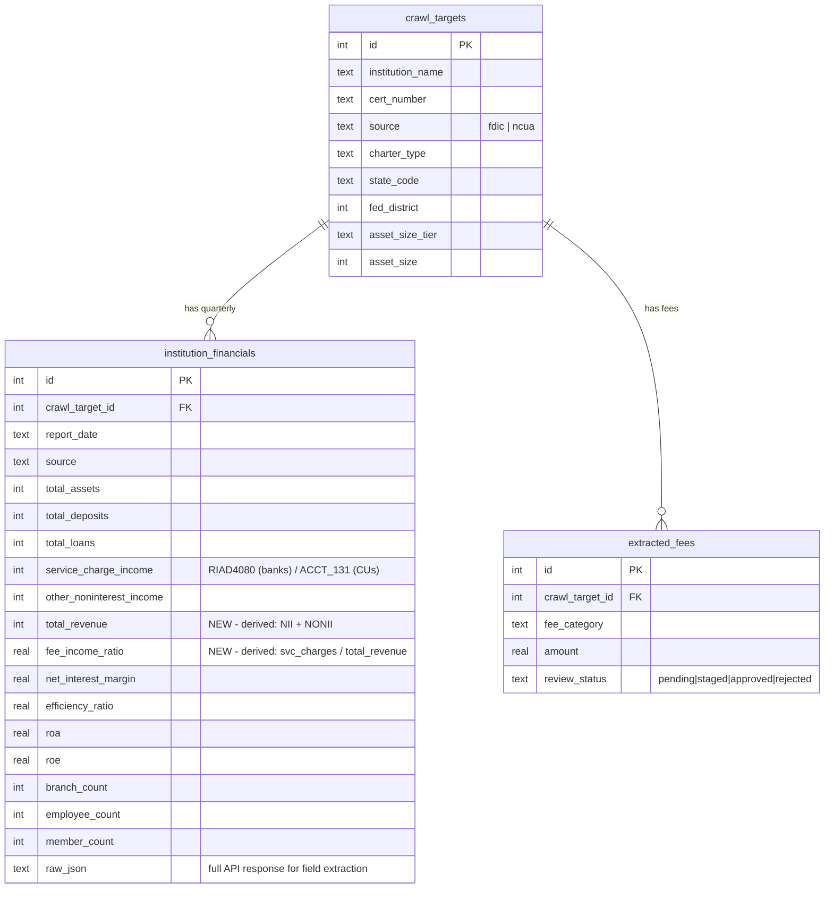

# feat: Call Report Data Integration — Fee-to-Revenue Pipeline

## Enhancement Summary

**Deepened on:** 2026-03-11
**Research agents used:** Architecture Strategist, Data Integrity Guardian, Performance Oracle, Security Sentinel, Code Simplicity Reviewer, Data Migration Expert, Pattern Recognition Specialist, FFIEC CDR Researcher
**Sections enhanced:** All

### Key Discovery: FDIC API Already Exposes RIAD4080 as `SC`

The FFIEC CDR bulk download is **not needed**. The FDIC BankFind API exposes field `SC` (Service Charges on Deposit Accounts = RIAD4080). Confirmed with live data: JPMorgan Chase reports $594M, Bank of America $849M. This eliminates the IDRSSD crosswalk, the `ingest-ffiec` command, and the highest-risk item in the original plan.

### Simplification Summary (Original → Revised)

| Item | Original Plan | Revised Plan | Rationale |
|------|--------------|--------------|-----------|
| New CLI commands | 5 | 0 | Enhance existing `ingest-fdic` and `ingest-ncua` instead |
| New DB tables | 2 (crosswalk, snapshots) | 0 | IDRSSD not needed; computeStats() works at 10K rows |
| New columns | 8 + idrssd | 2 (total_revenue, fee_income_ratio) | Reuse existing `service_charge_income`; others parsed from raw_json when needed |
| New admin pages | 2 | 1 (`/admin/revenue`) | Merge Financial Index into Revenue page |
| New chart components | 3 | 1 (scatter plot) | Defer time series and composition charts |
| New TS files | 3 (outliers, fee-revenue, charts) | 1 (financial-charts) | Inline outlier logic; no fee-revenue abstraction |
| Phases | 6 | 3 | Data → UI → Public |
| New dependencies | pandas | none | In-memory stats via existing computeStats() |

### Critical Pre-requisites Discovered

1. **Convert INSERT OR REPLACE to ON CONFLICT DO UPDATE** in `ingest_fdic.py` and `ingest_ncua.py` — current pattern destroys any newly-added columns on re-ingest
2. **Fix connection.ts** — code creates new connections per call (not singleton as MEMORY.md claims); all query functions close the connection in `finally` blocks
3. **Add `SC` to FDIC_FINANCIAL_FIELDS** — this single change populates `service_charge_income` for all 4,600+ FDIC banks

---

## Overview

Integrate quarterly bank and credit union Call Report data from the FDIC BankFind API and NCUA 5300 reports into the Bank Fee Index platform. This creates a **fee-to-revenue pipeline** that links extracted fee schedule data (what banks charge) with their reported financial performance (what they earn), enabling consumer visibility into fee revenue dependency and producing high-quality research data segmented by institution, state, and Fed district.

## Problem Statement

The Bank Fee Index currently shows **what fees banks charge** (extracted from fee schedules) but not **how much revenue those fees generate**. Call Report data — filed quarterly by every FDIC-insured bank and NCUA-chartered credit union — contains the missing link: actual service charge income, noninterest income, and total revenue figures. Connecting these two datasets answers the critical question: *"How dependent is this institution on fee income?"*

### Why This Matters

- **Consumers**: See whether their bank earns an outsized share of revenue from fees vs. peers
- **Researchers**: Access normalized fee-to-revenue ratios by segment (tier, district, charter) for academic/policy work
- **Journalists**: Find compelling narratives — e.g., "Community banks in District 7 earn 2x the national median from overdraft fees"
- **Analysts**: Identify outlier institutions and monitor fee income trends over time

## Current State (What Already Exists)

| Component | Status | Key File |
|-----------|--------|----------|
| `institution_financials` table | Exists, 15 columns + raw_json | `fee_crawler/db.py:151` |
| FDIC API ingest command | Working, 14 fields, 4 quarters | `fee_crawler/commands/ingest_fdic.py` |
| NCUA 5300 ingest command | Working, FS220+FS220A, 1 quarter | `fee_crawler/commands/ingest_ncua.py` |
| `crawl_targets` with cert_number | Working, UNIQUE(source, cert_number) | `fee_crawler/db.py` |
| Peer filter system | Working on all admin pages | `src/lib/fed-districts.ts` |
| Fed district infrastructure | Working (beige book, indicators) | `src/app/admin/districts/` |
| Market Index Explorer | Working, segment vs. national comparison | `src/app/admin/market/` |
| TS financial queries | Exists but minimal usage | `src/lib/crawler-db/financial.ts` |

### Critical Gap: `service_charge_income` is NULL for All FDIC Banks

The existing `ingest_fdic.py` hardcodes `None` at line 154 for `service_charge_income` because the developer believed the FDIC BankFind API doesn't expose RIAD4080. **However, research confirms the field `SC` in the FDIC financials API IS RIAD4080.** The fix is adding `SC` to `FDIC_FINANCIAL_FIELDS` and mapping it to `service_charge_income`.

For NCUA credit unions, `ACCT_131` (fee income) is already stored as `service_charge_income`. Cross-charter comparison requires a UI caveat but no schema change.

## Technical Approach

### Architecture

```
┌───────────────────────────────────────────────┐
│              DATA SOURCES                      │
│    FDIC BankFind API    │    NCUA 5300 (ZIP)   │
│    (+ SC field)         │    (ACCT_131)        │
└──────────┬──────────────┴──────────┬───────────┘
           │                        │
           ▼                        ▼
┌───────────────────────────────────────────────┐
│          PYTHON INGEST COMMANDS (enhanced)     │
│    ingest-fdic          │    ingest-ncua       │
│    (+SC, +INTINC,       │    (+ACCT_115,       │
│     +NETINC, --quarters)│     --quarter flag)  │
└──────────┬──────────────┴──────────┬───────────┘
           │                        │
           ▼                        ▼
┌───────────────────────────────────────────────┐
│              SQLite DB                         │
│    institution_financials                      │
│    (+total_revenue, +fee_income_ratio)         │
│    service_charge_income populated for ALL     │
└───────────────────────┬───────────────────────┘
                        │
                        ▼
┌───────────────────────────────────────────────┐
│            NEXT.JS ADMIN UI                    │
│    /admin/revenue (Fee-to-Revenue page)        │
│    Institution detail gets financials section  │
│    computeStats() for in-memory aggregation    │
└───────────────────────────────────────────────┘
```

### Implementation Phases

#### Phase 1: Data Foundation (Schema + Enhanced Ingestion)

**Goal**: Populate `service_charge_income` for all FDIC banks and add derived revenue metrics.

##### P0: Fix INSERT OR REPLACE (Pre-requisite)

Both `ingest_fdic.py` (line 132) and `ingest_ncua.py` (line 193) use `INSERT OR REPLACE` which **deletes and re-inserts** the entire row. This destroys any columns not in the INSERT statement. Any new columns added to `institution_financials` will be wiped to NULL on the next ingest run.

**Fix**: Convert to `INSERT ... ON CONFLICT ... DO UPDATE SET`:

```python
# ingest_fdic.py — BEFORE (dangerous)
INSERT OR REPLACE INTO institution_financials (...) VALUES (...)

# ingest_fdic.py — AFTER (safe)
INSERT INTO institution_financials
    (crawl_target_id, report_date, source, total_assets, ...)
VALUES (?, ?, 'fdic', ?, ...)
ON CONFLICT(crawl_target_id, report_date, source) DO UPDATE SET
    total_assets = excluded.total_assets,
    total_deposits = excluded.total_deposits,
    ...
    raw_json = excluded.raw_json
```

Apply the same fix to `ingest_ncua.py`. This preserves existing `id` values and any columns not in the SET clause.

> **Research Insight (Data Integrity Guardian):** INSERT OR REPLACE also destroys the AUTOINCREMENT `id`, breaking any future foreign key references to `institution_financials.id`. The ON CONFLICT pattern preserves the original row ID.

##### 1a. Schema Migration (`fee_crawler/db.py`)

Add 2 columns to `institution_financials`:

```sql
ALTER TABLE institution_financials ADD COLUMN total_revenue INTEGER;
ALTER TABLE institution_financials ADD COLUMN fee_income_ratio REAL;
```

Add 1 index for date-based aggregate queries:

```sql
CREATE INDEX IF NOT EXISTS idx_financials_date_source
    ON institution_financials(report_date, source);
```

> **Research Insight (Performance Oracle):** The existing `idx_financials_target_date` on `(crawl_target_id, report_date)` only helps single-institution lookups. National-scope queries filtering by `report_date` across all institutions will full-scan 80K rows without `idx_financials_date_source`.

**No new tables needed.** The original plan proposed `id_crosswalk` and `financial_snapshots` — both eliminated:
- `id_crosswalk`: Not needed since FDIC API has `SC` directly (no IDRSSD mapping required)
- `financial_snapshots`: `computeStats()` in TypeScript handles 10K rows in <5ms; pre-computing is premature optimization

> **Research Insight (Simplicity Reviewer):** The existing fee index computes median/P25/P75 across all institutions in-memory via `computeStats()`. Financial metrics are structurally identical — pull values, filter by peer scope, call `computeStats()`. No pandas, no new table.

**Migration safety notes:**
- SQLite `ALTER TABLE ADD COLUMN` doesn't support `IF NOT EXISTS` — wrap in try/except per existing pattern in `_run_migrations()`
- New columns default to NULL for existing rows (safe)
- Add new index to `_create_indexes()` method with `IF NOT EXISTS`
- Backup `data/crawler.db` before running migration

##### 1b. Enhance FDIC Ingest (`fee_crawler/commands/ingest_fdic.py`)

Changes:
1. Add `SC` (service charges = RIAD4080) to `FDIC_FINANCIAL_FIELDS`
2. Add `INTINC` (total interest income) and `NETINC` (net income) to fields
3. Map `SC` → `service_charge_income` column (currently hardcoded to `None` at line 154)
4. Compute `total_revenue` = `INTINC - EINTEXP + NONII` during ingest
5. Compute `fee_income_ratio` = `SC / total_revenue` during ingest (NULL if total_revenue is 0 or NULL)
6. Add `--quarters` flag (default 8) to control historical depth
7. Convert `INSERT OR REPLACE` to `ON CONFLICT DO UPDATE` (P0 fix)
8. Use `executemany` with batch size 500 for bulk inserts

```python
# New fields to add to FDIC_FINANCIAL_FIELDS
FDIC_FINANCIAL_FIELDS = [
    # ... existing fields ...
    "SC",       # Service charges on deposit accounts (RIAD4080)
    "INTINC",   # Total interest income
    "NETINC",   # Net income
    "NONIX",    # Total noninterest expense
]
```

> **Research Insight (FFIEC Researcher):** Confirmed via live API call: `SC` returns real data. JPMorgan Chase reports $594M, Bank of America $849M in Q2 2024. Two API requests (offset=0, offset=5000) cover all ~4,609 FDIC institutions.

> **Research Insight (Performance Oracle):** Use `executemany` with batch sizes of 500-1000 for bulk ingestion — 10-50x faster than individual inserts due to reduced transaction overhead. The existing `db.executemany()` in `fee_crawler/db.py:349` supports this.

##### 1c. Enhance NCUA Ingest (`fee_crawler/commands/ingest_ncua.py`)

Changes:
1. Add `ACCT_115` (interest income) parsing from FS220A for `total_revenue` computation
2. Compute `total_revenue` = `ACCT_115 - interest_expense + ACCT_117` during ingest
3. Compute `fee_income_ratio` = `ACCT_131 / total_revenue` during ingest
4. Add `--quarter` flag with date-based URL generation instead of hardcoded URL
5. Convert `INSERT OR REPLACE` to `ON CONFLICT DO UPDATE` (P0 fix)
6. Add ZIP size guard: check `Content-Length` header before downloading, reject >500MB

> **Research Insight (Security Sentinel, H-3):** The NCUA ingest downloads a ZIP file and reads its entire content into memory without size limits. Add a maximum download size check and verify `zf.infolist()` for suspiciously large uncompressed sizes before extracting.

##### 1d. Historical Backfill

Not a new CLI command — documented as a shell loop:

```bash
# Backfill 8 quarters of FDIC data
for q in 20230331 20230630 20230930 20231231 20240331 20240630 20240930 20241231; do
    python -m fee_crawler ingest-fdic --date $q
done

# Backfill NCUA (one quarter at a time, different ZIP URLs)
python -m fee_crawler ingest-ncua --quarter 2023-03-31
python -m fee_crawler ingest-ncua --quarter 2023-06-30
# ... etc
```

> **Research Insight (Simplicity Reviewer):** A shell for-loop replaces an entire Python command (`backfill_financials.py`). Same for the refresh orchestrator — a Makefile target or documented sequence, not a Python module.

**Phase 1 Acceptance Criteria:**
- [ ] P0: Both ingest commands use ON CONFLICT DO UPDATE (not INSERT OR REPLACE)
- [ ] `service_charge_income` populated for 4,500+ FDIC banks (via `SC` field)
- [ ] `service_charge_income` remains populated for 4,500+ NCUA credit unions (via ACCT_131)
- [ ] `total_revenue` and `fee_income_ratio` computed for all institutions with sufficient data
- [ ] 8 quarters of historical data ingested
- [ ] Re-running ingest is idempotent (new columns not wiped)
- [ ] ZIP size guard on NCUA download

**Verification SQL:**

```sql
-- Confirm service_charge_income populated for FDIC banks
SELECT source, COUNT(*) as total,
       SUM(CASE WHEN service_charge_income IS NOT NULL THEN 1 ELSE 0 END) as has_svc,
       SUM(CASE WHEN total_revenue IS NOT NULL THEN 1 ELSE 0 END) as has_rev,
       SUM(CASE WHEN fee_income_ratio IS NOT NULL THEN 1 ELSE 0 END) as has_ratio
FROM institution_financials
GROUP BY source;

-- Verify re-ingest doesn't wipe new columns
-- Run ingest-fdic twice, check total_revenue still populated
SELECT COUNT(*) FROM institution_financials
WHERE source = 'fdic' AND total_revenue IS NOT NULL;
```

---

#### Phase 2: Revenue Admin Page + Institution Detail

**Goal**: Single `/admin/revenue` page with fee income ratio benchmarks, scatter plot, outlier panel. Plus financials section on institution detail.

##### 2a. TypeScript DB Layer (`src/lib/crawler-db/financial.ts`)

Expand existing file with new queries. All functions must follow the project's `try { ... } finally { db.close(); }` pattern.

```typescript
// Expanded interface
interface InstitutionFinancial {
  // ... existing fields ...
  total_revenue: number | null;        // NEW
  fee_income_ratio: number | null;     // NEW
}

// New query functions
export function getRevenueIndex(
  reportDate: string,
  filters?: PeerDbFilters
): { institution_count: number; values: number[] };
// Returns all fee_income_ratio values for computeStats()

export function getFeeRevenueCorrelation(
  reportDate: string,
  filters?: PeerDbFilters,
  limit?: number  // default 500 for scatter plot performance
): FeeRevenuePoint[];
// Joins extracted_fees AVG(amount) with institution_financials

export function getRevenueOutliers(
  reportDate: string,
  filters?: PeerDbFilters,
  threshold?: number  // default P5/P95
): RevenueOutlier[];
// IQR-based outlier detection inline (not a separate module)
```

> **Research Insight (Architecture Strategist, R4):** Add revenue queries in `financial.ts` (not a new `revenue.ts`), since the existing file is small and these queries are closely related to the existing financial data.

> **Research Insight (Pattern Recognition):** Every DB function must wrap queries in `try { ... } finally { db.close(); }`. The existing code creates a new connection per call (not a singleton despite MEMORY.md claims). Follow the actual code pattern, not the stale documentation.

##### 2b. Revenue Page (`src/app/admin/revenue/page.tsx`)

Server component following Market page pattern:
- `requireAuth("view")` at top
- `parsePeerFilters(params)` for URL-based filtering
- Breadcrumbs, heading with peer filter bar (charter/tier/district)

Layout:
- **Hero cards** (4): National median fee income ratio, YoY change, total fee revenue, institution count
- **Scatter plot**: X = average extracted fee amount, Y = service charge income (capped at 500 points default)
- **Segment comparison table**: Fee income ratio by tier, district, charter — computed via `computeStats()` in-memory
- **Outlier panel**: Top/bottom 5% institutions by fee income ratio (IQR-based, inline computation)
- **CSV export**: All visible data

> **Research Insight (Performance Oracle):** Cap scatter plot to 500 institutions by default. Recharts renders each point as a separate SVG `<circle>` element. At 10K points, the browser will struggle (~40-60ms render, janky tooltip hover). Add a "show all" toggle.

> **Research Insight (Performance Oracle):** Compute average fee per institution in SQL, not in application code:
> ```sql
> SELECT ct.id, ct.institution_name,
>        AVG(ef.amount) as avg_fee_amount,
>        COUNT(ef.id) as fee_count,
>        if.service_charge_income,
>        if.total_revenue,
>        if.fee_income_ratio
> FROM crawl_targets ct
> JOIN extracted_fees ef ON ef.crawl_target_id = ct.id
>   AND ef.amount IS NOT NULL AND ef.amount > 0
>   AND ef.review_status != 'rejected'
> JOIN institution_financials if ON if.crawl_target_id = ct.id
>   AND if.report_date = ?
> GROUP BY ct.id
> LIMIT ?
> ```

##### 2c. Scatter Plot Component (`src/components/financial-charts.tsx`)

Single chart component for MVP — `FeeRevenueScatter`:

```typescript
"use client";

import {
  ScatterChart, Scatter, XAxis, YAxis, Tooltip,
  ResponsiveContainer, CartesianGrid
} from "recharts";

interface FeeRevenuePoint {
  institution_name: string;
  avg_fee_amount: number;
  service_charge_income: number;
  fee_income_ratio: number;
}

export function FeeRevenueScatter({ data }: { data: FeeRevenuePoint[] }) {
  // Follow existing Recharts conventions from fee-histogram.tsx:
  // ResponsiveContainer width="100%" height={260}
  // XAxis/YAxis: tick={{ fontSize: 11, fill: "#9ca3af" }}, axisLine={false}
  // Admin card wrapper with bg-gray-50/80 header
}
```

> **Research Insight (Simplicity Reviewer):** Ship with scatter plot only for MVP. The time series AreaChart and income composition BarChart are nice context but not the core deliverable. Add them if users request.

##### 2d. Nav Update (`src/app/admin/admin-nav.tsx`)

Add "Revenue" as a single item in the existing "Index" nav group:

```
Index: Dashboard, Market, National, Peer, Categories, Revenue
Ops: Review, Districts, Institutions, Extracts
```

> **Research Insight (Architecture Strategist, R6):** Merge into the "Index" group rather than creating a 2-item orphan group. Fee-to-revenue analysis is conceptually an extension of fee indexing. One new item keeps the nav at 10 total.

##### 2e. Institution Detail Extension (`src/app/admin/institutions/[id]/page.tsx`)

Add a "Revenue Context" section to the existing institution detail page:
- Fee income ratio with peer comparison: "This bank earns X% of revenue from fees (peer median: Y%)"
- Sparkline showing 8-quarter fee_income_ratio trend (reuse existing `Sparkline` component)
- Service charge income with context: "$X.XM in service charges on deposits (Q3 2024)"
- Peer percentile rank

##### 2f. Skeleton Loader (`src/app/admin/revenue/loading.tsx`)

Standard skeleton using existing `SkeletonPage` pattern.

> **Research Insight (Documented Learning — dark mode audit):** New admin pages must use `.admin-card` class and follow dark mode CSS overrides in globals.css. Previous audit found 20+ containers with hardcoded `bg-white` that broke dark mode. Use CSS variables for all backgrounds.

**Phase 2 Acceptance Criteria:**
- [ ] `/admin/revenue` renders national fee income ratio benchmarks
- [ ] Peer filters (charter/tier/district) narrow the dataset correctly
- [ ] Scatter plot shows fee amounts vs. service charge income (capped at 500 points)
- [ ] Outlier panel flags top/bottom 5% correctly
- [ ] Institution detail shows revenue context with peer comparison
- [ ] Dark mode works correctly (no hardcoded `bg-white`)
- [ ] CSV export includes all visible data
- [ ] Skeleton loading state matches design system

---

#### Phase 3: Public-Facing Pages (Future)

**Goal**: Consumer-visible fee revenue context on public institution pages.

- Show "Fee Revenue Context" card on public institution pages
- Peer comparison: "This bank earns X% of revenue from fees (national median: Y%)"
- Restrict to high-level ratios only (no raw financial figures on public pages)
- Deferred to a separate plan after Phases 1-2 are complete
- Public pages use `slate-*` color palette (vs `gray-*` for admin)

> **Research Insight (Pattern Recognition):** The FI Fee Tracker plan establishes that public pages use `slate-*` while admin pages use `gray-*`. Document this as an explicit design decision.

---

## Data Model (ERD)



**Note:** `net_income`, `total_interest_income`, `total_interest_expense`, `interchange_income`, and `total_noninterest_expense` are available in `raw_json` if needed for future charts. No dedicated columns until there's a UI that uses them.

## Key Technical Decisions

### D1: FDIC API `SC` Field (Revised)
**Decision**: Use the FDIC BankFind API `SC` field directly. No FFIEC CDR or IDRSSD crosswalk needed.
**Rationale**: Research confirmed `SC` = RIAD4080 with live data. This eliminates the highest-risk and most complex part of the original plan (FFIEC CDR auth, TSV parsing, IDRSSD mapping). Two HTTP GET requests cover all ~4,609 FDIC institutions.

### D2: Reuse `service_charge_income` Column (Revised)
**Decision**: Populate the existing `service_charge_income` column with `SC` for banks, keep `ACCT_131` for credit unions. No new `service_charges_deposits` column.
**Rationale**: Both represent "what the institution earns from deposit account service charges." Adding a second column with a confusingly similar name creates a maintenance trap. The semantic difference between RIAD4080 and ACCT_131 is documented in UI caveats.

> **Research Insight (Data Integrity Guardian):** Two columns storing similar data violates single-source-of-truth. TypeScript queries in `financial.ts` already SELECT `service_charge_income` — reusing it means zero UI code changes for the existing data.

### D3: Derived Fields Stored During Ingest (Kept)
**Decision**: Store `total_revenue` and `fee_income_ratio` as materialized columns, computed during ingest.
**Rationale**: Computing during batch ingest is simple and keeps the Next.js layer fast. The ON CONFLICT DO UPDATE pattern ensures these are recomputed whenever source data changes.

### D4: In-Memory Aggregation (Revised)
**Decision**: Use existing `computeStats()` in TypeScript for percentile computation. No `financial_snapshots` table.
**Rationale**: 10K institution rows per quarter is trivial for in-memory computation (<5ms). The existing fee index already handles this scale successfully. Pre-computing is premature optimization that adds a table, a CLI command, and a pandas dependency.

### D5: Revenue Formula (Kept)
**Decision**: `total_revenue = total_interest_income - total_interest_expense + total_noninterest_income`
**Rationale**: Standard UBPR formula. For FDIC: `INTINC - EINTEXP + NONII`. For NCUA: `ACCT_115 - interest_expense + ACCT_117`. Stored in `raw_json` fields; `total_revenue` column stores the computed result.

### D6: Historical Depth (Kept)
**Decision**: 8 quarters (2 years) for initial backfill via shell loop.
**Rationale**: Enables YoY comparison. ~80K rows is trivial for SQLite. Expandable to 20 quarters later.

### D7: Single Revenue Page in Index Group (Revised)
**Decision**: One new page `/admin/revenue` added to the existing "Index" nav group. No separate "Revenue" group.
**Rationale**: Two items is too few for a nav group. Revenue analysis is analytically related to fee indexing.

## Data Normalization Notes

| Metric | FDIC Banks | NCUA Credit Unions | Column |
|--------|-----------|-------------------|--------|
| Service charge income | `SC` (RIAD4080, in thousands) | `ACCT_131` (whole dollars, /1000) | `service_charge_income` |
| Total noninterest income | `NONII` (in thousands) | `ACCT_110+ACCT_131` (/1000) | `other_noninterest_income` |
| Total assets | `ASSET` (thousands) | `ACCT_010` (/1000) | `total_assets` |
| Total deposits | `DEP` (thousands) | `ACCT_018` (/1000) | `total_deposits` |
| Interest income | `INTINC` (thousands) | `ACCT_115` (/1000) | In `raw_json` |
| Net income | `NETINC` (thousands) | `ACCT_661` (/1000) | In `raw_json` |

**All INTEGER financial columns store values in thousands of dollars.** NCUA whole-dollar values must be divided by 1000. FDIC values arrive in thousands.

**Caveat for UI**: Display a note when showing cross-charter comparisons: *"Bank and credit union fee income definitions differ slightly. Use for directional comparison only."*

> **Research Insight (Data Migration Expert):** The NCUA ingest divides by 1000 at lines 172-182. New fields from the NCUA ingest must also apply this conversion. Forgetting the division creates values 1000x too large, silently corrupting aggregates.

> **Research Insight (Documented Learning — NaN dates):** `timeAgo()` guards against empty/NaN dates. Apply the same defensive pattern when displaying financial data dates — some quarters may have NULL report_date values. Always check before formatting.

## Risk Analysis & Mitigation

| Risk | Likelihood | Impact | Mitigation |
|------|-----------|--------|------------|
| FDIC API `SC` field unavailable for some institutions | Low | Low | Fall back to `NONII` as proxy; flag missing data in UI |
| NCUA ACCT_131 not semantically equivalent to RIAD4080 | Known | Medium | Document difference in UI; allow filtering by charter type |
| Call report data lag (60-90 days after quarter end) | Known | Low | Show "data as of Q3 2024" labels |
| INSERT OR REPLACE wipes new columns | Known | Critical | P0 fix: convert to ON CONFLICT DO UPDATE before adding columns |
| DB size with raw_json for 80K+ rows (~300MB) | Low | Medium | Store raw_json for most recent 8 quarters only |
| Scatter plot performance at 10K points | Medium | Medium | Cap at 500 default, add "show all" toggle |
| connection.ts not truly singleton | Known | Medium | Follow actual try/finally/close pattern; fix singleton as separate task |

## Success Metrics

- **Data coverage**: `service_charge_income` populated for 80%+ of institutions with fee data
- **Query performance**: Revenue page loads in < 500ms (in-memory computeStats on 10K rows)
- **Data freshness**: New quarterly data ingested within 7 days of regulatory publication
- **Linkage rate**: 70%+ of institutions with both fee schedule and financial data
- **Research utility**: CSV exports include all metrics with clear field descriptions

## Dependencies & Prerequisites

- [x] ~~Verify FFIEC CDR bulk download access~~ — Not needed; FDIC API has `SC` directly
- [ ] Confirm FDIC API returns `SC` field in financials endpoint (verified via research, confirm in code)
- [ ] Convert INSERT OR REPLACE to ON CONFLICT DO UPDATE in both ingest commands
- [ ] Backup `data/crawler.db` before schema migration
- [ ] Validate NCUA `ACCT_131` mapping against published 5300 data dictionary

## File Manifest (New & Modified)

### New Files (3)

| File | Purpose |
|------|---------|
| `src/app/admin/revenue/page.tsx` | Fee-to-Revenue dashboard |
| `src/app/admin/revenue/loading.tsx` | Skeleton loader |
| `src/components/financial-charts.tsx` | FeeRevenueScatter chart component |

### Modified Files (8)

| File | Change |
|------|--------|
| `fee_crawler/db.py` | Add 2 columns (total_revenue, fee_income_ratio) + 1 index |
| `fee_crawler/commands/ingest_fdic.py` | Add SC/INTINC/NETINC fields, ON CONFLICT, --quarters flag, executemany |
| `fee_crawler/commands/ingest_ncua.py` | Add ACCT_115, ON CONFLICT, --quarter flag, ZIP size guard |
| `src/lib/crawler-db/types.ts` | Add total_revenue, fee_income_ratio to InstitutionFinancial |
| `src/lib/crawler-db/financial.ts` | Add getRevenueIndex, getFeeRevenueCorrelation, getRevenueOutliers |
| `src/lib/crawler-db/index.ts` | Export new functions |
| `src/app/admin/admin-nav.tsx` | Add Revenue to Index nav group |
| `src/app/admin/institutions/[id]/page.tsx` | Add revenue context section |

### Pre-existing Issues to Address (Separate Tasks)

These were discovered during review and should be tracked separately:

| Issue | Severity | File |
|-------|----------|------|
| connection.ts is not a singleton (MEMORY.md stale) | Medium | `src/lib/crawler-db/connection.ts` |
| Password hash mismatch (scrypt vs SHA-256) | Critical | `src/lib/auth.ts` / `seed_users.py` |
| Search action missing authentication | High | `src/app/admin/actions/search.ts` |
| Session cookie `secure: false` | High | `src/lib/auth.ts:87` |
| No security headers in next.config.ts | Medium | `next.config.ts` |
| MEMORY.md stale about getDb() and getWriteDb() | Medium | Memory file |

## Rollback Plan

1. **Before migration**: `cp data/crawler.db data/crawler.db.bak-$(date +%Y%m%d)`
2. **New columns with NULL are harmless**: Old code doesn't SELECT them, so partial migration is safe
3. **If data corruption**: Restore from backup
4. **Feature flag**: Gate new revenue page behind `ENABLE_REVENUE_PAGE=true` env var during development

## References

### Internal
- `fee_crawler/commands/ingest_fdic.py` — existing FDIC API ingest pattern (enhance, don't replace)
- `fee_crawler/commands/ingest_ncua.py` — existing NCUA 5300 ingest pattern (enhance)
- `src/app/admin/market/page.tsx` — Market Index Explorer (UI pattern reference)
- `src/lib/crawler-db/fee-index.ts` — `buildIndexEntries` + `computeStats()` pattern for aggregation
- `src/lib/crawler-db/fees.ts` — `computeStats()` implementation
- `src/components/fee-histogram.tsx` — Recharts convention reference
- `docs/solutions/ui-bugs/dark-mode-comprehensive-admin-audit-FeeScheduleHub-20260216.md` — Dark mode patterns

### External
- [FDIC BankFind API — Financials endpoint](https://api.fdic.gov/banks/docs/) — `SC` field = RIAD4080
- [FDIC All Financial Reports Field Definitions (XLSX)](https://api.fdic.gov/banks/docs/All%20Financial%20Reports.xlsx)
- [NCUA 5300 Call Report Data](https://ncua.gov/analysis/credit-union-corporate-call-report-data)
- [FFIEC CDR Bulk Data Download](https://cdr.ffiec.gov/public/pws/downloadbulkdata.aspx) — fallback if FDIC `SC` is insufficient
- [call-report/data-collector (GitHub)](https://github.com/call-report/data-collector) — FFIEC bulk download reference (not needed for MVP)

### FDIC API Example

```bash
# Fetch service charge income for all banks, Q2 2024
curl "https://api.fdic.gov/banks/financials?fields=CERT,NAMEFULL,REPDTE,SC,ASSET,NONII&filters=REPDTE:20240630&sort_by=ASSET&sort_order=DESC&limit=10"
```
