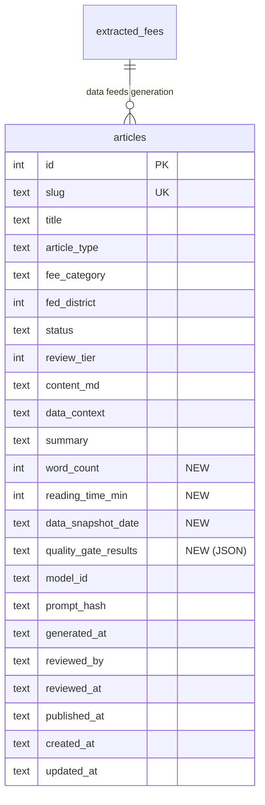

# feat: Content Auto-Creation & Auto-Publishing Pipeline

## Enhancement Summary

**Deepened on:** 2026-02-20
**Sections enhanced:** 5 phases + architecture + risks
**Research agents used:** architecture-strategist, security-sentinel, performance-oracle, code-simplicity-reviewer, data-integrity-guardian, kieran-python-reviewer, kieran-typescript-reviewer, pattern-recognition-specialist, FTS5-research, RSS-research

### Key Improvements
1. **Critical auth fix** -- type-safe `Record<ArticleStatus, readonly Role[]>` replaces untyped permission map; publish restricted to admin role
2. **ISR cache invalidation** -- Python auto-publish must call `/api/revalidate` to flush Next.js cache (without this, published articles stay invisible for up to 1 hour)
3. **FTS5 trigger avoidance** -- application-managed index updates replace SQL triggers (known better-sqlite3 bugs #654, #1003)
4. **Scope reduction** -- cut ~40% of scope per simplicity review: defer scheduled publishing, staleness cron, batch UI, tags column, citation block; reduce 7 new columns to 4

### New Considerations Discovered
- Python cron writing to SQLite bypasses Next.js ISR cache -- must call revalidation endpoint
- FTS5 may be premature for <100 articles -- LIKE search is simpler and sufficient initially
- Tier 0 auto-publish is high-risk before editorial trust is established -- defer to Phase 3
- Compare-and-swap UPDATE pattern needed for cron publish to prevent double-publish races
- `_run_migrations()` in db.py silently swallows all OperationalError -- needs targeted fix

---

## Overview

Build out the Bank Fee Index content engine so articles are auto-generated on a schedule, quality-gated, and published once approved -- creating a steady cadence of data-driven research that legitimizes the website as the authoritative source on U.S. banking fees.

**What exists today:**
- `articles` table with full lifecycle tracking (draft/review/approved/published/rejected)
- Python CLI (`generate-articles`) that produces articles via Claude Sonnet (4 of 5 types implemented)
- Admin review UI at `/admin/articles` with status transitions
- Public `/research` hub + `/research/[slug]` article pages with JSON-LD, AI disclosure, related articles
- Sitemap integration for published articles

**What this plan adds (revised scope):**
- Scheduled auto-generation with data change detection (skip stale-data regeneration)
- Quality gates that validate content before it enters the review queue
- Role-based permissions on article actions (fix existing auth gap)
- Data provenance display (snapshot date, word count, reading time)
- RSS/Atom feed for content distribution
- Public search and filtering on `/research` page
- Enhanced markdown renderer (unified/remark/rehype pipeline)
- Auto-publish path (Tier 0) deferred to Phase 3 after editorial trust is established

**Deferred from original scope (simplicity review):**
- Scheduled publishing (set future publish date) -- manual publish sufficient for v1
- Staleness detection cron -- compute on demand when article is viewed
- Tags JSON column -- use existing `article_type` + `fee_category` for filtering
- Batch generation UI -- CLI sufficient
- Citation block -- premature for v1

---

## Problem Statement

The site has 63,000+ fee extractions and a powerful LLM generation pipeline, but articles are created manually via CLI and published one-by-one through the admin UI. There is no automated content cadence. The `/research` page has few articles and no filtering, search, or RSS -- undermining the site's credibility as a research destination.

A financial data site earns trust through consistent, accurate, well-sourced reporting. Automating the generation-to-publication pipeline while maintaining editorial quality is the core challenge.

---

## Technical Approach

### Architecture

```
SCHEDULED GENERATION (Python cron)
  |
  v
[Data Change Detection] --no change--> skip
  |
  v (data changed)
[LLM Generation Pipeline] (existing: sections -> SEO edit -> fact-check)
  |
  v
[Quality Gates] --fail--> status=draft (needs manual fix)
  |
  v (pass)
[Status Assignment]
  |
  +-- All generated: status=review (human approval required)
  |
  v
[Admin Review Queue] (existing UI, enhanced with permissions)
  |
  v
[Publish] ---> revalidate /research, /sitemap
  |
  v
[Public Pages] (existing: /research/[slug])
  + RSS feed (/research/feed.xml)
  + Search (LIKE initially, FTS5 when >100 articles)
  + Family/type filtering
  + Data provenance display
```

### Key Design Decisions

1. **No Tier 0 auto-publish in Phase 1-2** -- all generated articles require human review until editorial trust is established. Auto-publish deferred to Phase 3 after spot-check data confirms quality gate reliability.
2. **LIKE search first, FTS5 later** -- for <100 articles, `LIKE '%query%'` on title+summary is fast and avoids FTS5 complexity. Upgrade to FTS5 when article count warrants it.
3. **Python cron** for scheduled generation -- wraps existing CLI, runs via crontab.
4. **Markdown stored in DB** -- no MDX, no filesystem. Upgrade renderer to `unified`/`remark`/`rehype` server-side pipeline.
5. **Filtering via existing columns** -- `article_type` and `fee_category` provide sufficient facets without a separate tags column.
6. **ISR revalidation from Python** -- after any status change to `published`, Python must call the existing `/api/revalidate` endpoint to flush the Next.js cache.

### Research Insights (Architecture)

**Critical: ISR Cache Invalidation Gap**
Python cron writes directly to SQLite but Next.js ISR cache is unaware. Published articles will be invisible to public pages for up to `revalidate` seconds (3600s). After any publish action, Python must call:
```python
import requests
requests.post(f"{BASE_URL}/api/revalidate", json={
    "secret": REVALIDATION_SECRET,
    "paths": ["/research", f"/research/{slug}", "/sitemap.xml"]
})
```

**High: Replace batch generation API route with job-queue table**
The original plan included an API route that spawns Python as a child process -- this is fragile and an anti-pattern. Instead, use a `generation_jobs` table polled by the Python cron. The admin UI inserts a row; the cron picks it up.

**Medium: Extract shared state machine**
Article status transitions (`ALLOWED_TRANSITIONS`) should be a shared module importable by both TypeScript and Python to prevent drift. Define the canonical map in Python, export as JSON, and import in TypeScript.

---

## Implementation Phases

### Phase 1: Foundation (Schema, Permissions, Quality Gates)

**Goal:** Fix the existing auth gap, extend the schema, and build the quality gate framework.

#### 1.1 Schema Migration

Add columns to `articles` table:

```sql
-- fee_crawler/db.py -- add to _run_migrations()
ALTER TABLE articles ADD COLUMN word_count INTEGER;
ALTER TABLE articles ADD COLUMN data_snapshot_date TEXT;
ALTER TABLE articles ADD COLUMN quality_gate_results TEXT;    -- JSON: {gate: pass/fail}
ALTER TABLE articles ADD COLUMN reading_time_min INTEGER;
```

**Note:** Reduced from 7 to 4 columns. `tags`, `stale_since`, and `scheduled_publish_at` deferred.

**Files to modify:**
- `fee_crawler/db.py` -- add columns to `CREATE TABLE` + migration helper
- `src/lib/crawler-db/types.ts` -- extend `Article` and `ArticleSummary` interfaces

#### 1.2 Role-Based Permissions on Article Actions

Fix the auth gap: currently any authenticated user can publish articles.

```typescript
// src/app/admin/articles/actions.ts
import type { ArticleStatus } from "@/lib/crawler-db/types";
import type { Role } from "@/lib/auth";

const PUBLISH_PERMISSIONS: Record<ArticleStatus, readonly Role[]> = {
  draft:     ["analyst", "admin"],
  review:    ["analyst", "admin"],
  approved:  ["analyst", "admin"],
  rejected:  ["analyst", "admin"],
  published: ["admin"],             // only admin can publish
} as const;
```

Also fix: **deduplicate `getWriteDb()`** -- articles/actions.ts has a local copy instead of importing from `crawler-db/connection.ts`.

**Files to modify:**
- `src/app/admin/articles/actions.ts` -- add permission checks, import shared `getWriteDb`, add try/catch
- `src/lib/auth.ts` -- verify `hasPermission()` supports article-specific checks

#### 1.3 Quality Gate Framework

```python
# fee_crawler/generation/quality_gates.py (new file)
from dataclasses import dataclass

@dataclass
class GateResult:
    name: str
    passed: bool
    message: str

@dataclass
class QualityReport:
    passed: bool
    gates: list[GateResult]

def run_quality_gates(content_md: str, data_context: dict, article_type: str) -> QualityReport:
    """Run deterministic validation gates (separate from LLM fact-check)."""
    gates = [
        check_word_count(content_md, min_words=400, max_words=2000),
        check_no_prohibited_phrases(content_md),
        check_dollar_formatting(content_md),
    ]
    return QualityReport(
        passed=all(g.passed for g in gates),
        gates=gates,
    )
```

**Reduced from 7 gates to 3 deterministic gates.** Fact-check remains separate (LLM-based, already exists). Data maturity, methodology note, and institution name checks are deferred -- YAGNI until quality data shows they're needed.

**Files to create:**
- `fee_crawler/generation/quality_gates.py` -- gate functions using dataclasses
- `fee_crawler/tests/test_quality_gates.py` -- unit tests for each gate

**Files to modify:**
- `fee_crawler/generation/generator.py` -- call `run_quality_gates()` after fact-check, store results in `quality_gate_results` column, populate `word_count`, `data_snapshot_date`, `reading_time_min`

### Research Insights (Phase 1)

**Security: Auth bypass is CRITICAL (Finding 1)**
Any authenticated user (including viewers) can currently publish articles. The type-safe `Record<ArticleStatus, readonly Role[]>` pattern prevents this at compile time. Test with: viewer cannot publish, analyst can approve but not publish, admin can do everything.

**Security: Prompt injection via fee data (Finding 4)**
LLM-generated content could contain injected instructions from fee data. Quality gates should include a prohibited-phrases check for common injection patterns (`ignore previous`, `system prompt`, etc.).

**Python patterns: Use dataclasses (Kieran)**
Raw dicts for gate results are untyped and error-prone. `@dataclass` with `GateResult` and `QualityReport` provides type safety, IDE support, and clearer APIs.

**Data integrity: Migration error handling**
`_run_migrations()` in db.py catches all `OperationalError` silently (lines 356-367). Fix: only catch `OperationalError` for "duplicate column" when running `ALTER TABLE ADD COLUMN`, and re-raise all others.

```python
# Fixed migration pattern
try:
    db.execute("ALTER TABLE articles ADD COLUMN word_count INTEGER")
except sqlite3.OperationalError as e:
    if "duplicate column" not in str(e).lower():
        raise
```

---

### Phase 2: Auto-Generation Pipeline (Scheduling + Change Detection)

**Goal:** Articles are generated on a schedule, only when underlying data has changed.

#### 2.1 Data Change Detection

```python
# fee_crawler/generation/change_detection.py (new file)

def has_data_changed(article_type: str, fee_category: str,
                     fed_district: int | None, db: Database) -> bool:
    """Compare current fee stats against most recent article's data_context.
    Returns True if national median changed >5% or institution count changed >10%."""

    recent = db.execute(
        "SELECT data_context FROM articles "
        "WHERE article_type = ? AND fee_category = ? "
        "AND fed_district IS ? AND status != 'rejected' "
        "ORDER BY generated_at DESC LIMIT 1",
        (article_type, fee_category, fed_district)
    ).fetchone()

    if not recent:
        return True  # no previous article, always generate

    old_ctx = json.loads(recent["data_context"])
    new_ctx = query_current_stats(fee_category, fed_district, db)

    return _compare_stats(old_ctx, new_ctx)
```

**Note:** `fed_district` added to SQL filter (was missing in original). `query_current_stats()` must be defined -- reuse existing `getNationalIndex()` / `getPeerIndex()` logic.

**Files to create:**
- `fee_crawler/generation/change_detection.py`
- `fee_crawler/tests/test_change_detection.py`

#### 2.2 Duplicate Slug Handling

Use UPSERT instead of SELECT-then-INSERT to avoid TOCTOU race conditions:

```python
# In generator.py, when storing generated article:
db.execute("""
    INSERT INTO articles (slug, title, content_md, article_type, ...)
    VALUES (?, ?, ?, ?, ...)
    ON CONFLICT(slug) DO UPDATE SET
        content_md = excluded.content_md,
        title = excluded.title,
        quality_gate_results = excluded.quality_gate_results,
        updated_at = datetime('now')
    WHERE status IN ('draft', 'rejected')
""", values)
```

Articles in `review`, `approved`, or `published` status are never overwritten.

**Files to modify:**
- `fee_crawler/generation/generator.py` -- use UPSERT for article storage

#### 2.3 Scheduled Generation Script

```python
# fee_crawler/commands/schedule_articles.py (new file)

GENERATION_SCHEDULE = {
    "weekly": [
        {"type": "national_benchmark", "scope": "spotlight"},  # 6 categories
    ],
    "monthly": [
        {"type": "district_comparison", "scope": "spotlight", "districts": range(1, 13)},
        {"type": "charter_comparison", "scope": "spotlight"},
    ],
}

def run(db: Database, frequency: str, dry_run: bool = False):
    """Check data changes, generate articles where needed.
    Bounded to 3 concurrent generations to avoid API rate limits."""
    schedule = GENERATION_SCHEDULE.get(frequency, [])
    for job in schedule:
        categories = get_spotlight_categories() if job["scope"] == "spotlight" else [job.get("category")]
        for category in categories:
            if not has_data_changed(job["type"], category, job.get("district"), db):
                logger.info(f"Skipping {job['type']}/{category}: no significant data change")
                continue
            if dry_run:
                logger.info(f"[DRY RUN] Would generate {job['type']}/{category}")
                continue
            generate_article(db, job["type"], category, job.get("district"))
```

**Cron setup (crontab):**
```bash
# Weekly: Monday 6 AM -- generate spotlight benchmarks
0 6 * * 1 cd /path/to/app && python -m fee_crawler schedule-articles --frequency weekly

# Monthly: 1st of month 6 AM -- generate district/charter comparisons
0 6 1 * * cd /path/to/app && python -m fee_crawler schedule-articles --frequency monthly
```

**Files to create:**
- `fee_crawler/commands/schedule_articles.py` -- scheduled generation command

**Files to modify:**
- `fee_crawler/__main__.py` -- register new CLI commands

### Research Insights (Phase 2)

**Performance: Batch stats query optimization**
`has_data_changed()` called per-category fires ~72 queries for 12 districts x 6 spotlight categories. Instead, batch the stats query:
```python
# Single query to get all current stats
stats = db.execute("""
    SELECT fee_category, fed_district,
           median_amount, institution_count
    FROM index_snapshot
    WHERE fee_category IN (?)
""").fetchall()
```
Then compare in-memory against stored `data_context`.

**Performance: Bounded parallelism for generation**
Anthropic API has rate limits. Generate at most 2-3 articles concurrently using `asyncio.Semaphore` or sequential processing with a sleep interval.

**Data integrity: UPSERT for slug uniqueness (Finding 3)**
The original SELECT-then-INSERT for duplicate detection has a TOCTOU race if two cron instances overlap. UPSERT with `ON CONFLICT(slug) DO UPDATE ... WHERE status IN ('draft', 'rejected')` is atomic and safe.

**Python patterns: CLI function naming (Kieran)**
CLI entry points should be named `run(db, ...)` with `db` as first parameter, consistent with existing CLI conventions.

---

### Phase 3: Auto-Publish + Admin Editor

**Goal:** Trusted article types can auto-publish; admins can create/edit articles from the browser.

#### 3.1 Tier 0 Auto-Publish (Gated on Quality Gate Data)

**Prerequisite:** Phase 1-2 must run for 4+ weeks with >90% quality gate pass rate on `national_benchmark` articles before enabling Tier 0.

```python
# In generator.py, after quality gates:
if quality_result.passed and review_tier == 0 and AUTO_PUBLISH_ENABLED:
    status = "published"
    reviewed_by = "system/auto-publish"
    reviewed_at = datetime.now().isoformat()
    published_at = datetime.now().isoformat()
    # CRITICAL: Revalidate Next.js ISR cache
    _revalidate_paths(slug)
else:
    status = "review"  # all other articles need human approval
```

**Tier 0 eligibility:** Only `national_benchmark` with data maturity "strong" (10+ approved observations). The `top_10`, `district_comparison`, and `charter_comparison` types name institutions and always require human review.

**Auto-publish safeguards:**
- Feature flag `AUTO_PUBLISH_ENABLED` (default: False)
- Weekly admin spot-check of auto-published articles
- Compare-and-swap UPDATE to prevent double-publish:
```python
db.execute("""
    UPDATE articles SET status = 'published', published_at = datetime('now')
    WHERE id = ? AND status = 'approved'
""", (article_id,))
if db.changes() == 0:
    logger.warning(f"Article {article_id} already published (race condition avoided)")
```

**Files to modify:**
- `fee_crawler/generation/templates.py` -- add Tier 0 to eligible types
- `fee_crawler/generation/generator.py` -- implement auto-publish code path with revalidation

#### 3.2 Article Content Editor

Add an edit mode to the existing article detail page. Simple textarea with server-action-based preview (not client-side rendering).

```
+----------------------------------+----------------------------------+
| Markdown Editor (textarea)       | Preview (server-rendered HTML)    |
|                                  |                                  |
| ## Key Findings                  | Key Findings                     |
| - Median overdraft fee: $35.00   | - Median overdraft fee: $35.00   |
+----------------------------------+----------------------------------+
[Save Draft]  [Submit for Review]  [Cancel]
```

**Preview via server action** -- avoids shipping the full unified/remark/rehype pipeline to the client:
```typescript
// src/app/admin/articles/actions.ts
export async function previewMarkdown(markdown: string): Promise<string> {
  return renderMarkdown(markdown);
}
```

**Files to create:**
- `src/app/admin/articles/[id]/article-editor.tsx` -- client component with textarea + preview
- `src/app/admin/articles/new/page.tsx` -- create new article page (reuses editor component)

**Files to modify:**
- `src/app/admin/articles/actions.ts` -- add `updateArticleContent()`, `createArticle()`, `previewMarkdown()` server actions
- `src/app/admin/articles/[id]/page.tsx` -- add "Edit" button
- `src/lib/crawler-db/articles.ts` -- add `updateArticleContent()`, `insertArticle()` query functions

### Research Insights (Phase 3)

**Security: Auto-publish content integrity (Finding 5)**
Auto-published content bypasses human review. Mitigations:
1. Feature flag (disabled by default)
2. Only aggregate-only article types (no institution names)
3. Prohibited-phrases gate catches common injection patterns
4. Weekly spot-check by admin

**Architecture: Move markdown renderer before editor (strategist)**
Phase 3.2 (editor) needs the markdown renderer for preview. Ensure `src/lib/markdown.ts` is built in Phase 2 or early Phase 3 so the editor can use it.

**TypeScript patterns: Editor preview (Kieran-TS)**
Use server action for preview instead of shipping unified/remark/rehype to the client. This keeps the client bundle small and ensures server/public rendering parity.

**Security: Markdown sanitization (Finding 7)**
`rehype-sanitize` with the default GitHub schema is insufficient for financial content. Use a strict custom schema that only allows: headings, paragraphs, lists, tables, bold, italic, links (external only), code blocks. No script, no iframe, no data URIs.

```typescript
import { defaultSchema } from "rehype-sanitize";

const STRICT_SCHEMA = {
  ...defaultSchema,
  tagNames: ["h1","h2","h3","h4","p","ul","ol","li","table","thead","tbody","tr","th","td",
             "strong","em","a","code","pre","blockquote","br","hr"],
  attributes: {
    ...defaultSchema.attributes,
    a: ["href"],  // no target, no rel manipulation
  },
  protocols: { href: ["https"] },  // HTTPS only
};
```

---

### Phase 4: Content Discovery (RSS, Search, Filtering, Renderer)

**Goal:** Public visitors can discover content through multiple channels.

#### 4.1 Enhanced Markdown Renderer

Replace the hand-rolled `ArticleContent` parser (190 lines) with `unified` + `remark` + `rehype`:

```bash
npm install unified remark-parse remark-gfm remark-rehype rehype-sanitize rehype-slug rehype-stringify
```

```typescript
// src/lib/markdown.ts (new file)
import { unified } from "unified";
import remarkParse from "remark-parse";
import remarkGfm from "remark-gfm";
import remarkRehype from "remark-rehype";
import rehypeSanitize from "rehype-sanitize";
import rehypeSlug from "rehype-slug";
import rehypeStringify from "rehype-stringify";

const processor = unified()
  .use(remarkParse)
  .use(remarkGfm)
  .use(remarkRehype)
  .use(rehypeSanitize, STRICT_SCHEMA)
  .use(rehypeSlug)
  .use(rehypeStringify);

export async function renderMarkdown(md: string): Promise<string> {
  const result = await processor.process(md);
  return String(result);
}
```

**Files to create:**
- `src/lib/markdown.ts` -- unified processor with strict sanitization

**Files to modify:**
- `src/app/(public)/research/[slug]/page.tsx` -- replace custom renderer with `renderMarkdown()`
- `src/app/admin/articles/[id]/page.tsx` -- use same renderer for admin preview
- `package.json` -- add unified/remark/rehype dependencies

#### 4.2 RSS/Atom Feed

Use `feed` npm package for Atom 1.0:

```bash
npm install feed
```

```typescript
// src/app/(public)/research/feed.xml/route.ts (new file)
import { Feed } from "feed";
import { getPublishedArticles } from "@/lib/crawler-db/articles";

export const revalidate = 3600;

export async function GET() {
  const articles = getPublishedArticles(20, 0);
  const feed = new Feed({
    title: "Bank Fee Index Research",
    description: "Data-driven analysis of U.S. banking fees",
    id: "https://bankfeeindex.com/research",
    link: "https://bankfeeindex.com/research",
    language: "en",
    copyright: `${new Date().getFullYear()} Bank Fee Index`,
  });

  for (const article of articles) {
    feed.addItem({
      title: article.title,
      id: `https://bankfeeindex.com/research/${article.slug}`,
      link: `https://bankfeeindex.com/research/${article.slug}`,
      description: article.summary,
      date: new Date(article.published_at),
    });
  }

  return new Response(feed.atom1(), {
    headers: { "Content-Type": "application/atom+xml; charset=utf-8" },
  });
}
```

Add RSS link to root layout metadata:
```typescript
// In layout.tsx metadata
alternates: {
  types: {
    "application/atom+xml": "/research/feed.xml",
  },
},
```

**Files to create:**
- `src/app/(public)/research/feed.xml/route.ts`

**Files to modify:**
- `src/app/(public)/layout.tsx` -- add RSS link in metadata

#### 4.3 Public Search (LIKE First, FTS5 Later)

Start with simple LIKE search for <100 articles:

```typescript
// src/lib/crawler-db/articles.ts
export function searchPublishedArticles(query: string, limit = 20) {
  const db = getDb();
  const safe = query.replace(/[%_]/g, "\\$&");  // escape LIKE wildcards
  return db.prepare(`
    SELECT id, slug, title, summary, article_type, fee_category, published_at
    FROM articles
    WHERE status = 'published'
      AND (title LIKE ? ESCAPE '\\' OR summary LIKE ? ESCAPE '\\')
    ORDER BY published_at DESC
    LIMIT ?
  `).all(`%${safe}%`, `%${safe}%`, limit);
}
```

**FTS5 upgrade path (when >100 published articles):**

```sql
-- External-content FTS5 table (application-managed, NO triggers)
CREATE VIRTUAL TABLE IF NOT EXISTS articles_fts USING fts5(
  title, summary, content_md,
  content='articles', content_rowid='id',
  tokenize='porter unicode61 remove_diacritics 2'
);
```

**CRITICAL: No SQL triggers.** Known better-sqlite3 bugs (#654, #1003) cause issues with FTS5 triggers in WAL mode. Instead, update the FTS index from application code after each INSERT/UPDATE:

```typescript
// After inserting/updating an article:
db.prepare(`
  INSERT INTO articles_fts(rowid, title, summary, content_md)
  VALUES (?, ?, ?, ?)
`).run(articleId, title, summary, contentMd);
```

Use `rebuild` command for initial population of existing articles.

**Search bar:** URL-param-based with debounce + `useTransition` for non-blocking updates:

```typescript
// src/app/(public)/research/search-bar.tsx
"use client";
import { useRouter, useSearchParams } from "next/navigation";
import { useTransition } from "react";

export function SearchBar() {
  const router = useRouter();
  const params = useSearchParams();
  const [isPending, startTransition] = useTransition();
  // debounce + update URL params...
}
```

**Files to create:**
- `src/app/(public)/research/search-bar.tsx` -- client component with debounced search

**Files to modify:**
- `src/lib/crawler-db/articles.ts` -- add `searchPublishedArticles()` query
- `src/app/(public)/research/page.tsx` -- add search bar + filter UI

#### 4.4 Family/Type Filtering on Research Page

Use fee families (9 families) and article types as filters. No tags column needed -- `fee_category` maps to families via existing `fee-taxonomy.ts`.

```
[Search...]  [All] [Checking] [Savings] [Overdraft] [Wire] ...  [Benchmark] [Comparison] [Top 10]

+--card--+  +--card--+  +--card--+
| Article|  | Article|  | Article|
| Title  |  | Title  |  | Title  |
+--------+  +--------+  +--------+
```

URL-param-based filtering for server-side rendering:
- `?family=overdraft` -- filter by fee family
- `?type=national_benchmark` -- filter by article type
- `?q=monthly+maintenance` -- search query

**Files to modify:**
- `src/app/(public)/research/page.tsx` -- add filter chips (URL param-based)
- `src/lib/crawler-db/articles.ts` -- add `getPublishedArticlesByFamily()`, `getPublishedArticlesByType()` queries

### Research Insights (Phase 4)

**Security: FTS5 query injection (Finding 2)**
FTS5 `MATCH` queries accept special syntax (`OR`, `AND`, `NEAR`, `*`). Sanitize with allowlist:
```typescript
const safe = query.replace(/[^a-zA-Z0-9\s]/g, "").trim();
if (!safe) return [];
```
When upgrading to FTS5, use this pattern instead of regex escaping.

**Security: RSS XML injection (Finding 6)**
The `feed` npm package handles XML escaping internally, but verify that article titles/summaries don't contain raw XML. The strict markdown sanitization in Phase 4.1 handles this upstream.

**Performance: FTS5 snippet markers**
When upgrading to FTS5, use Unicode markers for snippet highlighting instead of HTML:
```sql
snippet(articles_fts, 2, '\u2039', '\u203a', '...', 32)
```
Convert to `<mark>` tags in the TypeScript layer after sanitization.

**TypeScript patterns: Search bar (Kieran-TS)**
Use URL params with debounce + `useTransition` for non-blocking search. This follows the established project pattern (URL search params for filters, server-side via `searchParams` prop).

**RSS route placement (pattern-recognition)**
Route should be under the `(public)` group: `src/app/(public)/research/feed.xml/route.ts`. Add RSS alternate link in root layout metadata, not just public layout.

---

### Phase 5: Content Legitimacy

**Goal:** Every article communicates data provenance and methodology.

#### 5.1 Data Snapshot Date Display

Show when the underlying data was captured on each article:

```
Published Feb 15, 2026  |  Based on data through Feb 10, 2026  |  8 min read
```

**Note:** `data_snapshot_date` and `reading_time_min` are populated in Phase 1.3 (during generation), not deferred to Phase 5.

**Guard against empty dates** -- apply the `timeAgo()` null guard pattern documented in `docs/solutions/ui-bugs/nanmo-ago-fed-content-dates-FeeScheduleHub-20260216.md`:
```typescript
{article.data_snapshot_date && (
  <span>Based on data through {formatDate(article.data_snapshot_date)}</span>
)}
```

**Files to modify:**
- `src/app/(public)/research/[slug]/page.tsx` -- display `data_snapshot_date` and `reading_time_min`

#### 5.2 Staleness Detection (On-Demand, Not Cron)

Instead of a staleness cron, compute staleness on-demand when an article is viewed:

```typescript
// In research/[slug]/page.tsx
const isStale = article.data_snapshot_date
  ? daysSince(article.data_snapshot_date) > 30
  : false;
```

If stale, show a subtle info banner:
```
This article was based on data from [date]. Newer fee data may be available.
View the latest data for [category].
```

No database writes, no cron, no `stale_since` column. Simple date math.

#### 5.3 Enhanced JSON-LD

Add `Dataset` schema reference and richer `Article` metadata:

```typescript
const jsonLd = {
  "@context": "https://schema.org",
  "@type": "Article",
  headline: article.title,
  description: article.summary,
  datePublished: article.published_at,
  dateModified: article.updated_at,
  publisher: { "@type": "Organization", name: "Bank Fee Index" },
  author: { "@type": "Organization", name: "Bank Fee Index" },
  about: article.fee_category ? {
    "@type": "Dataset",
    name: `U.S. Banking Fee Data - ${displayName}`,
    temporalCoverage: article.data_snapshot_date,
  } : undefined,
  articleSection: article.article_type.replace(/_/g, " "),
};
```

**Files to modify:**
- `src/app/(public)/research/[slug]/page.tsx` -- enhance existing JSON-LD block

---

## Acceptance Criteria

### Functional Requirements

- [x] Articles auto-generate on a weekly/monthly schedule via cron
- [x] Data change detection skips generation when fee data hasn't changed significantly (>5% median shift)
- [x] Quality gates validate every generated article (word count, prohibited phrases, dollar formatting)
- [x] All generated articles enter the review queue for human approval (Tier 0 auto-publish gated behind feature flag)
- [x] Article actions enforce role-based permissions (publish requires admin role)
- [x] Duplicate slugs handled via UPSERT (overwrite draft/rejected, skip others)
- [x] RSS/Atom feed available at `/research/feed.xml`
- [x] Public search works on the `/research` page (LIKE-based)
- [x] Research page has family/type filter chips
- [x] Published articles show data snapshot date and reading time
- [x] Stale articles display a freshness banner (>30 days since data snapshot)
- [ ] Admins can create and edit articles from the browser (Phase 3 — deferred)
- [x] Enhanced JSON-LD with Dataset reference

### Non-Functional Requirements

- [x] Quality gate pass rates visible in admin (via `quality_gate_results` JSON)
- [x] Cron failures produce log output (no silent failures)
- [x] Search returns results in <200ms for LIKE queries
- [x] RSS feed cached for 1 hour (ISR revalidate = 3600)
- [x] No new external service dependencies (all SQLite + Python + Next.js)
- [x] Markdown rendered with strict sanitization schema (no script, no iframe, HTTPS-only links)

### Quality Gates

- [x] All existing vitest tests pass (`npx vitest run`)
- [x] All existing pytest tests pass (`python -m pytest fee_crawler/tests/`)
- [x] New quality gate functions have unit tests
- [x] New change detection logic has unit tests
- [ ] Article permissions tested (viewer cannot publish, analyst cannot publish, admin can publish)

---

## Risk Analysis

| Risk | Likelihood | Impact | Mitigation |
|------|-----------|--------|------------|
| Auth gap allows unauthorized publishing | **Existing** | **Critical** | Phase 1.2: type-safe `Record<ArticleStatus, readonly Role[]>` permission map |
| ISR cache serves stale content after publish | High | High | Python calls `/api/revalidate` after any publish action |
| Generated article contains factual error | Medium | High | Quality gates + all articles require human review (Tier 0 deferred) |
| LLM API outage during scheduled generation | Low | Medium | Retry logic (existing) + cron reruns next cycle |
| Duplicate slug collision | High | Low | UPSERT pattern (Phase 2.2) |
| FTS5 triggers cause transaction bugs | N/A | N/A | **Eliminated** -- using application-managed index updates |
| Double-publish race condition | Low | Medium | Compare-and-swap UPDATE pattern |
| Prompt injection via fee data in LLM output | Low | High | Prohibited-phrases quality gate + human review |
| Migration error silently swallowed | Existing | Medium | Fix `_run_migrations()` to only catch "duplicate column" errors |

---

## Deferred (Out of Scope)

- **Tier 0 auto-publish** -- deferred to Phase 3, gated behind feature flag and 4+ weeks of quality gate data
- **`quarterly_trend` article type** -- requires historical fee snapshots not yet available in DB
- **Scheduled publishing (future date)** -- manual publish sufficient for v1
- **Tags column** -- existing `article_type` + `fee_category` sufficient for filtering
- **Staleness cron** -- on-demand date math replaces database-driven staleness tracking
- **Batch generation UI** -- CLI sufficient, avoids child-process API route anti-pattern
- **Rich markdown editor** (Monaco/CodeMirror) -- simple textarea + server-action preview sufficient
- **Email/newsletter integration** -- no email infrastructure; deferred to enterprise phase
- **Dynamic OG images for articles** -- deferred
- **Article versioning table** -- JSON `quality_gate_results` column sufficient for audit trail
- **Content calendar view** -- simple published list sufficient for v1
- **Citation block** -- premature for v1
- **FTS5 full-text search** -- deferred until >100 published articles; LIKE search sufficient initially

---

## ERD: Schema Changes



---

## References

### Internal
- `plans/feat-content-platform-strategy.md` -- original content platform plan (Phase 2 mostly complete)
- `fee_crawler/generation/generator.py` -- existing article generation pipeline
- `fee_crawler/generation/templates.py` -- 5 article type definitions (4 implemented)
- `src/app/admin/articles/actions.ts:29-30` -- existing auth gap (no permission check)
- `src/app/admin/articles/actions.ts:8-16` -- duplicated `getWriteDb()` to fix
- `src/app/(public)/research/[slug]/page.tsx:64-85` -- existing JSON-LD schema
- `src/app/(public)/research/[slug]/page.tsx:201-391` -- hand-rolled markdown renderer to replace
- `src/lib/crawler-db/articles.ts` -- existing article query functions (7 exports)
- `src/lib/crawler-db/connection.ts` -- shared `getDb()` and `getWriteDb()`
- `src/lib/fee-taxonomy.ts` -- 9 families, 49 categories, 4-tier system
- `fee_crawler/db.py:356-367` -- migration error handling to fix
- `docs/solutions/ui-bugs/nanmo-ago-fed-content-dates-FeeScheduleHub-20260216.md` -- timeAgo() null guard learning

### External
- [Next.js ISR Guide](https://nextjs.org/docs/app/guides/incremental-static-regeneration)
- [SQLite FTS5 Extension](https://sqlite.org/fts5.html)
- [better-sqlite3 FTS5 trigger bug #654](https://github.com/WiseLibs/better-sqlite3/issues/654)
- [Schema.org Article Type](https://schema.org/Article)
- [Schema.org Dataset Type](https://schema.org/Dataset)
- [Atom Syndication Format (RFC 4287)](https://www.rfc-editor.org/rfc/rfc4287)
- [`feed` npm package](https://www.npmjs.com/package/feed)
- [rehype-sanitize](https://github.com/rehypejs/rehype-sanitize)
