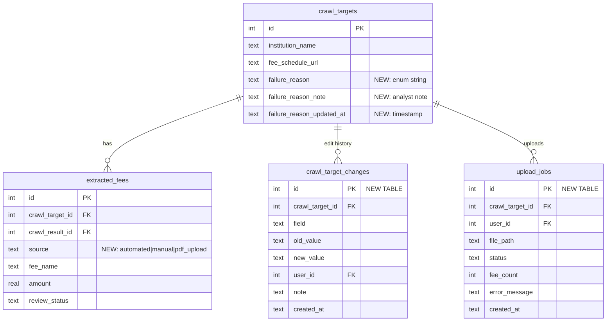

# feat: Coverage Operations Dashboard & Data Completeness Pipeline

**Created:** 2026-03-11
**Type:** Enhancement (multi-phase)
**Priority:** Critical (launch blocker)

---

## Overview

Bank Fee Index has 8,751 institutions but only **2,115 (24.2%) have extracted fees**. Of the 2,575 with fee URLs, **485 (18.8%) have URLs but zero extracted fees** — including Capital One, Truist, and TD Bank. The admin hub lacks visibility into *why* institutions have no data, offers no way to manually fix gaps, and has no mechanism for human-submitted fee schedules. This plan addresses three interconnected problems:

1. **Visibility** — No coverage gap analysis by segment, no failure categorization
2. **Manual intervention** — No way to correct URLs, enter fees, or upload PDFs
3. **Data protection** — Re-crawl destructively deletes all fees including approved and manually entered ones

## Problem Statement

### Current Coverage Snapshot (as of 2026-03-11)

| Metric | Value |
|--------|-------|
| Total institutions | 8,751 |
| With fee schedule URL | 2,575 (29.4%) |
| With extracted fees | 2,115 (24.2%) |
| URL but zero fees | 485 (18.8% of URLs) |
| Total extracted fees | 65,287 |
| Approved fees | 46,898 (71.8%) |
| Staged (awaiting review) | 11,324 |
| Flagged | 7,063 |

### Coverage by Tier (extraction rate = has fees / has URL)

| Tier | Total | Has URL | Has Fees | Extraction Rate |
|------|-------|---------|----------|-----------------|
| Super Regional ($250B+) | 12 | 7 | 4 | 57% |
| Large Regional ($50-250B) | 37 | 9 | 6 | 67% |
| Regional ($10-50B) | 106 | 35 | 21 | 60% |
| Community Large ($1-10B) | 884 | 198 | 159 | 80% |
| Community Mid ($300M-1B) | 1,427 | 257 | 228 | 89% |
| Community Small (<$300M) | 6,285 | 2,069 | 1,697 | 82% |

**Key insight:** Largest institutions (super/large regional) have the worst extraction rates (57-67%) due to complex/dynamic websites, login walls, and multi-page fee schedules. These are the most impactful gaps.

### Why Institutions Have No Fees (observed patterns)

| Failure Pattern | Example | Count (est.) |
|----------------|---------|-------------|
| Fee URL is actually an account agreement | Capital One | ~100-150 |
| Fee URL points to a landing page with links | BankUnited (consumer/business links) | ~80-120 |
| PDF exists but extraction produced zero fees | Truist (scanned/complex PDF) | ~50-80 |
| HTML is dynamically rendered (JS-only) | TD Bank | ~30-50 |
| URL behind login wall | Various | ~20-30 |
| Crawl succeeds (200 OK) but page has no fee data | KCBS Bank | ~50-80 |
| No website URL at all | 635 institutions (mostly small CUs) | 635 |

### Current Limitations

1. **Institutions page is read-only** — Cannot correct `fee_schedule_url`, cannot set `document_type`
2. **Pipeline is CLI-only** — No web-triggered crawl or extraction
3. **No failure categorization** — Only `consecutive_failures` count, no reason why
4. **No manual data entry** — If automation fails, no fallback
5. **Destructive re-crawl** — `crawl.py:132-148` deletes ALL `extracted_fees` and `fee_reviews` before inserting, destroying approved fees and manual entries
6. **No upload capability** — Cannot submit PDFs or CSVs found manually

---

## Proposed Solution

### Phase 1: Coverage Visibility & Failure Triage (Read + Classify)

**Goal:** See the full picture of what we have, what we don't, and why.

#### 1A. Schema Migration — `failure_reason` + `source` columns

```sql
-- fee_crawler/db.py migration
ALTER TABLE crawl_targets ADD COLUMN failure_reason TEXT;
ALTER TABLE crawl_targets ADD COLUMN failure_reason_note TEXT;
ALTER TABLE crawl_targets ADD COLUMN failure_reason_updated_at TEXT;

ALTER TABLE extracted_fees ADD COLUMN source TEXT NOT NULL DEFAULT 'automated';
-- source values: 'automated' | 'manual' | 'pdf_upload'
```

**Failure reason enum:**
```python
# fee_crawler/constants.py (new file)
FAILURE_REASONS = {
    "wrong_url": "URL does not point to a fee schedule",
    "account_agreement": "URL points to full account agreement, not fee schedule",
    "html_links_only": "Page contains links to fee schedule PDFs/pages but no direct fee data",
    "pdf_no_extract": "PDF exists but text extraction or LLM parsing produced zero fees",
    "dynamic_content": "Content is JS-rendered and not accessible to crawler",
    "login_required": "Fee schedule behind authentication wall",
    "no_fee_keywords": "Page loaded but no fee-related keywords detected",
    "scanned_pdf": "PDF is a scanned image, OCR failed or produced garbage",
    "multi_page": "Fee schedule spans multiple URLs/pages, only partial captured",
    "other": "Other reason (see note)",
}
```

#### 1B. Coverage Operations Page — `/admin/ops`

**New files:**
- `src/app/admin/ops/page.tsx` — Server component
- `src/app/admin/ops/ops-filters.tsx` — Client filter component
- `src/app/admin/ops/loading.tsx` — Skeleton
- `src/lib/crawler-db/coverage.ts` — Coverage queries

**Layout (4 rows):**

**Row 1: Coverage KPIs (4 hero cards)**
```
| Institutions   | Fee URL       | Extraction     | Category        |
| with Fees      | Coverage      | Success Rate   | Completeness    |
| 2,115 / 8,751  | 29.4%         | 81.2%          | 32.1%           |
| (24.2%)        | 2,575 URLs    | 2,090 / 2,575  | avg categories  |
```

**Row 2: Coverage Heatmap — Tier x Fee Family (6 rows x 9 cols = 54 cells)**
- Rows: 6 asset tiers (sorted largest first)
- Columns: 9 fee families
- Cell: coverage % (institutions in that tier with at least one fee in that family)
- Color gradient: dark emerald (>80%) → amber (40-80%) → red (<20%)
- Click cell → drills to filtered institution list
- Toggle: "By Tier" | "By District" (swaps rows to 12 Fed districts)

**Row 3: Triage Queue (full-width table)**
- Default filter: institutions with `fee_schedule_url IS NOT NULL` AND zero extracted fees
- Columns: Institution | Tier | Charter | State | Doc Type | Failures | Failure Reason | Last Crawl | Actions
- Sort by `asset_size DESC` (largest gaps = highest impact)
- Inline failure reason dropdown (classify directly from queue)
- Action buttons: "View URL" (external link) | "Update URL" | "Enter Fees"
- Peer filters apply (charter, tier, district)

**Row 4: Pipeline Health (2 panels)**
- Left: Crawl runs timeline from `crawl_runs` table (last 30 days, bar chart: success/fail/unchanged)
- Right: Failure reason distribution (horizontal bars, one per reason category)

**New DB queries in `src/lib/crawler-db/coverage.ts`:**

```typescript
// coverage.ts

export function getCoverageKPIs(filters?: PeerFilterOpts): CoverageKPIs;
// Returns: institutions_with_fees, fee_url_coverage_pct, extraction_rate, avg_categories_per_institution

export function getCoverageHeatmap(
  dimension: "tier" | "district",
  filters?: PeerFilterOpts
): { segment: string; family: string; coverage_pct: number; institution_count: number }[];
// Pivot query: for each (segment, family), count institutions with at least 1 fee in that family / total in segment

export function getTriageQueue(opts: {
  filters?: PeerFilterOpts;
  failureReason?: string;
  hasUrl?: boolean;
  hasFees?: boolean;
  limit?: number;
  offset?: number;
}): { entries: TriageEntry[]; total: number };
// Institution list with gap analysis columns

export function getFailureReasonDistribution(filters?: PeerFilterOpts): { reason: string; count: number }[];

export function getPipelineHealth(days?: number): { date: string; success: number; fail: number; unchanged: number }[];
```

#### 1C. Failure Reason Classification (Server Action)

```typescript
// src/app/admin/ops/actions.ts

"use server";

export async function classifyFailureReason(
  targetId: number,
  reason: string,
  note?: string
): Promise<void>;
// Updates crawl_targets.failure_reason, failure_reason_note, failure_reason_updated_at
// Requires: analyst or admin role
```

#### 1D. Auto-Classification in Crawler

Enhance the crawl pipeline to automatically set `failure_reason` when it can:

```python
# In fee_crawler/commands/crawl.py, after extraction attempt:

if len(extracted_fees) == 0:
    if not has_fee_keywords(text):
        failure_reason = "no_fee_keywords"
    elif document_type == "pdf" and is_scanned_pdf(text):
        failure_reason = "scanned_pdf"
    elif document_type == "html" and has_schedule_links(text):
        failure_reason = "html_links_only"
    else:
        failure_reason = "pdf_no_extract" if document_type == "pdf" else "other"

    db.execute(
        "UPDATE crawl_targets SET failure_reason = ? WHERE id = ?",
        (failure_reason, target_id)
    )
```

#### 1E. Nav Update

Add "Ops" item to admin-nav.tsx in a new "Operations" group or rename the existing "Ops" group label to avoid confusion:

```typescript
// In admin-nav.tsx
{ label: "Coverage", href: "/admin/ops", icon: BarChart3Icon }
```

---

### Phase 2: Manual URL Correction & Fee Entry (Write)

**Goal:** Let analysts fix data gaps directly from the admin UI.

#### 2A. Fix Destructive Re-Crawl (prerequisite)

**Before any manual entry is possible**, the re-crawl must be made safe:

```python
# fee_crawler/commands/crawl.py — modify lines 132-148

# BEFORE (destructive):
# db.execute("DELETE FROM extracted_fees WHERE crawl_target_id = ?", (target_id,))

# AFTER (preserve manual + approved):
db.execute(
    """DELETE FROM extracted_fees
       WHERE crawl_target_id = ?
       AND source = 'automated'""",
    (target_id,)
)
# Also delete only automated fee_reviews:
db.execute(
    """DELETE FROM fee_reviews
       WHERE fee_id IN (
         SELECT id FROM extracted_fees
         WHERE crawl_target_id = ? AND source = 'automated'
       )""",
    (target_id,)
)
```

This ensures:
- Manually entered fees (`source = 'manual'`) survive re-crawl
- PDF-uploaded fees (`source = 'pdf_upload'`) survive re-crawl
- Approved automated fees are still replaced (the crawler may have better data)

#### 2B. URL Correction Form

**New component in institution detail or triage queue:**

```typescript
// src/app/admin/ops/url-correction-form.tsx (client component)

interface UrlCorrectionFormProps {
  targetId: number;
  currentUrl: string | null;
  currentDocType: string | null;
}

// Fields: URL input (validated), document type select (pdf/html), notes
// Submits to server action that updates crawl_targets
```

**Server action:**

```typescript
// src/app/admin/ops/actions.ts

export async function updateFeeScheduleUrl(
  targetId: number,
  url: string,
  documentType: "pdf" | "html",
  note?: string
): Promise<void>;
// Validates URL format
// Updates crawl_targets.fee_schedule_url, document_type
// Resets consecutive_failures to 0
// Clears failure_reason (URL was manually corrected)
// Creates audit entry in crawl_target_changes table (new table)
// Requires: analyst or admin role
```

**Audit table migration:**

```sql
CREATE TABLE IF NOT EXISTS crawl_target_changes (
    id INTEGER PRIMARY KEY AUTOINCREMENT,
    crawl_target_id INTEGER NOT NULL REFERENCES crawl_targets(id),
    field TEXT NOT NULL,
    old_value TEXT,
    new_value TEXT,
    user_id INTEGER REFERENCES users(id),
    note TEXT,
    created_at TEXT NOT NULL DEFAULT (datetime('now'))
);
CREATE INDEX idx_target_changes_target ON crawl_target_changes(crawl_target_id);
```

#### 2C. Manual Fee Entry Form

**New page:** `/admin/ops/entry/[id]` (institution-specific fee entry)

```typescript
// src/app/admin/ops/entry/[id]/page.tsx

// Layout: institution header + fee entry form
// Form fields per fee row:
//   - fee_category (searchable dropdown, 49 categories)
//   - fee_name (text, auto-populated from category but editable)
//   - amount (number, validated against fee_amount_rules.py ranges)
//   - frequency (select: monthly/per_occurrence/annual/etc.)
//   - conditions (textarea, optional)
//
// Multiple fees per submission (add/remove rows)
// Submit creates extracted_fees rows with:
//   source = 'manual'
//   extraction_confidence = 1.0
//   review_status = 'staged' (human-entered but needs second review)
//   crawl_result_id = NULL (make column nullable)
//   fee_family = derived from category
```

**Schema change for `crawl_result_id`:**

```sql
-- Make nullable to support manual entries
-- SQLite doesn't support ALTER COLUMN, so this needs the migration pattern:
-- 1. Create new table without NOT NULL on crawl_result_id
-- 2. Copy data
-- 3. Drop old, rename new
-- OR simpler: just allow NULL in the INSERT and rely on app-level validation
```

Actually, the simpler approach: create a synthetic "manual entry" crawl_result for each manual submission session:

```sql
INSERT INTO crawl_results (crawl_run_id, crawl_target_id, status, document_url, created_at)
VALUES (NULL, ?, 'manual', 'manual-entry', datetime('now'));
```

This preserves the FK constraint and creates an audit trail.

#### 2D. Permission Model Update

```typescript
// src/lib/auth.ts — update ROLE_PERMISSIONS

const ROLE_PERMISSIONS = {
  viewer: ["view"],
  analyst: ["view", "approve", "reject", "edit", "submit_url", "manual_entry", "triage"],
  admin: ["view", "approve", "reject", "edit", "submit_url", "manual_entry", "triage", "bulk_approve", "bulk_upload", "manage_users"],
};
```

---

### Phase 3: PDF Upload & Bulk Operations (Scale)

**Goal:** Handle manual PDF submissions and bulk URL corrections.

#### 3A. PDF Upload (Async Pattern)

**Why async:** LLM extraction takes 5-30 seconds and costs API credits. Synchronous server actions would timeout.

**Flow:**
1. Analyst uploads PDF via drag-drop on `/admin/ops/entry/[id]`
2. Server action saves PDF to `data/uploads/{target_id}/{timestamp}.pdf`
3. Creates a job row in new `upload_jobs` table (status: `queued`)
4. Returns job ID to client
5. Client polls `/api/upload-status/[jobId]` every 3 seconds
6. Background worker (Python) picks up job, runs extraction, writes to `extracted_fees` with `source = 'pdf_upload'`
7. Worker updates job status to `completed` with fee count
8. Client shows extracted fees for review

**New table:**

```sql
CREATE TABLE IF NOT EXISTS upload_jobs (
    id INTEGER PRIMARY KEY AUTOINCREMENT,
    crawl_target_id INTEGER NOT NULL REFERENCES crawl_targets(id),
    user_id INTEGER REFERENCES users(id),
    file_path TEXT NOT NULL,
    status TEXT NOT NULL DEFAULT 'queued',  -- queued, processing, completed, failed
    fee_count INTEGER,
    error_message TEXT,
    created_at TEXT NOT NULL DEFAULT (datetime('now')),
    completed_at TEXT
);
```

**Worker command:**

```python
# fee_crawler/commands/process_uploads.py

def run(db, config):
    """Process queued PDF uploads. Run via cron or manual trigger."""
    jobs = db.fetchall("SELECT * FROM upload_jobs WHERE status = 'queued' ORDER BY created_at")
    for job in jobs:
        db.execute("UPDATE upload_jobs SET status = 'processing' WHERE id = ?", (job["id"],))
        try:
            text = extract_text_from_pdf(job["file_path"])
            fees = extract_fees_with_llm(text, config)
            # Insert as source='pdf_upload', review_status='staged'
            # Update job status='completed', fee_count=len(fees)
        except Exception as e:
            # Update job status='failed', error_message=str(e)
```

#### 3B. CSV Bulk URL Upload (Admin Only)

**Flow:**
1. Admin downloads CSV template with columns: `cert_number, institution_name (reference), new_fee_url, document_type`
2. Admin fills in URLs found manually
3. Uploads CSV on `/admin/ops`
4. Server action parses, validates, shows preview with diffs
5. Admin confirms, bulk updates `crawl_targets.fee_schedule_url`
6. Creates audit entries in `crawl_target_changes`

**Server action:**

```typescript
// src/app/admin/ops/actions.ts

export async function bulkUpdateUrls(
  updates: { certNumber: string; url: string; documentType: string }[]
): Promise<{ updated: number; errors: { certNumber: string; reason: string }[] }>;
// Max 500 rows per batch
// Validates each URL
// Requires: admin role (bulk_upload permission)
```

---

## Acceptance Criteria

### Phase 1 (Coverage Visibility)

- [x] `/admin/ops` page renders with 5 coverage KPI cards
- [x] Coverage heatmap shows tier x district matrix with color-coded cells
- [x] Heatmap toggle switches between "By Tier" and "By District"
- [x] Triage queue lists institutions with URLs but no fees, sorted by asset size
- [x] Triage queue supports peer filters (charter, tier, district)
- [x] Analysts can classify `failure_reason` via server action (inline UI deferred to Phase 2)
- [x] Pipeline health panel shows crawl health metrics
- [x] Failure reason distribution shows breakdown by category
- [x] Crawler auto-sets `failure_reason` when extraction produces zero fees
- [x] "Coverage" nav item appears in admin navigation

### Phase 2 (Manual Intervention)

- [x] Re-crawl preserves `source = 'manual'` and `source = 'pdf_upload'` fees
- [x] URL correction form validates URL and updates `crawl_targets`
- [x] URL changes create audit entries in `crawl_target_changes`
- [x] Manual fee entry form allows selecting from 49 categories
- [x] Manual fees inserted with `source = 'manual'`, `review_status = 'staged'`
- [x] Amount validation warns on out-of-range values (does not hard-block)
- [x] Duplicate fee detection warns analyst if category already exists for institution
- [x] Analyst role has `submit_url`, `manual_entry`, `triage` permissions

### Phase 3 (PDF Upload & Bulk)

- [x] PDF upload accepts files up to 10MB, validates file type
- [x] Upload creates async job, client polls for completion
- [x] Extracted fees from PDF shown to analyst before committing
- [x] CSV template downloadable from `/admin/ops`
- [x] CSV upload validates and previews changes before applying
- [x] Bulk upload limited to admin role, max 500 rows

---

## Technical Considerations

### Architecture

- **Server components** for all read-only views (coverage KPIs, heatmap, pipeline health)
- **Client components** pushed to leaf level: filter bar, failure reason dropdown, URL form, fee entry form
- All new DB queries in `src/lib/crawler-db/coverage.ts` (new file)
- Server actions in `src/app/admin/ops/actions.ts`
- PDF storage: `data/uploads/{target_id}/` directory, gitignored
- Reuse existing design system: `admin-card`, `tabular-nums`, `text-[11px]` labels, emerald/red palette

### Performance

- Coverage heatmap query: 6 tiers x 9 families = 54 cells, each requiring a COUNT with GROUP BY. Use a single query with `GROUP BY asset_size_tier, fee_family` on a JOIN of `crawl_targets` and `extracted_fees`
- Triage queue: paginated (LIMIT 50), sorted by `asset_size DESC`, indexed on `fee_schedule_url IS NOT NULL`
- Consider adding index: `CREATE INDEX idx_fees_source ON extracted_fees(source)`

### Security

- URL correction must validate against SSRF: reject private IPs, localhost, metadata endpoints
- PDF upload: validate magic bytes (not just extension), enforce 10MB limit, store outside webroot
- CSV upload: validate each row, cap at 500, reject if any row is malicious
- All write actions require `requireAuth()` with appropriate permission

### Data Integrity

- `source` column on `extracted_fees` distinguishes automated vs manual entries
- `crawl_target_changes` table provides full audit trail for URL edits
- Synthetic `crawl_result` rows (status='manual') maintain FK integrity
- Re-crawl modified to `DELETE ... WHERE source = 'automated'` only

---

## ERD: New/Modified Tables



---

## Success Metrics

| Metric | Current | Target (30 days) | Target (90 days) |
|--------|---------|-------------------|-------------------|
| Institutions with fees | 2,115 (24.2%) | 2,800 (32%) | 4,000 (45%) |
| Super/large regional with fees | 10 / 49 | 35 / 49 | 45 / 49 |
| URL but zero fees | 485 | < 200 | < 50 |
| Failure reasons classified | 0 | 400 | 485 |
| Manually entered fees | 0 | 500+ | 2,000+ |

---

## Dependencies & Risks

| Risk | Impact | Mitigation |
|------|--------|-----------|
| Re-crawl deletes manual entries | Data loss | Phase 2A: add `source` column, modify DELETE query |
| LLM extraction cost for PDF uploads | Budget | Rate limit uploads, batch processing |
| Python-Node integration complexity | High effort | Phase 3: async job queue, not synchronous |
| Large institution websites are dynamic | Low extraction rate | Manual entry fallback (Phase 2C) |
| Schema migrations on production DB | Downtime risk | All migrations are additive (ADD COLUMN), safe for WAL mode |

---

## Implementation Order

1. **Phase 1A** — Schema migration (failure_reason, source columns)
2. **Phase 1B-1E** — Coverage ops page (read-only) + nav update
3. **Phase 1C** — Failure reason classification action
4. **Phase 1D** — Auto-classification in crawler
5. **Phase 2A** — Fix destructive re-crawl (critical prerequisite)
6. **Phase 2B** — URL correction form + audit table
7. **Phase 2C** — Manual fee entry form
8. **Phase 2D** — Permission model update
9. **Phase 3A** — PDF upload (async)
10. **Phase 3B** — CSV bulk upload

Phases 1 and 2A-2C are launch-critical. Phase 3 can follow after initial launch.

---

## References

### Internal

- `fee_crawler/commands/crawl.py:132-148` — Destructive re-crawl DELETE
- `fee_crawler/db.py:8-31` — crawl_targets schema
- `fee_crawler/db.py:70-83` — extracted_fees schema
- `fee_crawler/validation.py:196-227` — Review status determination
- `src/lib/auth.ts:18-24` — ROLE_PERMISSIONS
- `src/lib/fed-districts.ts:16-32` — TIER_LABELS, TIER_ORDER
- `src/lib/fee-taxonomy.ts` — 9 families, 49 categories
- `src/app/admin/institutions/page.tsx` — Current read-only institutions view
- `src/lib/fee-actions.ts` — Server actions pattern (approve/reject/edit)

### External

- [DataKitchen: Data Quality Dashboard Types](https://datakitchen.io/the-six-types-of-data-quality-dashboards/)
- [Metaplane: PICERL Data Quality Incident Management](https://www.metaplane.dev/blog/data-quality-issue-management-process)
- [Monte Carlo: Data Quality Metrics](https://www.montecarlodata.com/blog-data-quality-metrics/)
