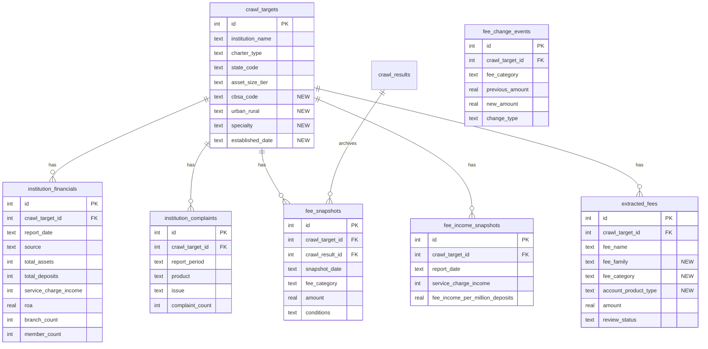

# Enhance Data Enrichment Pipeline

**Type:** Enhancement
**Created:** 2026-02-14
**Status:** Draft

---

## Overview

FeeSchedule Hub currently has 8,751 institutions seeded but only 4 with extracted fees (117 records), 17 canonical fee categories, and no financial context beyond total assets. This plan adds new public data sources, expands fee taxonomy, introduces historical tracking, adds visualizations and export, and improves crawl coverage -- transforming the platform from a prototype into a production-grade benchmarking tool.

## Problem Statement

1. **Thin financial context**: Only `asset_size` is stored per institution. No deposit totals, fee income, profitability ratios, branch counts, or complaint data. Peer comparisons lack the financial depth that pricing strategists need.

2. **Low coverage**: 4,419 credit unions (50.5%) have no website URL and cannot enter the discovery pipeline. URL discovery succeeds only 14% of the time on institutions that do have websites. Only 4 institutions have extracted fees.

3. **No historical tracking**: Re-crawling deletes old fees and replaces them. No way to track fee changes over time, compute trends, or answer "how has this institution's OD fee changed?"

4. **Limited taxonomy**: 17 canonical fee categories with 86 aliases. Real-world fee schedules contain 50+ distinct fee types. No fee family hierarchy, no account product type dimension.

5. **No visualizations or export**: The admin UI shows raw tables with no charts, no CSV/Excel download, no PDF reports.

6. **No database optimization**: SQLite runs without WAL mode, no indexes beyond PKs, no PRAGMAs. Both Python writer and Node.js reader open/close connections per call.

---

## Proposed Solution

Five phases, each independently deployable:

| Phase | Scope | Key Deliverable |
|-------|-------|-----------------|
| **1: Data Foundation** | New data sources + expanded taxonomy | `institution_financials` table, FFIEC/NCUA/CFPB ingestion commands, 50 canonical fee categories |
| **2: Coverage** | More institutions with fee data | NCUA website URL resolution, improved URL discovery, async crawling |
| **3: Historical Tracking** | Fee versioning + trends | `fee_snapshots` table, versioned re-crawl, trend queries |
| **4: Analytics & UI** | Charts, export, alerts | Recharts visualizations, CSV/XLSX export, fee change alerts |
| **5: Performance & Ops** | Database optimization + scheduling | WAL mode, indexes, ISR caching, APScheduler |

---

## Phase 1: Data Foundation

### 1a. Institution Financials Table

**New table: `institution_financials`**

```sql
CREATE TABLE IF NOT EXISTS institution_financials (
    id INTEGER PRIMARY KEY AUTOINCREMENT,
    crawl_target_id INTEGER NOT NULL REFERENCES crawl_targets(id),
    report_date TEXT NOT NULL,              -- YYYY-MM-DD (quarter end)
    source TEXT NOT NULL,                   -- ffiec_call_report | ncua_5300 | fdic_sod
    total_assets INTEGER,                   -- in thousands
    total_deposits INTEGER,                 -- in thousands
    total_loans INTEGER,                    -- in thousands
    service_charge_income INTEGER,          -- in thousands (RIAD4080 for banks)
    other_noninterest_income INTEGER,       -- in thousands
    net_interest_margin REAL,               -- percentage
    efficiency_ratio REAL,                  -- percentage
    roa REAL,                               -- return on assets %
    roe REAL,                               -- return on equity %
    tier1_capital_ratio REAL,               -- percentage
    branch_count INTEGER,
    employee_count INTEGER,
    member_count INTEGER,                   -- credit unions only
    raw_json TEXT,                          -- full report for future fields
    fetched_at TEXT NOT NULL DEFAULT (datetime('now')),
    UNIQUE(crawl_target_id, report_date, source)
);
```

**New table: `institution_complaints`**

```sql
CREATE TABLE IF NOT EXISTS institution_complaints (
    id INTEGER PRIMARY KEY AUTOINCREMENT,
    crawl_target_id INTEGER NOT NULL REFERENCES crawl_targets(id),
    report_period TEXT NOT NULL,            -- YYYY-MM (monthly)
    product TEXT NOT NULL,                  -- checking_savings | credit_card | mortgage | ...
    issue TEXT,                             -- overdraft | fees | account_management | ...
    complaint_count INTEGER NOT NULL,
    fetched_at TEXT NOT NULL DEFAULT (datetime('now')),
    UNIQUE(crawl_target_id, report_period, product, issue)
);
```

**Modify: `fee_crawler/db.py`**
- Add both table definitions to `_init_tables()`
- Follow existing migration pattern (try/except for idempotent ALTERs)

### 1b. FFIEC Call Report Ingestion

**New file: `fee_crawler/commands/ingest_ffiec.py`**

Data source: FFIEC CDR bulk download (https://cdr.ffiec.gov/public/)
- Schedule RI (Income Statement): `RIAD4080` (service charges on deposits), `RIAD4079` (non-interest income)
- Schedule RC (Balance Sheet): `RCFD2170` (total assets), `RCON2200` (total deposits), `RCFD2122` (total loans)
- Schedule RC-R (Capital): `RCFAA223` (tier 1 capital ratio)

```python
def run(db: Database, config: Config, *, quarter: str | None = None) -> None:
    """Ingest FFIEC Call Report data for all FDIC-insured banks.

    Args:
        quarter: e.g. "2025-09-30". If None, fetch most recent.
    """
    # 1. Download bulk CSV from FFIEC CDR
    # 2. Parse relevant fields by CERT number
    # 3. Match to crawl_targets via cert_number WHERE source='fdic'
    # 4. UPSERT into institution_financials
```

CLI: `python -m fee_crawler ingest-ffiec --quarter 2025-09-30`

**Key fields to extract:**

| Call Report Field | Column | Description |
|-------------------|--------|-------------|
| `RIAD4080` | `service_charge_income` | Service charges on deposit accounts |
| `RIAD4079` | `other_noninterest_income` | Other non-interest income |
| `RCFD2170` | `total_assets` | Total assets |
| `RCON2200` | `total_deposits` | Total deposits |
| `RCFD2122` | `total_loans` | Total loans net |
| `RCFAA223` | `tier1_capital_ratio` | Tier 1 capital ratio |
| `RIAD4340` | (compute ROA) | Net income |
| `RCFD3210` | (compute ROE) | Total equity |
| `NUMEMP` | `employee_count` | Full-time equivalent employees |

**Edge cases:**
- Institutions that file on a different quarter-end (rare but exists)
- Mergers: CERT numbers may change; match by name as fallback
- Missing fields: some small banks don't report all line items -- store NULLs
- Rate limiting: FFIEC CDR has no API rate limits for bulk downloads but may throttle large requests

### 1c. NCUA 5300 Financial Ingestion

**New file: `fee_crawler/commands/ingest_ncua_financials.py`**

Data source: NCUA quarterly ZIP files (same source as current seed, different tables)
- `FS220.txt`: Balance sheet (ACCT_010 total assets, ACCT_018 total shares/deposits)
- `FS220A.txt` or `FS220H.txt`: Income statement (ACCT_131 fee income)

```python
def run(db: Database, config: Config, *, quarter: str | None = None) -> None:
    """Ingest NCUA 5300 financial data for credit unions."""
    # 1. Download quarterly ZIP (reuse existing NCUA download logic)
    # 2. Parse FS220.txt for balance sheet fields
    # 3. Parse income statement for fee income (ACCT_131, ACCT_131A)
    # 4. Match to crawl_targets via cert_number WHERE source='ncua'
    # 5. UPSERT into institution_financials
```

CLI: `python -m fee_crawler ingest-ncua-financials --quarter 2025-09`

**Key NCUA fields:**

| 5300 Account | Column | Description |
|-------------|--------|-------------|
| `ACCT_010` | `total_assets` | Total assets |
| `ACCT_018` | `total_deposits` | Total shares and deposits |
| `ACCT_025B` | `total_loans` | Total loans outstanding |
| `ACCT_131` | `service_charge_income` | Fee income |
| `ACCT_131A` | `other_noninterest_income` | Other fee income |
| `ACCT_083` | `member_count` | Number of members |
| `ACCT_602` | `employee_count` | Number of employees |

**Migration note for existing NCUA data:** The current seed command already downloads the NCUA ZIP but only reads FOICU.txt (directory) and FS220.txt (total assets for ACCT_010). The financial ingestion command reuses the same download but reads additional accounts from FS220.txt and adds the income statement tables.

### 1d. CFPB Complaint Data Ingestion

**New file: `fee_crawler/commands/ingest_complaints.py`**

Data source: CFPB Consumer Complaint API (https://www.consumerfinance.gov/data-research/consumer-complaints/search/api/v1/)

```python
def run(db: Database, config: Config) -> None:
    """Ingest CFPB complaint counts by institution."""
    # 1. Query CFPB API: product=checking_savings, group by company + issue
    # 2. Match company name to crawl_targets.institution_name (fuzzy match)
    # 3. UPSERT into institution_complaints
```

CLI: `python -m fee_crawler ingest-complaints`

**Matching strategy:** CFPB uses company names (e.g., "BANK OF AMERICA, NATIONAL ASSOCIATION"). Match to `crawl_targets.institution_name` via:
1. Exact match (case-insensitive, strip suffixes like ", N.A.", "NATIONAL ASSOCIATION")
2. Fuzzy match with >90% similarity threshold (python-Levenshtein or rapidfuzz)
3. Manual mapping table for top 100 institutions (handle edge cases like "JPMORGAN CHASE" vs "JPMorgan Chase Bank")

**Rate limits:** CFPB API has no published rate limits but returns paginated results (10,000 per page). Use 1-second delay between pages.

**Edge case:** CFPB data covers the last ~10 years. For initial load, ingest only the most recent 12 months. Store `report_period` as YYYY-MM for monthly aggregation.

### 1e. Expanded Fee Taxonomy

**Modify: `fee_crawler/fee_analysis.py`**

Expand from 17 to ~50 canonical categories organized into fee families:

```python
FEE_FAMILIES = {
    "deposit_account": [
        "monthly_maintenance",
        "min_balance_fee",
        "excessive_withdrawal",
        "early_closure",
        "dormant_account",
        "account_research",
    ],
    "overdraft_nsf": [
        "overdraft",
        "nsf",
        "continuous_overdraft",
        "overdraft_protection_transfer",
    ],
    "atm": [
        "atm_non_network",
        "atm_international",
        "atm_deposit",
    ],
    "wire_transfer": [
        "wire_domestic_outgoing",
        "wire_domestic_incoming",
        "wire_intl_outgoing",
        "wire_intl_incoming",
    ],
    "check_services": [
        "cashiers_check",
        "money_order",
        "check_printing",
        "counter_check",
        "check_cashing_noncustomer",
        "returned_deposited_check",
        "foreign_check_deposit",
    ],
    "card_services": [
        "card_replacement",
        "rush_card",
        "card_foreign_transaction",
    ],
    "statements_notices": [
        "paper_statement",
        "check_image_copy",
        "account_verification_letter",
        "returned_mail",
    ],
    "safe_deposit": [
        "safe_deposit_small",
        "safe_deposit_medium",
        "safe_deposit_large",
        "safe_deposit_drill",
    ],
    "international": [
        "fx_exchange",
        "foreign_collection",
    ],
    "digital_services": [
        "bill_pay",
        "mobile_deposit",
        "zelle_p2p",
    ],
    "cash_services": [
        "coin_counting",
        "cash_handling",
        "night_depository",
    ],
    "legal_admin": [
        "levy_garnishment",
        "notary_service",
        "legal_process",
    ],
    "investment_retirement": [
        "ira_maintenance",
        "ira_transfer",
        "options_trading",
        "margin_interest",
    ],
}
```

Add ~150 new aliases mapping real-world fee names to canonical categories.

**Modify: `extracted_fees` table**

```sql
ALTER TABLE extracted_fees ADD COLUMN fee_family TEXT;
ALTER TABLE extracted_fees ADD COLUMN fee_category TEXT;       -- canonical name
ALTER TABLE extracted_fees ADD COLUMN account_product_type TEXT; -- basic_checking, premium_checking, savings, etc.
```

**Migration for existing 117 fees:** Run a one-time backfill command that:
1. Normalizes each existing `fee_name` using the expanded alias map
2. Sets `fee_category` to the canonical name
3. Sets `fee_family` based on `FEE_FAMILIES` lookup
4. Leaves `account_product_type` as NULL for existing records (LLM prompt update needed for new extractions)

**Modify: `fee_crawler/pipeline/extract_llm.py`**

Update the LLM extraction prompt to:
- Request `account_product_type` for each fee (which account type does this fee apply to?)
- Request `fee_category` suggestion (which canonical category does this fee belong to?)
- Provide the fee family/category list as context in the prompt

### 1f. Enriched `crawl_targets` Columns

```sql
ALTER TABLE crawl_targets ADD COLUMN city_clean TEXT;      -- normalized city name
ALTER TABLE crawl_targets ADD COLUMN cbsa_code TEXT;        -- CBSA/MSA code
ALTER TABLE crawl_targets ADD COLUMN cbsa_name TEXT;        -- metro area name
ALTER TABLE crawl_targets ADD COLUMN urban_rural TEXT;      -- urban | suburban | rural
ALTER TABLE crawl_targets ADD COLUMN established_date TEXT;  -- founding date (YYYY)
ALTER TABLE crawl_targets ADD COLUMN specialty TEXT;         -- ag | mortgage | cre | ci | consumer | multi | none
```

Source: FDIC API already provides `ESTYMD` (established date) and `SPECGRP` (specialty). Pull these during seed or via a new `enrich-extended` command.

### Acceptance Criteria -- Phase 1

- [x] `institution_financials` table exists with quarterly data for banks (FDIC API) and CUs (NCUA 5300)
- [x] At least one quarter of financial data loaded for all 8,751 institutions (17,280 FDIC + 4,419 NCUA = 21,699 records)
- [ ] `service_charge_income` populated for banks via RIAD4080 (FDIC API does not expose this field; NONII used as proxy)
- [x] CFPB complaint counts loaded for institutions with matching names (703 records, 241 institutions)
- [x] Fee taxonomy expanded to 47 canonical categories in 9 families (142 alias mappings)
- [x] `fee_family`, `fee_category`, `account_product_type` columns added to `extracted_fees`
- [x] Existing 117 fees backfilled with `fee_family` and `fee_category` (16 matched to families, 101 brokerage-specific)
- [ ] LLM extraction prompt updated to request account product type and fee category
- [x] All new CLI commands documented in `--help` (ingest-fdic, ingest-ncua, ingest-cfpb)
- [x] Each ingestion command is idempotent (UPSERT via INSERT OR REPLACE, safe to re-run)

---

## Phase 2: Improved Discovery & Coverage

### 2a. NCUA Credit Union Website Resolution

**New file: `fee_crawler/commands/resolve_cu_websites.py`**

4,419 credit unions have no `website_url`. Resolve via:

1. **NCUA Mapping API**: Query `https://mapping.ncua.gov/api/...` for each charter number to get website URL
2. **Google Custom Search** (fallback): `"[institution_name]" fee schedule site:.org OR site:.com`
3. **Manual top-100 curation**: Hardcode the 100 largest CUs by assets (these are the most valuable)

```python
def run(db: Database, config: Config, *, method: str = "ncua_api", limit: int | None = None) -> None:
    """Resolve website URLs for credit unions missing them.

    Methods:
        ncua_api: Query NCUA mapping API (free, no key needed)
        google: Use Google Custom Search API (requires API key, $5/1000 queries)
    """
```

CLI: `python -m fee_crawler resolve-websites --method ncua_api --limit 500`

**Rate limiting:**
- NCUA API: No published limits; use 0.5s delay between requests
- Google CSE: 100 free queries/day, then $5/1000. Budget: 4,419 CUs = ~$22 one-time cost

**Expected yield:** NCUA mapping API should resolve 60-80% of CU websites. Google fallback covers most of the remainder.

### 2b. Improved URL Discovery

**Modify: `fee_crawler/pipeline/url_discoverer.py`**

Current success rate: 14% (7/50). Improvements:

1. **Expand common paths list** from 14 to 30+ patterns:
   - `/fee-schedule`, `/fees`, `/fee-information`, `/disclosures/fees`
   - `/personal/checking/fees`, `/accounts/fee-schedule`
   - `/resources/fee-schedule`, `/about/fees`

2. **Add PDF-specific search**: Many fee schedules are PDFs linked from random pages. Scan all `<a href="*.pdf">` links for fee-related keywords in the link text or filename.

3. **Add sitemap.xml parsing**: Download and parse sitemaps for URLs containing "fee", "schedule", "disclosure", "pricing".

4. **Add Google site search**: `site:example.com "fee schedule"` as final fallback (requires Google CSE key).

### 2c. Playwright Integration (Future)

**New file: `fee_crawler/pipeline/download_playwright.py`**

Many bank websites require JavaScript rendering. Add optional Playwright-based download:

```python
async def download_with_playwright(url: str, config: Config) -> dict:
    """Download page content using headless browser for JS-rendered sites."""
    from playwright.async_api import async_playwright

    async with async_playwright() as p:
        browser = await p.chromium.launch(headless=True)
        page = await browser.new_page()
        await page.goto(url, wait_until="networkidle")
        content = await page.content()
        await browser.close()
    return {"content": content, "content_type": "text/html"}
```

**When to use Playwright:** After the standard HTTP download fails or returns minimal content (< 500 chars of text after HTML parsing). Add a `requires_js` boolean column to `crawl_targets` to cache which sites need Playwright.

**Dependency:** `playwright>=1.40` + `python -m playwright install chromium`

### 2d. Async Crawling with httpx

**Modify: `fee_crawler/pipeline/download.py`**

Replace synchronous `requests.get()` with async `httpx.AsyncClient`:

```python
import asyncio
import httpx

async def download_batch(targets: list[dict], config: Config) -> list[dict]:
    """Download multiple URLs concurrently with rate limiting."""
    semaphore = asyncio.Semaphore(config.crawl.concurrent_per_domain)

    async with httpx.AsyncClient(
        timeout=30.0,
        follow_redirects=True,
        headers={"User-Agent": config.crawl.user_agent},
    ) as client:
        tasks = [download_one(client, t, config, semaphore) for t in targets]
        return await asyncio.gather(*tasks, return_exceptions=True)
```

**Config addition:**
```yaml
crawl:
  concurrent_requests: 5    # max parallel downloads
  requests_per_second: 2    # rate limit
```

### Acceptance Criteria -- Phase 2

- [ ] NCUA credit union website URLs resolved for 60%+ of CUs
- [ ] URL discovery success rate improved to 30%+ (from 14%)
- [ ] Sitemap.xml parsing added to discovery pipeline
- [ ] Common paths list expanded to 30+ patterns
- [ ] At least 20 institutions have extracted fees (up from 4)
- [ ] Async download with rate limiting working via httpx

---

## Phase 3: Historical Tracking & Trends

### 3a. Fee Snapshots Table

**New table: `fee_snapshots`**

```sql
CREATE TABLE IF NOT EXISTS fee_snapshots (
    id INTEGER PRIMARY KEY AUTOINCREMENT,
    crawl_target_id INTEGER NOT NULL REFERENCES crawl_targets(id),
    crawl_result_id INTEGER REFERENCES crawl_results(id),
    snapshot_date TEXT NOT NULL,             -- date the fee was observed
    fee_name TEXT NOT NULL,                  -- raw extracted name
    fee_category TEXT,                       -- canonical category
    amount REAL,
    frequency TEXT,
    conditions TEXT,
    account_product_type TEXT,
    extraction_confidence REAL,
    created_at TEXT NOT NULL DEFAULT (datetime('now')),
    UNIQUE(crawl_target_id, snapshot_date, fee_category)
);
```

### 3b. Versioned Re-Crawl

**Modify: `fee_crawler/commands/crawl.py`**

Current behavior: DELETE all existing fees for an institution, INSERT new ones.

New behavior:
1. Before deleting, snapshot all existing approved/staged fees into `fee_snapshots`
2. DELETE existing fees from `extracted_fees` (current behavior)
3. INSERT new fees with validation (current behavior)
4. Record `snapshot_created` action in `fee_reviews` audit trail

```python
def snapshot_existing_fees(db: Database, target_id: int) -> int:
    """Archive current fees into fee_snapshots before re-crawl."""
    return db.execute("""
        INSERT OR IGNORE INTO fee_snapshots
            (crawl_target_id, crawl_result_id, snapshot_date, fee_name,
             fee_category, amount, frequency, conditions,
             account_product_type, extraction_confidence)
        SELECT crawl_target_id, crawl_result_id, date('now'), fee_name,
               fee_category, amount, frequency, conditions,
               account_product_type, extraction_confidence
        FROM extracted_fees
        WHERE crawl_target_id = ? AND review_status IN ('staged', 'approved')
    """, (target_id,)).rowcount
```

### 3c. Fee Income Snapshots

**New table: `fee_income_snapshots`**

```sql
CREATE TABLE IF NOT EXISTS fee_income_snapshots (
    id INTEGER PRIMARY KEY AUTOINCREMENT,
    crawl_target_id INTEGER NOT NULL REFERENCES crawl_targets(id),
    report_date TEXT NOT NULL,
    service_charge_income INTEGER,          -- in thousands
    total_deposits INTEGER,                 -- in thousands
    fee_income_per_million_deposits REAL,   -- computed
    source TEXT NOT NULL,                   -- ffiec | ncua
    created_at TEXT NOT NULL DEFAULT (datetime('now')),
    UNIQUE(crawl_target_id, report_date)
);
```

This is derived from `institution_financials` but denormalized for fast trend queries. Populated by a post-ingestion step in `ingest_ffiec.py` / `ingest_ncua_financials.py`.

### 3d. Trend Queries

**New file: `fee_crawler/trend_analysis.py`**

```python
def fee_amount_trend(db: Database, target_id: int, fee_category: str) -> list[dict]:
    """Get historical fee amounts for a specific fee at an institution."""
    return db.fetchall("""
        SELECT snapshot_date, amount
        FROM fee_snapshots
        WHERE crawl_target_id = ? AND fee_category = ?
        ORDER BY snapshot_date
    """, (target_id, fee_category))

def peer_percentile_trend(db: Database, target_id: int, fee_category: str) -> list[dict]:
    """Track how an institution's percentile rank has changed over time."""
    # Window function over fee_snapshots grouped by snapshot_date
    ...

def fee_income_trend(db: Database, target_id: int) -> list[dict]:
    """Get quarterly fee income trend from Call Report data."""
    return db.fetchall("""
        SELECT report_date, service_charge_income, fee_income_per_million_deposits
        FROM fee_income_snapshots
        WHERE crawl_target_id = ?
        ORDER BY report_date
    """, (target_id,))
```

**Add to `src/lib/crawler-db.ts`:**

```typescript
export function getFeeAmountTrend(targetId: number, feeCategory: string): { snapshot_date: string; amount: number }[]
export function getFeeIncomeTrend(targetId: number): { report_date: string; service_charge_income: number; fee_income_per_million_deposits: number }[]
```

### Acceptance Criteria -- Phase 3

- [ ] `fee_snapshots` table exists and is populated on re-crawl
- [ ] Re-crawl archives existing fees before deleting
- [ ] `fee_income_snapshots` populated from institution_financials data
- [ ] Trend query functions return time-series data
- [ ] At least 2 quarters of financial data loaded to demonstrate trends
- [ ] Audit trail records snapshot creation events

---

## Phase 4: Analytics & UI

### 4a. Visualization Library

**Install:** `npm install recharts` (178KB, well-maintained, React-native)

Recharts is the best fit because:
- Works with Server Component data-passing pattern (fetch in server, render in client)
- No native Tailwind integration needed (styling via props)
- Supports all needed chart types: bar, line, area, scatter, radar, box plot (custom)
- 36K GitHub stars, actively maintained

**Alternative considered:** Tremor (built on Tailwind/Recharts) -- heavier at 250KB and adds an abstraction layer. Since we only need a few chart types, Recharts directly is simpler.

### 4b. Dashboard Charts

**New file: `src/app/admin/analytics/page.tsx`** (Server Component)

New analytics page at `/admin/analytics` with:

1. **Fee Distribution Chart** -- Bar chart showing average fee amount by canonical category across all institutions
2. **Fee Coverage Heatmap** -- Which fee categories have data for which asset tiers
3. **Peer Comparison Radar** -- Radar chart for a selected institution showing fee position vs. peer median across categories
4. **Fee Income Trend** -- Line chart showing service charge income over quarters (from institution_financials)
5. **Complaint Volume Chart** -- Bar chart of CFPB complaints by institution (top 20)

Each chart is a `"use client"` component receiving data as props from the server component:

```tsx
// Server Component fetches data
export default async function AnalyticsPage() {
  const [feeDistribution, tierCoverage, incomeTrend] = await Promise.all([
    getFeeDistribution(),
    getFeeCoverageByTier(),
    getAggregateIncomeTrend(),
  ]);

  return (
    <>
      <FeeDistributionChart data={feeDistribution} />
      <TierCoverageChart data={tierCoverage} />
      <IncomeTrendChart data={incomeTrend} />
    </>
  );
}
```

**New query functions in `src/lib/crawler-db.ts`:**

```typescript
export function getFeeDistribution(): { fee_category: string; avg_amount: number; median_amount: number; count: number }[]
export function getFeeCoverageByTier(): { tier: string; fee_category: string; count: number }[]
export function getAggregateIncomeTrend(): { report_date: string; avg_fee_income: number; institution_count: number }[]
```

### 4c. Enhanced Peer Comparison Page

**Modify: `src/app/admin/peers/[id]/page.tsx`**

Add to existing page:
- **Bar chart**: Target fee vs. peer min/p25/median/p75/max for each fee category
- **Financial context card**: Service charge income, fee income per $M deposits, complaint count, ROA
- **Trend sparklines**: Fee amount trend for each fee (requires fee_snapshots data)

### 4d. CSV/Excel Export

**New file: `src/app/api/export/fees/route.ts`** (CSV export)
**New file: `src/app/api/export/fees-xlsx/route.ts`** (Excel export)

```typescript
// CSV Route Handler
export async function GET(request: NextRequest) {
  const { searchParams } = new URL(request.url);
  const status = searchParams.get("status") || "approved";
  const fees = getFeesByStatus(status);

  const csv = [
    "Institution,Fee Name,Category,Amount,Frequency,Conditions,Confidence,Status",
    ...fees.map(f => [
      `"${f.institution_name}"`,
      `"${f.fee_name}"`,
      f.fee_category ?? "",
      f.amount ?? "",
      f.frequency ?? "",
      `"${(f.conditions ?? "").replace(/"/g, '""')}"`,
      f.extraction_confidence,
      f.review_status,
    ].join(","))
  ].join("\n");

  return new Response(csv, {
    headers: {
      "Content-Type": "text/csv",
      "Content-Disposition": `attachment; filename="fees_${status}.csv"`,
    },
  });
}
```

**Excel export:** Use SheetJS (`xlsx` package) for multi-sheet workbooks:
- Sheet 1: Fee data with formatting
- Sheet 2: Institution summary
- Sheet 3: Peer comparison (if applicable)

**UI:** Add export buttons to the review page and peer comparison page:

```tsx
<a href={`/api/export/fees?status=${activeStatus}`} download className="...">
  Export CSV
</a>
```

### 4e. Fee Change Alerts

**New table: `fee_change_events`**

```sql
CREATE TABLE IF NOT EXISTS fee_change_events (
    id INTEGER PRIMARY KEY AUTOINCREMENT,
    crawl_target_id INTEGER NOT NULL REFERENCES crawl_targets(id),
    fee_category TEXT NOT NULL,
    previous_amount REAL,
    new_amount REAL,
    change_type TEXT NOT NULL,      -- increase | decrease | new | removed
    detected_at TEXT NOT NULL DEFAULT (datetime('now'))
);
```

Populated during re-crawl by comparing new fees against `fee_snapshots`.

**UI: `/admin/alerts` page**
- Timeline of recent fee changes across all institutions
- Filter by peer group, fee category, change direction
- "3 of your 15 peers raised OD fees this quarter"

### 4f. Data Freshness Indicators

**Modify: `src/app/admin/page.tsx`**

Add to dashboard:
- Last crawl date/time
- Count of institutions with stale data (>90 days since last crawl)
- Count of institutions never crawled
- Financial data freshness (latest Call Report quarter available)

### Acceptance Criteria -- Phase 4

- [ ] Recharts installed and rendering charts
- [ ] Analytics page with fee distribution and income trend charts
- [ ] Peer comparison page includes bar chart visualization
- [ ] CSV export working for fee data
- [ ] Excel export working with multi-sheet workbook
- [ ] Export buttons visible on review and peer pages
- [ ] Fee change events detected and stored on re-crawl
- [ ] Data freshness indicators on dashboard

---

## Phase 5: Performance & Operations

### 5a. SQLite WAL Mode + PRAGMAs

**Modify: `fee_crawler/db.py`**

```python
def __init__(self, config: Config) -> None:
    # ... existing init ...
    self.conn.execute("PRAGMA journal_mode=WAL")
    self.conn.execute("PRAGMA synchronous=NORMAL")
    self.conn.execute("PRAGMA cache_size=-32000")    # 32MB
    self.conn.execute("PRAGMA mmap_size=268435456")  # 256MB
    self.conn.execute("PRAGMA temp_store=memory")
```

**Modify: `src/lib/crawler-db.ts`**

```typescript
function getDb(): Database.Database {
  const db = new Database(DB_PATH, { readonly: true });
  db.pragma("journal_mode = WAL");
  db.pragma("synchronous = normal");
  db.pragma("cache_size = -32000");
  db.pragma("mmap_size = 268435456");
  db.pragma("temp_store = memory");
  return db;
}
```

**Consider singleton pattern** for the Node.js side to avoid per-request connection overhead.

### 5b. Database Indexes

```sql
CREATE INDEX IF NOT EXISTS idx_fees_review_status ON extracted_fees(review_status);
CREATE INDEX IF NOT EXISTS idx_fees_target_id ON extracted_fees(crawl_target_id);
CREATE INDEX IF NOT EXISTS idx_fees_category ON extracted_fees(fee_category);
CREATE INDEX IF NOT EXISTS idx_targets_charter_tier ON crawl_targets(charter_type, asset_size_tier);
CREATE INDEX IF NOT EXISTS idx_targets_fee_url ON crawl_targets(fee_schedule_url) WHERE fee_schedule_url IS NOT NULL;
CREATE INDEX IF NOT EXISTS idx_financials_target_date ON institution_financials(crawl_target_id, report_date);
CREATE INDEX IF NOT EXISTS idx_complaints_target ON institution_complaints(crawl_target_id);
CREATE INDEX IF NOT EXISTS idx_snapshots_target_cat ON fee_snapshots(crawl_target_id, fee_category);
CREATE INDEX IF NOT EXISTS idx_analysis_target_type ON analysis_results(crawl_target_id, analysis_type);
```

Add to `_init_tables()` in `db.py`.

### 5c. ISR Caching for Dashboard

**Modify: `src/app/admin/page.tsx`**

```typescript
export const revalidate = 3600; // Revalidate every hour
```

**New file: `src/app/api/revalidate/route.ts`**

On-demand revalidation endpoint called by the Python crawler after completing a crawl run:

```typescript
export async function POST(request: NextRequest) {
  const authHeader = request.headers.get("Authorization");
  if (authHeader !== `Bearer ${process.env.REVALIDATION_SECRET}`) {
    return NextResponse.json({ error: "Unauthorized" }, { status: 401 });
  }
  revalidatePath("/admin");
  revalidatePath("/admin/fees");
  revalidatePath("/admin/review");
  revalidatePath("/admin/peers");
  return NextResponse.json({ revalidated: true });
}
```

### 5d. APScheduler for Automated Crawling

**New file: `fee_crawler/scheduler.py`**

```python
from apscheduler.schedulers.blocking import BlockingScheduler
from apscheduler.jobstores.sqlalchemy import SQLAlchemyJobStore

def create_scheduler() -> BlockingScheduler:
    scheduler = BlockingScheduler(
        jobstores={"default": SQLAlchemyJobStore(url="sqlite:///data/scheduler.db")},
        job_defaults={"coalesce": True, "max_instances": 1},
    )

    # Nightly crawl at 2 AM
    scheduler.add_job(scheduled_crawl, "cron", hour=2, id="nightly_crawl", replace_existing=True)

    # Weekly analysis on Sundays at 4 AM
    scheduler.add_job(scheduled_analysis, "cron", day_of_week="sun", hour=4, id="weekly_analysis", replace_existing=True)

    # Quarterly financial data ingestion (1st of Jan/Apr/Jul/Oct)
    scheduler.add_job(scheduled_ingest, "cron", month="1,4,7,10", day=15, hour=6, id="quarterly_ingest", replace_existing=True)

    return scheduler
```

CLI: `python -m fee_crawler scheduler`

**Dependency:** `apscheduler>=3.10`, `sqlalchemy>=2.0` (for APScheduler jobstore)

### Acceptance Criteria -- Phase 5

- [x] WAL mode enabled on both Python and Node.js database connections
- [x] All specified indexes created in `_init_tables()` (9 indexes)
- [ ] Dashboard pages use ISR with `revalidate = 3600`
- [ ] Revalidation API endpoint working (called after crawl completes)
- [ ] APScheduler running nightly crawl, weekly analysis, quarterly ingestion
- [ ] Singleton DB connection pattern on Node.js side

---

## Implementation Order

```
Phase 5a-b (WAL + Indexes)          -- 1 session, zero risk, immediate benefit
  |
Phase 1a (institution_financials)    -- 1 session, schema only
  |
Phase 1b-c (FFIEC + NCUA ingest)    -- 2 sessions, new commands
  |
Phase 1d (CFPB complaints)          -- 1 session, new command
  |
Phase 1e (expanded taxonomy)        -- 2 sessions, taxonomy + backfill + LLM prompt
  |
Phase 1f (crawl_targets enrichment) -- 1 session, new columns + enrich command
  |
Phase 2a (NCUA website resolution)  -- 1 session, new command
  |
Phase 2b (improved discovery)       -- 1 session, modify url_discoverer
  |
Phase 3a-b (fee snapshots + versioned re-crawl) -- 1 session
  |
Phase 4a-b (Recharts + dashboard charts)        -- 2 sessions
  |
Phase 4d (CSV/Excel export)         -- 1 session
  |
Phase 4c (enhanced peer page)       -- 1 session
  |
Phase 3c-d (fee income snapshots + trends)       -- 1 session
  |
Phase 4e-f (alerts + freshness)     -- 1 session
  |
Phase 5c-d (ISR + APScheduler)      -- 1 session
  |
Phase 2c-d (Playwright + httpx async) -- 2 sessions, optional
```

Total: ~18 sessions. Phases 5a-b and 1a should be done first for immediate benefit.

---

## Files Summary

**New files (15):**
- `fee_crawler/commands/ingest_ffiec.py` -- FFIEC Call Report ingestion
- `fee_crawler/commands/ingest_ncua_financials.py` -- NCUA 5300 financial ingestion
- `fee_crawler/commands/ingest_complaints.py` -- CFPB complaint data
- `fee_crawler/commands/resolve_cu_websites.py` -- NCUA CU website URL resolution
- `fee_crawler/trend_analysis.py` -- Historical trend query functions
- `fee_crawler/scheduler.py` -- APScheduler configuration
- `fee_crawler/pipeline/download_playwright.py` -- Playwright-based download (optional)
- `src/app/admin/analytics/page.tsx` -- Analytics dashboard with charts
- `src/app/admin/analytics/fee-distribution-chart.tsx` -- Bar chart component
- `src/app/admin/analytics/income-trend-chart.tsx` -- Line chart component
- `src/app/admin/alerts/page.tsx` -- Fee change alerts page
- `src/app/api/export/fees/route.ts` -- CSV export endpoint
- `src/app/api/export/fees-xlsx/route.ts` -- Excel export endpoint
- `src/app/api/revalidate/route.ts` -- ISR revalidation endpoint

**Modified files (9):**
- `fee_crawler/db.py` -- New tables, indexes, WAL mode
- `fee_crawler/config.py` -- New config sections for ingestion sources
- `fee_crawler/__main__.py` -- New CLI subcommands (6 new)
- `fee_crawler/fee_analysis.py` -- Expanded taxonomy (17 -> 50 categories)
- `fee_crawler/pipeline/extract_llm.py` -- Updated prompt for account type + category
- `fee_crawler/commands/crawl.py` -- Fee snapshot before re-crawl
- `src/lib/crawler-db.ts` -- New query functions for analytics/trends/export
- `src/app/admin/page.tsx` -- Data freshness indicators
- `src/app/admin/peers/[id]/page.tsx` -- Charts + financial context

---

## ERD: New Tables



---

## References

### Data Sources
- FFIEC CDR: https://cdr.ffiec.gov/public/
- NCUA 5300 Data: https://ncua.gov/analysis/credit-union-corporate-call-report-data/quarterly-data
- CFPB Complaints API: https://www.consumerfinance.gov/data-research/consumer-complaints/search/api/v1/
- FDIC SOD: https://banks.data.fdic.gov/bankfind-suite/SOD
- FDIC BankFind API: https://banks.data.fdic.gov/

### Industry Reports
- MoneyRates Fee Survey 2025: https://www.moneyrates.com/research-center/bank-fees/
- CFPB OD/NSF Revenue Analysis: https://www.consumerfinance.gov/data-research/research-reports/data-spotlight-overdraft-nsf-revenue-in-2023-down-more-than-50-versus-pre-pandemic-levels-saving-consumers-over-6-billion-annually/

### Competitors
- Curinos (enterprise): https://curinos.com/
- S&P Global Market Intelligence: https://spglobal.com/marketintelligence
- Callahan (CU-focused): https://callahan.com/
- QwickAnalytics (community banks): https://qwickanalytics.com/

### Technical
- better-sqlite3 Performance: https://github.com/WiseLibs/better-sqlite3/blob/master/docs/performance.md
- SQLite Performance Tuning: https://phiresky.github.io/blog/2020/sqlite-performance-tuning/
- Recharts: https://recharts.org/
- APScheduler: https://apscheduler.readthedocs.io/en/3.x/
