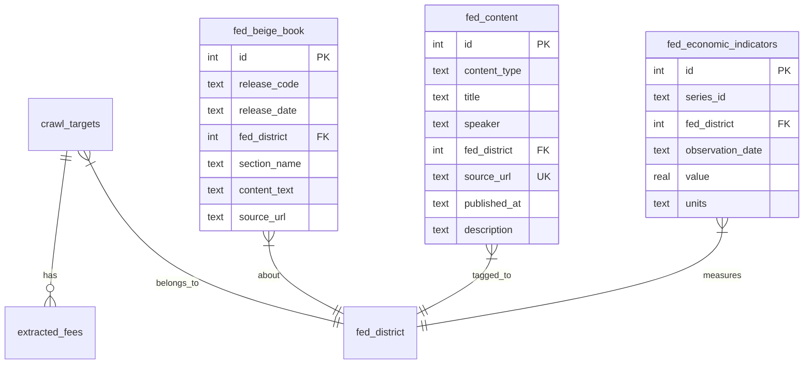

# Fed District Commentary & Beige Book Integration

## Overview

Add Federal Reserve district-level content (Beige Book reports, Fed speeches, research papers, FRED economic indicators) to FeeSchedule Hub. This gives analysts regional economic context alongside fee benchmarking data -- enabling them to understand *why* fees in a district are changing, not just *that* they changed.

**Scope**: Informational display only (no computed correlation between commentary and fee data in V1). All data sources are public, free, and require no authentication except FRED (free API key).

## Problem Statement

Analysts reviewing fee data see institution-level metrics but lack regional economic context. When a District 6 bank raises overdraft fees, the analyst cannot easily determine whether this reflects regional economic stress, competitive positioning, or regulatory response. The Federal Reserve publishes exactly this context 8 times per year in the Beige Book, plus ongoing speeches, research papers, and economic indicators -- all organized by the same 12 districts already modeled in the app.

## Proposed Solution

### Data Pipeline (Python)

Add 3 new CLI commands to the existing crawler pipeline, following the `ingest_fdic`/`ingest_cfpb` pattern:

1. **`ingest-beige-book`** -- Scrape Beige Book HTML from `federalreserve.gov`, parse per-district sections, store full text
2. **`ingest-fed-speeches`** -- Parse Board of Governors RSS feed + Fed in Print per-district RSS feeds, tag speakers to districts
3. **`ingest-fred`** -- Fetch district-level economic indicators from FRED API (requires API key)

### Database (SQLite)

Add 3 new tables following existing conventions (`CREATE TABLE IF NOT EXISTS`, UNIQUE constraints for upsert, `fetched_at` timestamps):

```sql
CREATE TABLE IF NOT EXISTS fed_beige_book (
    id INTEGER PRIMARY KEY AUTOINCREMENT,
    release_date TEXT NOT NULL,
    release_code TEXT NOT NULL,
    fed_district INTEGER,
    section_name TEXT NOT NULL,
    content_text TEXT NOT NULL,
    source_url TEXT NOT NULL,
    fetched_at TEXT NOT NULL DEFAULT (datetime('now')),
    UNIQUE(release_code, fed_district, section_name)
);

CREATE TABLE IF NOT EXISTS fed_content (
    id INTEGER PRIMARY KEY AUTOINCREMENT,
    content_type TEXT NOT NULL,
    title TEXT NOT NULL,
    speaker TEXT,
    fed_district INTEGER,
    source_url TEXT NOT NULL UNIQUE,
    published_at TEXT NOT NULL,
    description TEXT,
    source_feed TEXT,
    fetched_at TEXT NOT NULL DEFAULT (datetime('now'))
);

CREATE TABLE IF NOT EXISTS fed_economic_indicators (
    id INTEGER PRIMARY KEY AUTOINCREMENT,
    series_id TEXT NOT NULL,
    series_title TEXT,
    fed_district INTEGER,
    observation_date TEXT NOT NULL,
    value REAL,
    units TEXT,
    frequency TEXT,
    fetched_at TEXT NOT NULL DEFAULT (datetime('now')),
    UNIQUE(series_id, observation_date)
);
```

### Frontend (Next.js)

Add Fed commentary to 4 UI surfaces, all server-rendered, gracefully degrading when no data exists:

1. **Segment Builder card** (peers page) -- Show latest Beige Book summary when 1 district selected
2. **District map tooltip** -- Add one-line Beige Book headline to existing tooltip
3. **Institution detail page** -- "Regional Context" section with Beige Book excerpt + recent speeches
4. **New `/admin/districts/[id]` route** -- Full district detail page (Beige Book, speeches, research, FRED indicators)



## Technical Approach

### Data Sources & Access Patterns

| Source | URL Pattern | Auth | Frequency | Format |
|--------|------------|------|-----------|--------|
| Beige Book | `federalreserve.gov/monetarypolicy/beigebook{YYYYMM}-{district-slug}.htm` | None | 8x/year | HTML scrape |
| Board Speeches | `federalreserve.gov/feeds/speeches.xml` | None | ~2-5/week | RSS 2.0 |
| Fed in Print | `fedinprint.org/rss/{bank}.rss` (12 feeds) | None | Varies | RSS |
| FRED API | `api.stlouisfed.org/fred/series/observations` | API key | Monthly+ | JSON |

**Beige Book district URL slugs** (maps to `DISTRICT_NAMES` in `fed-districts.ts`):

| District | Slug |
|----------|------|
| 1 Boston | `boston` |
| 2 New York | `new-york` |
| 3 Philadelphia | `philadelphia` |
| 4 Cleveland | `cleveland` |
| 5 Richmond | `richmond` |
| 6 Atlanta | `atlanta` |
| 7 Chicago | `chicago` |
| 8 St. Louis | `st-louis` |
| 9 Minneapolis | `minneapolis` |
| 10 Kansas City | `kansas-city` |
| 11 Dallas | `dallas` |
| 12 San Francisco | `san-francisco` |

**Fed in Print RSS slugs** (slightly different):

| District | RSS URL |
|----------|---------|
| 1 | `fedinprint.org/rss/boston.rss` |
| 2 | `fedinprint.org/rss/newyork.rss` |
| 3 | `fedinprint.org/rss/philadelphia.rss` |
| 4 | `fedinprint.org/rss/cleveland.rss` |
| 5 | `fedinprint.org/rss/richmond.rss` |
| 6 | `fedinprint.org/rss/atlanta.rss` |
| 7 | `fedinprint.org/rss/chicago.rss` |
| 8 | `fedinprint.org/rss/stlouis.rss` |
| 9 | `fedinprint.org/rss/minneapolis.rss` |
| 10 | `fedinprint.org/rss/kansascity.rss` |
| 11 | `fedinprint.org/rss/dallas.rss` |
| 12 | `fedinprint.org/rss/sanfrancisco.rss` |

**Speaker-to-district mapping** (for speech tagging):

```python
FED_PRESIDENT_DISTRICT = {
    "Collins": 1, "Williams": 2, "Harker": 3, "Hammack": 4,
    "Barkin": 5, "Bostic": 6, "Goolsbee": 7, "Musalem": 8,
    "Kashkari": 9, "Schmid": 10, "Logan": 11, "Daly": 12,
}
BOARD_GOVERNORS = {"Powell", "Jefferson", "Barr", "Bowman", "Cook", "Kugler", "Waller"}
```

Note: President mapping needs periodic updates when leadership changes. Check `federalreserve.gov/aboutthefed/bios/banks/`.

### Implementation Phases

#### Phase 1: Beige Book Pipeline + Schema

**Files to modify:**
- `fee_crawler/db.py` -- Add `fed_beige_book`, `fed_content`, `fed_economic_indicators` tables + indexes
- `fee_crawler/config.py` -- Add `FedContentConfig` and `FREDConfig` Pydantic models
- `fee_crawler/__main__.py` -- Register `ingest-beige-book` subcommand

**Files to create:**
- `fee_crawler/commands/ingest_beige_book.py` -- Beige Book HTML scraper

**CLI interface:**
```
python -m fee_crawler ingest-beige-book                    # Latest edition
python -m fee_crawler ingest-beige-book --edition 202601   # Specific edition
python -m fee_crawler ingest-beige-book --all              # All available editions
```

**Parsing strategy:** Use BeautifulSoup (already in stack). Beige Book pages have `<h4>` headings for sections ("Summary of Economic Activity", "Labor Markets", "Prices", etc.) with `<p>` body text. Extract each section as a separate row in `fed_beige_book`.

**Dependencies:** `beautifulsoup4` (already installed), `requests` (already installed)

**Acceptance criteria:**
- [x] `fed_beige_book` table created on first run
- [x] Scrapes national summary + all 12 districts for a given edition
- [x] Stores each section separately (Summary, Labor Markets, Prices, etc.)
- [x] UPSERT on `(release_code, fed_district, section_name)` -- idempotent re-runs
- [x] Respectful crawl delay (2s between requests)
- [x] Handles missing/unavailable editions gracefully (skip with warning)

#### Phase 2: Fed Speeches + Research RSS

**Files to create:**
- `fee_crawler/commands/ingest_fed_content.py` -- RSS ingestion for speeches + Fed in Print

**CLI interface:**
```
python -m fee_crawler ingest-fed-content                   # All feeds
python -m fee_crawler ingest-fed-content --type speeches   # Speeches only
python -m fee_crawler ingest-fed-content --type research   # Research only
python -m fee_crawler ingest-fed-content --limit 50        # Recent N items
```

**Dependencies:** Add `feedparser` to `requirements.txt`

**Speaker tagging:** Extract last name from RSS `<title>` (format: "LastName, Speech Title"), look up in `FED_PRESIDENT_DISTRICT` dict. Board governors get `fed_district=NULL`.

**Acceptance criteria:**
- [x] Parses Board speeches RSS feed (`federalreserve.gov/feeds/speeches.xml`)
- [x] Parses all 12 Fed in Print RSS feeds
- [x] Tags speeches to districts via speaker name mapping
- [x] UPSERT on `source_url` UNIQUE constraint -- idempotent
- [x] Stores content type (`speech`, `testimony`, `research`, `press_release`)

#### Phase 3: FRED Economic Indicators

**Files to create:**
- `fee_crawler/commands/ingest_fred.py` -- FRED API client

**CLI interface:**
```
python -m fee_crawler ingest-fred                          # All configured series
python -m fee_crawler ingest-fred --series UNRATE          # Specific series
python -m fee_crawler ingest-fred --from-date 2024-01-01   # Historical backfill
```

**Config:**
```yaml
fred:
  api_key: ""  # Or FRED_API_KEY env var
  series:
    - UNRATE           # National unemployment rate
    - USNIM            # Net interest margin, all US banks
    - EQTA             # Equity capital to assets, all US banks
    - DPSACBM027NBOG   # Deposits, all commercial banks
```

**District-level strategy:** Most FRED series are national or state-level, not district-level. For district-level views, aggregate state data using `STATE_TO_DISTRICT` mapping. Store the aggregated result with `fed_district` set.

**Acceptance criteria:**
- [x] FRED API key configurable via env var or config.yaml
- [x] Fetches configured series with date range filtering
- [x] Stores in `fed_economic_indicators` with UPSERT
- [x] Handles rate limits (120 req/min) with backoff
- [x] Prints summary of series fetched and rows stored

#### Phase 4: TypeScript Query Layer

**File to modify:** `src/lib/crawler-db.ts`

New query functions:
```typescript
// Beige Book
export interface BeigeBookSection {
  id: number;
  release_date: string;
  release_code: string;
  fed_district: number | null;
  section_name: string;
  content_text: string;
  source_url: string;
}
export function getLatestBeigeBook(district: number): BeigeBookSection[]
export function getBeigeBookEditions(limit?: number): { release_code: string; release_date: string }[]
export function getBeigeBookHeadline(district: number): { text: string; release_date: string } | null

// Fed content (speeches, research)
export interface FedContentItem {
  id: number;
  content_type: string;
  title: string;
  speaker: string | null;
  fed_district: number | null;
  source_url: string;
  published_at: string;
  description: string | null;
}
export function getDistrictContent(district: number, limit?: number): FedContentItem[]
export function getRecentSpeeches(limit?: number): FedContentItem[]

// FRED indicators
export interface EconomicIndicator {
  series_id: string;
  series_title: string | null;
  observation_date: string;
  value: number | null;
  units: string | null;
}
export function getDistrictIndicators(district: number): EconomicIndicator[]
```

All functions follow existing pattern: check if table exists (try/catch), return empty array if not.

**Acceptance criteria:**
- [x] All functions handle missing tables gracefully (return empty)
- [x] `getBeigeBookHeadline` returns first sentence of "Summary of Economic Activity" section
- [x] `getDistrictContent` supports filtering by `content_type`
- [x] Functions match existing naming and return type conventions

#### Phase 5: UI Integration -- Segment Builder + Tooltip

**Files to modify:**
- `src/app/admin/peers/page.tsx` -- Pass Beige Book data to segment builder card
- `src/components/district-map-select.tsx` -- Add headline to tooltip
- `src/components/peer-preview-panel.tsx` -- Add regional context section

**Segment Builder card behavior:**
- When exactly 1 district is selected: show "Regional Context" section with Beige Book summary excerpt + "Published {date}" badge
- When multiple districts selected: show "Select a single district for regional context"
- When no districts selected: section hidden

**Tooltip addition:**
- Add a single line below existing stats: latest Beige Book headline (first sentence of "Summary of Economic Activity")
- Max ~80 chars, truncated with ellipsis if longer
- Only shown when Beige Book data exists for the district

**Acceptance criteria:**
- [x] Segment Builder shows Beige Book excerpt for single-district selection
- [x] Multi-district gracefully hides commentary with message
- [x] Tooltip shows headline without overflow on standard viewports
- [x] All sections degrade gracefully when no data exists (no empty boxes)
- [x] Dates shown with `timeAgo()` from `format.ts`

#### Phase 6: UI Integration -- Institution Detail + District Page

**Files to modify:**
- `src/app/admin/peers/[id]/page.tsx` -- Add "Regional Context" section

**Files to create:**
- `src/app/admin/districts/[id]/page.tsx` -- Full district detail page
- `src/app/admin/districts/[id]/loading.tsx` -- Skeleton

**District detail page layout:**
```
Breadcrumbs: Dashboard / Districts / {N} - {Name}
Header: District {N} - {Name}

[Beige Book Section]
  Latest edition: {date}
  Summary of Economic Activity: {full text}
  Key sections expandable (Labor Markets, Prices, etc.)

[Recent Speeches & Research]
  List of 10 most recent items
  Each: title (linked), speaker, date, type badge

[Economic Indicators] (if FRED data available)
  Sparkline charts for key metrics
  "Data as of {date}" freshness indicator
```

**Navigation:** Add "Districts" to `AdminNav` between "Peers" and "Review". Link from district map, institution detail page, and dashboard district cards.

**Acceptance criteria:**
- [x] District detail page renders with Beige Book content
- [x] Collapsible sections for Beige Book detail (using native details/summary)
- [x] Recent speeches/research list with external links
- [x] Institution detail shows "Regional Context" linked to district page
- [x] Navigation item added to AdminNav
- [x] Loading skeleton matches page layout
- [x] Empty states for each section when no data

## Prerequisite Fix

**Python-side district mapping bug**: `fee_crawler/peer.py` line 34 has `"AZ": 11` (should be 12) and line 20 has `"WV": 4` (should be 5). Fix to match the corrected TypeScript mapping in `fed-districts.ts`.

## Dependencies & Risks

| Risk | Mitigation |
|------|------------|
| `federalreserve.gov` HTML structure changes | Pin expected CSS selectors, log warnings on parse failure, manual review |
| FRED API rate limits (120 req/min) | Add `time.sleep(0.5)` between requests, batch by series |
| Beige Book staleness (6+ weeks between editions) | Show "Published {date}" badge, `timeAgo()` indicator |
| Speaker-to-district mapping becomes stale | Make it a config dict, not hardcoded; log unmatched speakers |
| SQLite storage growth from full text | ~50KB per Beige Book edition (12 districts x ~3KB), negligible over years |
| RSS feeds disappear or change format | Use `feedparser` (handles format variations), log parse errors, skip bad items |

**New Python dependencies:**
- `feedparser` (BSD license, well-maintained, 40M+ downloads)

**New config entries:**
- `config.yaml` → `fred.api_key` (or `FRED_API_KEY` env var)
- `config.yaml` → `fed_content.crawl_delay` (default 2.0s)

## Ingestion Schedule

| Command | Frequency | Trigger |
|---------|-----------|---------|
| `ingest-beige-book` | After each FOMC meeting (~8x/year) | Manual or calendar-based cron |
| `ingest-fed-content --type speeches` | Daily | Cron or scheduler |
| `ingest-fed-content --type research` | Weekly | Cron or scheduler |
| `ingest-fred` | Monthly | Cron or scheduler |

## Success Metrics

- Analysts can see Beige Book summary for a selected district within 1 click from the peers page
- District detail page loads in <500ms (SQLite reads, no external calls)
- Pipeline commands complete without errors for 12 months of historical data
- Zero stale data indicators on the frontend when pipeline runs on schedule

## File Inventory

### New files (8)
| File | Type | Phase |
|------|------|-------|
| `fee_crawler/commands/ingest_beige_book.py` | Python | 1 |
| `fee_crawler/commands/ingest_fed_content.py` | Python | 2 |
| `fee_crawler/commands/ingest_fred.py` | Python | 3 |
| `src/app/admin/districts/[id]/page.tsx` | Server component | 6 |
| `src/app/admin/districts/[id]/loading.tsx` | Server component | 6 |

### Modified files (8)
| File | Phase | Changes |
|------|-------|---------|
| `fee_crawler/db.py` | 1 | 3 new tables, indexes, migrations |
| `fee_crawler/config.py` | 1 | `FedContentConfig`, `FREDConfig` classes |
| `fee_crawler/__main__.py` | 1-3 | 3 new subcommands |
| `fee_crawler/peer.py` | Prereq | Fix AZ (11→12), WV (4→5) district mapping |
| `fee_crawler/requirements.txt` | 2 | Add `feedparser` |
| `src/lib/crawler-db.ts` | 4 | ~8 new query functions |
| `src/app/admin/peers/page.tsx` | 5 | Pass Beige Book data to segment builder |
| `src/components/district-map-select.tsx` | 5 | Add headline to tooltip |
| `src/components/peer-preview-panel.tsx` | 5 | Add regional context section |
| `src/app/admin/peers/[id]/page.tsx` | 6 | Add Regional Context section |
| `src/app/admin/admin-nav.tsx` | 6 | Add "Districts" nav item |

## References

- [Federal Reserve Beige Book](https://www.federalreserve.gov/monetarypolicy/publications/beige-book-default.htm)
- [Board of Governors RSS Feeds](https://www.federalreserve.gov/feeds/feeds.htm)
- [Fed in Print (per-district research)](https://www.fedinprint.org/rss)
- [FRED API Documentation](https://fred.stlouisfed.org/docs/api/fred/)
- [GeoFRED Regional Data (district-level)](https://fred.stlouisfed.org/docs/api/geofred/regional_data.html)
- Existing ingestion pattern: `fee_crawler/commands/ingest_fdic.py`, `fee_crawler/commands/ingest_cfpb.py`
- Existing district model: `src/lib/fed-districts.ts`, `fee_crawler/peer.py`
