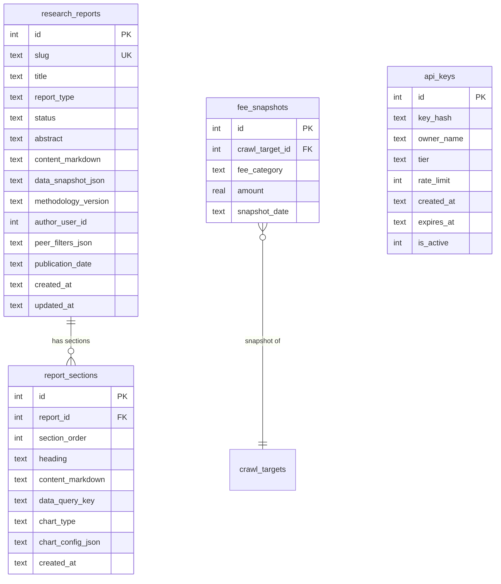

# feat: Federal Data → Consulting Research Pipeline

## Overview

Build a clear, end-to-end pipeline that transforms Bank Fee Index's federal data assets (FDIC, NCUA, CFPB, Federal Reserve, FRED) into publishable, consulting-grade research products. The pipeline connects six stages: **Ingest → Clean → Enrich → Analyze → Synthesize → Distribute**.

Stages 1–3 (Ingest, Clean, Enrich) are largely built. Stage 4 (Analyze) is partially built. **Stage 5 (Synthesize) is the critical gap** — the transformation of statistical findings into structured, citation-ready, narratively framed research output. Stage 6 (Distribute) has web infrastructure but lacks PDF, API auth, and newsletter channels.

## Problem Statement

The project has exceptional raw data coverage:

| Source | Records | Status |
|--------|---------|--------|
| Extracted fees | 65,287 | Active |
| FDIC Call Reports | 34,553 | Active |
| NCUA 5300 Reports | 4,419 | Active |
| CFPB Complaints | 2,069 | Active |
| Fed Beige Book | 114 sections | Active |
| Fed Speeches/Research | 315 items | Active |
| FRED Economic Indicators | 0 | Schema only |
| Fee Snapshots | 0 | Schema only |
| Fee Change Events | 0 | Schema only |

But there is no mechanism to go from "analysis findings" to "published research report." The middle of the pipeline — draft, review, format, publish — does not exist. Consulting clients cannot get branded PDF reports. Quarterly reports cannot be automated. AI agent findings cannot be saved to reports.

## Proposed Solution

### Architecture: The Six-Stage Pipeline

```
Stage 1: INGEST           Stage 2: CLEAN            Stage 3: ENRICH
─────────────────          ─────────────────          ─────────────────
Crawl fee schedules        Validation rules           Call report join
FDIC/NCUA APIs             Confidence scoring         CFPB complaint join
Beige Book scraping        Duplicate detection         Fed district mapping
FRED indicators            Outlier flagging            Asset tier assignment
CFPB complaints            Human review queue          Peer group computation
                           Auto-staging rules

Status: BUILT              Status: BUILT              Status: BUILT
Gap: FRED data empty       Gap: 99.7% unreviewed      Gap: FRED join missing


Stage 4: ANALYZE           Stage 5: SYNTHESIZE        Stage 6: DISTRIBUTE
─────────────────          ─────────────────          ─────────────────
Statistical aggregation    Report data model           Public pages (SSG)
Percentile computation     Template engine             REST API + auth
Cross-tabulation           Narrative framing           PDF generation
Trend detection            Methodology notes           CSV/JSON export
Peer benchmarking          Source citations             Newsletter
Correlation analysis       Draft/review/publish        Consulting deliverables

Status: MOSTLY BUILT       Status: NOT BUILT          Status: PARTIALLY BUILT
Gap: temporal analysis     THE CRITICAL GAP           Gap: PDF, API auth, email
```

### Data Model: The `research_reports` Table

This is the connective tissue between all pipeline flows.

```sql
-- fee_crawler/db.py
CREATE TABLE IF NOT EXISTS research_reports (
    id INTEGER PRIMARY KEY AUTOINCREMENT,
    slug TEXT NOT NULL UNIQUE,
    title TEXT NOT NULL,
    report_type TEXT NOT NULL,          -- quarterly | peer_benchmark | category_analysis | state_report | custom
    status TEXT NOT NULL DEFAULT 'draft', -- draft | review | published | archived
    abstract TEXT,
    content_markdown TEXT,
    data_snapshot_json TEXT,            -- frozen data at time of publication
    methodology_version TEXT,
    author_user_id INTEGER,
    peer_filters_json TEXT,            -- for peer benchmark reports
    publication_date TEXT,
    created_at TEXT DEFAULT (datetime('now')),
    updated_at TEXT DEFAULT (datetime('now'))
);

CREATE TABLE IF NOT EXISTS report_sections (
    id INTEGER PRIMARY KEY AUTOINCREMENT,
    report_id INTEGER NOT NULL REFERENCES research_reports(id),
    section_order INTEGER NOT NULL,
    heading TEXT NOT NULL,
    content_markdown TEXT,
    data_query_key TEXT,               -- references a pre-computed analysis
    chart_type TEXT,                   -- bar | histogram | table | map | none
    chart_config_json TEXT,
    created_at TEXT DEFAULT (datetime('now'))
);
```

### Report Types

| Type | Cadence | Audience | Template |
|------|---------|----------|----------|
| **Quarterly Fee Index** | Quarterly | Public | FDIC QBP structure: exec summary, national overview, segmentation, deep dive, appendix |
| **Peer Benchmark** | On-demand | Consulting clients | Institution vs peer group comparison with positioning |
| **Category Analysis** | Monthly/ad-hoc | Public + professional | Deep dive into one fee category across all dimensions |
| **State Report** | Quarterly | Public | State-level benchmarks with national delta (already exists as static pages) |
| **Custom Research** | On-demand | Enterprise clients | Analyst-generated from AI agent findings |

---

## Technical Approach

### Phase 1: Foundation — Data Quality + Temporal Data

**Goal:** Establish the minimum data quality bar for publishing and enable trend analysis.

#### 1.1 Populate Fee Snapshots

Build `fee_crawler/commands/snapshot_fees.py`:

```python
# fee_crawler/commands/snapshot_fees.py
def snapshot_fees(db, snapshot_date=None):
    """Copy current approved+staged fees to fee_snapshots table."""
    date = snapshot_date or datetime.now().strftime("%Y-%m-%d")
    db.execute("""
        INSERT INTO fee_snapshots (crawl_target_id, fee_category, amount, snapshot_date)
        SELECT crawl_target_id, fee_category, amount, ?
        FROM extracted_fees
        WHERE review_status IN ('approved', 'staged')
          AND fee_category IS NOT NULL
          AND amount IS NOT NULL
    """, (date,))
```

- [ ] Create `snapshot_fees.py` CLI command (`python -m fee_crawler snapshot`)
- [ ] Run initial snapshot to populate baseline data
- [ ] Add `--date` flag for backfilling historical snapshots
- [ ] Build `getSnapshotComparison()` query in `src/lib/crawler-db/fees.ts`

#### 1.2 Populate FRED Economic Indicators

- [ ] Configure FRED API key in environment
- [ ] Run `python -m fee_crawler ingest-fred` for key series: unemployment rate, CPI, GDP, federal funds rate — per Fed district where available
- [ ] Build `getDistrictEconomicContext()` query joining `fed_economic_indicators` with fee data

#### 1.3 Create Methodology Page

- [ ] Create `/methodology` public page (versioned: "Methodology v1.0, March 2026")
- [ ] Sections: Data Sources, Collection Process, Validation Rules, Statistical Methods, Fee Taxonomy, Update Cadence, Limitations, Citation Guide
- [ ] Link from every research page footer
- [ ] Include observation counts and coverage statistics

#### 1.4 Add Observation Counts to All Public Statistics

- [ ] Every median/percentile on public pages shows `(N=X)` institution count
- [ ] Maturity badges (strong/provisional/insufficient) on public-facing data
- [ ] "As of [date]" timestamp on every data page

### Phase 2: Report Engine — Synthesize Layer

**Goal:** Build the admin interface for creating, editing, and publishing research reports.

#### 2.1 Database Schema

- [ ] Add `research_reports` table to `fee_crawler/db.py`
- [ ] Add `report_sections` table
- [ ] Create migration command or add to schema initialization
- [ ] Add TypeScript types in `src/lib/crawler-db/types.ts`
- [ ] Add query functions in `src/lib/crawler-db/reports.ts`: `getReports()`, `getReport(slug)`, `createReport()`, `updateReport()`, `publishReport()`

#### 2.2 Report Templates

Pre-built templates for each report type with fixed sections:

```
QUARTERLY FEE INDEX TEMPLATE
─────────────────────────────
1. Executive Summary (300 words max)
   - Lead with single most important finding
   - 3 supporting data points
   - One forward-looking implication
2. Methodology Note (standardized, versioned)
3. National Overview
   - Headline metrics (spotlight 6 fees)
   - Quarter-over-quarter change (from fee_snapshots)
4. Segmentation Analysis
   - Charter type: bank vs credit union
   - Asset tier: 5 tiers
   - Geographic: 12 Fed districts
5. Deep Dive (rotating topic each quarter)
6. Statistical Appendix (full 49-category table)
7. About / Citation Guide
```

- [ ] Define template structure in `src/lib/report-templates.ts`
- [ ] Each template specifies: required sections, data queries per section, chart types, narrative prompts
- [ ] Template for quarterly, peer benchmark, category analysis

#### 2.3 Admin Report Builder

- [ ] Add `/admin/reports` page listing all reports (draft, review, published)
- [ ] Add `/admin/reports/new` page with template selection
- [ ] Add `/admin/reports/[id]/edit` page with:
  - Section editor (markdown with live preview)
  - Data query results panel (pre-computed stats for the section)
  - Chart configuration (type, data source, labels)
  - Status workflow: Draft → Review → Published
- [ ] "Generate from template" button that pre-fills sections with current data
- [ ] "Save finding from agent" action in research chat that appends to a draft report

#### 2.4 Public Report Pages

- [ ] Dynamic route at `/research/reports/[slug]`
- [ ] Renders `content_markdown` with embedded data components
- [ ] Metadata: publication date, methodology version, data snapshot date
- [ ] Citation block at bottom: "Source: Bank Fee Index, [Date]. Based on [N] observations from [M] institutions."
- [ ] Download as PDF link (Phase 3)

### Phase 3: Distribution — PDF, API Auth, Export

**Goal:** Enable all distribution channels: web, PDF, API, CSV.

#### 3.1 PDF Report Generation

Using `@react-pdf/renderer`:

- [ ] Add `@react-pdf/renderer` to dependencies
- [ ] Create report PDF components in `src/components/reports/`:
  - `report-pdf.tsx` — main document layout (cover page, headers, footers)
  - `report-table.tsx` — data tables with fee amounts
  - `report-chart-placeholder.tsx` — static chart images (pre-rendered)
- [ ] API route at `/api/v1/reports/[slug]/pdf` that renders and streams PDF
- [ ] Branding: Bank Fee Index header, page numbers, methodology footer, citation block
- [ ] For consulting clients: accept `?branding=minimal` to reduce Bank Fee Index branding

#### 3.2 API Authentication

- [ ] Add `api_keys` table: `id, key_hash, owner_name, tier (free|pro|enterprise), rate_limit, created_at, expires_at, is_active`
- [ ] Middleware in `/api/v1/` that checks `Authorization: Bearer <key>` header
- [ ] Free tier: no key required, 100 calls/day per IP (current behavior + rate limit)
- [ ] Pro tier: API key required, 5,000 calls/day
- [ ] Enterprise tier: API key, 50,000 calls/day, institution-level data access
- [ ] Add `Access-Control-Allow-Origin: *` for GET requests (enable browser consumers)
- [ ] Usage tracking: log every API call with key, endpoint, timestamp

#### 3.3 Enhanced Data Export

- [ ] `/api/v1/export` endpoint supporting:
  - `?format=csv` — CSV with headers
  - `?format=json` — JSON array
  - `?format=xlsx` — Excel (using a lightweight lib)
  - `?scope=national|state|district|institution`
  - `?categories=overdraft,nsf,atm` — filter by fee category
- [ ] Streaming response for large datasets
- [ ] Include metadata row/header with source, date, methodology version

### Phase 4: Automated Pipeline — Quarterly Reports

**Goal:** Automate the quarterly report generation cycle.

#### 4.1 Pipeline Orchestration

```
fee_crawler pipeline --quarterly
  1. crawl (refresh fee data)
  2. snapshot (capture current state to fee_snapshots)
  3. compute (pre-compute all statistics, write to analysis_results)
  4. generate-report (create draft quarterly report from template)
  5. notify (alert admin that draft is ready for review)
```

- [ ] Add `quarterly-pipeline` CLI command that orchestrates steps 1–5
- [ ] Add `generate-report` CLI command that creates a draft report from a template
- [ ] Quality gates: only generate if coverage ≥ threshold, observation count ≥ minimum
- [ ] Idempotency: skip if report for current quarter already exists

#### 4.2 Scheduling

- [ ] GitHub Actions workflow with cron schedule:
  - Weekly: `crawl` + `categorize` + `validate`
  - Quarterly (Jan 15, Apr 15, Jul 15, Oct 15): full pipeline
- [ ] On-demand revalidation: POST to `/api/revalidate` after pipeline completes
- [ ] Error notification: GitHub Actions failure alerts

#### 4.3 Narrative Generation

Use Claude API to generate first-draft narratives from structured data:

- [ ] `fee_crawler/commands/generate_narrative.py`
- [ ] Input: pre-computed statistics (JSON) + template prompts
- [ ] Output: markdown sections with data-backed sentences
- [ ] Pattern: "Community credit unions charge a median overdraft fee of $25.00, $10.00 less than national-charter banks (N=2,734 institutions, Bank Fee Index Q1 2026)."
- [ ] Human review required before publishing (status = 'review', not 'published')

### Phase 5: Consulting Client Flow

**Goal:** Enable analyst-mediated consulting deliverables. (Self-service portal deferred to v2.)

#### 5.1 Peer Benchmark Report Workflow

- [ ] Admin page: `/admin/reports/benchmark`
- [ ] Select institution (search by name)
- [ ] Define peer group (charter, asset tier, district, state)
- [ ] System generates comparison: institution fees vs peer medians, percentile ranking
- [ ] Preview report in browser
- [ ] Export as branded PDF
- [ ] Track report generation for billing

#### 5.2 Report Delivery

- [ ] For v1: analyst emails PDF to client manually
- [ ] Track deliveries in `report_deliveries` table (report_id, client_name, delivered_at)
- [ ] Future (v2): client login portal, self-service peer group configuration

---

## Acceptance Criteria

### Functional Requirements

- [ ] `fee_snapshots` table populated with baseline data via CLI command
- [ ] FRED economic indicators ingested for key series
- [ ] `/methodology` page published with versioned content
- [ ] All public statistics show observation counts
- [ ] `research_reports` and `report_sections` tables created
- [ ] Admin can create, edit, and publish reports via `/admin/reports`
- [ ] Published reports render at `/research/reports/[slug]`
- [ ] PDF export generates branded reports via `/api/v1/reports/[slug]/pdf`
- [ ] API endpoints authenticated with API keys (free tier open, pro/enterprise keyed)
- [ ] Quarterly pipeline command automates snapshot + compute + draft generation
- [ ] Peer benchmark report can be generated for any institution against any peer group

### Non-Functional Requirements

- [ ] PDF generation completes in < 5 seconds for standard reports
- [ ] API rate limiting enforced (100/day free, 5K/day pro)
- [ ] All published statistics include methodology version and date
- [ ] Report content stored with frozen data snapshot (reproducibility)

---

## Success Metrics

| Metric | Target |
|--------|--------|
| Published quarterly reports | 1 per quarter starting Q2 2026 |
| Peer benchmark reports generated | 10+ in first 6 months |
| API keys issued (pro tier) | 5+ in first 6 months |
| Data export downloads | 50+/month |
| Methodology page views | Indicates researcher/journalist interest |
| PDF report downloads | 20+/month after launch |

## Dependencies & Risks

**Dependencies:**
- FRED API key (for economic indicators ingestion)
- `@react-pdf/renderer` (for PDF generation)
- Claude API (for narrative generation — already integrated)
- GitHub Actions (for pipeline scheduling)

**Risks:**
- **Data quality:** 99.7% of fees are unreviewed. Publishing research on unvalidated data creates reputational risk. **Mitigation:** Implement auto-review rules as Phase 0 prerequisite; show maturity badges on all statistics.
- **Temporal data gap:** Fee snapshots table is empty. Without historical data, quarterly reports cannot show trends for the first 2 quarters. **Mitigation:** Take initial snapshot immediately; backfill from crawl history if possible.
- **PDF complexity:** `@react-pdf/renderer` has limited CSS support. Complex chart rendering may require pre-rendered images. **Mitigation:** Use static chart images (SVG → PNG) embedded in PDFs rather than rendering charts in React-PDF.

## References

### Internal

- `fee_crawler/db.py` — Complete schema (18 tables)
- `fee_crawler/commands/` — 16 CLI commands
- `src/lib/crawler-db/` — 14 query files, 47+ exports
- `src/lib/research/` — AI agent definitions and tools
- `src/app/api/v1/` — Existing REST API (3 endpoints)
- `plans/feat-research-pipelines.md` — 7-pipeline architecture (partially implemented)
- `plans/feat-ai-research-platform.md` — AI agents plan (mostly implemented)
- `plans/roadmap-bank-fee-index-2026.md` — Full 6-phase roadmap

### External

- [FDIC Quarterly Banking Profile](https://www.fdic.gov/quarterly-banking-profile) — Template for quarterly reports
- [McKinsey Pyramid Principle](https://slideworks.io/resources/the-pyramid-principle-mckinsey-toolbox-with-examples) — Narrative framing
- [React-PDF Renderer](https://react-pdf.org/) — PDF generation
- [FRED API](https://fred.stlouisfed.org/docs/api/) — Economic indicators
- [Curinos Pricing Data](https://curinos.com/pricing-data/) — Competitive reference
- [Next.js ISR Guide](https://nextjs.org/docs/app/guides/incremental-static-regeneration) — Revalidation patterns

---

## ERD: Report Pipeline Data Model



## Implementation Sequence

```
Phase 1 (Foundation)          Phase 2 (Report Engine)        Phase 3 (Distribution)
──────────────────            ──────────────────────          ──────────────────────
1.1 Fee snapshots CLI         2.1 DB schema + queries        3.1 PDF generation
1.2 FRED ingestion            2.2 Report templates           3.2 API key auth
1.3 Methodology page          2.3 Admin report builder       3.3 Enhanced export
1.4 Observation counts        2.4 Public report pages

Phase 4 (Automation)          Phase 5 (Consulting)
──────────────────            ──────────────────
4.1 Pipeline orchestration    5.1 Peer benchmark workflow
4.2 GitHub Actions cron       5.2 Report delivery tracking
4.3 Narrative generation
```

Each phase is independently shippable. Phase 1 can be completed without any other phase. Phase 2 depends on Phase 1 (needs snapshot data for quarterly reports). Phase 3 depends on Phase 2 (needs reports to export as PDF). Phases 4 and 5 depend on Phase 2+3.
