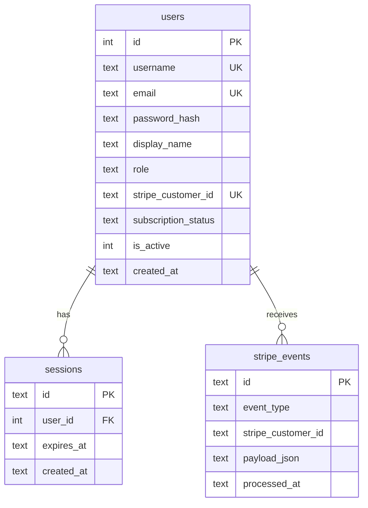

# feat: Stripe Payments & Account Management

## Enhancement Summary

**Deepened on:** 2026-03-15
**Agents used:** security-sentinel, architecture-strategist, performance-oracle, data-migration-expert, data-integrity-guardian, deployment-verification-agent, code-simplicity-reviewer, pattern-recognition-specialist, kieran-typescript-reviewer, learnings-analyzer

### Key Improvements from Deepening
1. **Simplified to ~160 lines of new code** -- cut 4 planned tables to 0 new tables + 3 columns on `users` (simplicity reviewer)
2. **Fixed critical SHA-256 hash format bug** -- legacy verify used wrong separator (architecture reviewer)
3. **Added atomic webhook processing** -- INSERT OR IGNORE + single transaction prevents TOCTOU races (data-integrity)
4. **Reduced bcrypt rounds 12 -> 10** -- 4x faster on shared-cpu-1x, still secure (performance oracle)
5. **Added rate limiting on auth endpoints** -- missing from original plan, critical security gap (security sentinel)
6. **Fixed role overloading problem** -- subscription status must be separate from authorization role (architecture)
7. **Added CI stub table updates** -- new tables break CI builds without stubs (data-migration, learnings)
8. **Added `timingSafeEqual` for legacy hash comparison** -- prevents timing attacks during migration (typescript reviewer)

### Simplification Decisions (from Code Simplicity Review)
| Originally Planned | Decision | Reason |
|---|---|---|
| `subscriptions` table | **Cut** | Add 3 columns to `users` instead (under 100 users) |
| `stripe_events` table | **Keep** | Required for webhook idempotency (no alternative) |
| `password_reset_tokens` table | **Defer** | Admin can reset manually for MVP |
| `waitlist` table migration | **Defer** | JSON file works; migrate when needed |
| Email verification flow | **Defer** | No abuse problem at this scale |
| Password reset flow | **Defer** | "Email me" is fine for <100 users |
| Resend integration | **Defer** | Stripe sends receipts; add email later |
| `middleware.ts` | **Cut** | Per-page `requireAuth()` already works |
| TierLimits (7 properties) | **Cut** | Replace with boolean `canAccessPremium()` |
| 4-phase rollout | **Simplified** | 2 phases: MVP + Polish |

---

## Overview

Add Stripe subscription billing and basic account management to Bank Fee Index. The existing custom auth system will be extended to support email-based registration and Stripe checkout. Scope is deliberately minimal -- accept money first, add polish later.

**Stack choices:**
| Layer | Choice | Rationale |
|-------|--------|-----------|
| Payments | Stripe | Best SDK, lowest fees (2.9%+30c), full control |
| Auth | Extend existing custom auth | Already works (200 lines), avoid migration risk |
| Password hashing | bcrypt 10 rounds (upgrade from SHA-256) | Required for public-facing registration |
| Email | Stripe receipts only (MVP) | Defer Resend until needed |
| Database | SQLite (existing) | Sufficient for single-machine Fly.io |
| Billing portal | Stripe Customer Portal | Zero UI work for subscription management |

---

## Problem Statement / Motivation

- The `premium` role exists in the permission system but there is no way for a user to become premium
- Users are only created via Python CLI `seed-users` command -- no self-registration
- The waitlist at `/pro` collects emails but has no path to conversion
- The "founding members get the first year free" promise on the waitlist page has no fulfillment mechanism
- No revenue generation despite having a production product with valuable fee intelligence data

---

## Proposed Solution

### Architecture

```
User Registration    Stripe Checkout    Stripe Webhooks
     |                    |                   |
     v                    v                   v
  [Server Action]   [Server Action]    [Route Handler]
     |                    |                   |
     v                    v                   v
  users table      Stripe API         users table
  (email, hash)    (checkout.session)  (subscription_status)
     |                                        |
     +-----> subscription_status field <------+
              none | active | past_due | canceled
```

### Identity Model Decision

Add `email` column to `users` table. Support login by **either** username or email:
- CLI-seeded admin/analyst users: continue using username
- Self-registered users: use email as both `username` and `email`
- Stripe customer creation uses the `email` field

> **Important:** Add `CREATE UNIQUE INDEX IF NOT EXISTS idx_users_username ON users(username)` -- verify current schema has this constraint.

### Content Gating Decision (NEEDS YOUR INPUT)

> **Question:** What specific content is behind the Pro paywall? Current options:
> - A) Public pages stay free, Pro unlocks the full admin dashboard (all 22 pages)
> - B) Public pages show limited data (6 spotlight fees), Pro unlocks all 49 categories + peer filters + exports
> - C) Separate `/pro/*` namespace with curated analytics experience
>
> This must be decided before implementation. The plan below assumes **Option B** but can be adjusted.

---

## Technical Approach

### Prerequisite: Fix Existing Defects (Before Any New Code)

These pre-existing issues will compound payment integration risks if not fixed first.

**P1. Consolidate duplicate `getWriteDb()` definitions**

Three separate `getWriteDb()` exist with different pragma configurations:
- `src/lib/crawler-db/connection.ts:69-77` -- canonical, includes `foreign_keys=ON`
- `src/lib/auth.ts:71-79` -- omits `foreign_keys=ON`
- `src/lib/fee-actions.ts:10-18` -- omits `foreign_keys=ON`

Delete the copies in `auth.ts` and `fee-actions.ts`; import from `connection.ts` everywhere.

**P2. Fix `getCurrentUser()` opening new DB per call**

`src/lib/auth.ts:168-184` creates a new `Database` instance on every call. Switch to using the singleton `getDb()` from `connection.ts`. This eliminates file descriptor churn and the 256MB mmap pragma overhead per call.

```typescript
// Replace lines 168-184 in auth.ts:
export async function getCurrentUser(): Promise<User | null> {
  const cookieStore = await cookies();
  const raw = cookieStore.get(SESSION_COOKIE)?.value;
  if (!raw) return null;
  const sessionId = verifyAndExtractSessionId(raw);
  if (!sessionId) return null;
  const db = getDb(); // Use singleton -- no open/close
  const row = db.prepare(
    `SELECT u.id, u.username, u.display_name, u.role
     FROM sessions s JOIN users u ON s.user_id = u.id
     WHERE s.id = ? AND s.expires_at > datetime('now') AND u.is_active = 1`
  ).get(sessionId) as User | undefined;
  return row ?? null;
}
```

**P3. Add `foreign_keys=ON` to read singleton**

The read singleton in `connection.ts` does not set `foreign_keys=ON`. Add it, or set `readonly: true` to prevent accidental writes.

**P4. Fix `searchInstitutions()` closing singleton**

`src/app/submit-fees/actions.ts:137-154` calls `getDb()` then `db.close()` in finally -- this kills the singleton for all subsequent reads.

- [ ] Delete local `getWriteDb()` from `auth.ts` and `fee-actions.ts`
- [ ] Switch `getCurrentUser()` to use `getDb()` singleton
- [ ] Add `foreign_keys=ON` to `getDb()` singleton
- [ ] Remove `db.close()` from `searchInstitutions()`

### Phase A: MVP (Schema + Stripe + Registration + Gating)

This is the minimum to accept money. One deploy, one phase.

#### Database Schema Changes

```sql
-- src/lib/crawler-db/migrations/001-payments.sql

-- Migration tracking
CREATE TABLE IF NOT EXISTS schema_migrations (
  version TEXT PRIMARY KEY,
  applied_at TEXT DEFAULT (datetime('now'))
);

-- Extend users table (3 new columns)
ALTER TABLE users ADD COLUMN email TEXT;
ALTER TABLE users ADD COLUMN stripe_customer_id TEXT;
ALTER TABLE users ADD COLUMN subscription_status TEXT DEFAULT 'none';
  -- values: none, active, past_due, canceled

CREATE UNIQUE INDEX IF NOT EXISTS idx_users_email
  ON users(email) WHERE email IS NOT NULL;
CREATE UNIQUE INDEX IF NOT EXISTS idx_users_stripe_customer
  ON users(stripe_customer_id) WHERE stripe_customer_id IS NOT NULL;

-- Webhook event log (idempotency -- REQUIRED, cannot defer)
CREATE TABLE IF NOT EXISTS stripe_events (
  id                TEXT PRIMARY KEY,       -- Stripe event ID (evt_...)
  event_type        TEXT NOT NULL,
  stripe_customer_id TEXT,
  payload_json      TEXT NOT NULL,
  processed_at      TEXT NOT NULL DEFAULT (datetime('now'))
);
CREATE INDEX IF NOT EXISTS idx_stripe_events_type ON stripe_events(event_type);

-- Record migration version
INSERT INTO schema_migrations (version) VALUES ('001-payments');
```

#### Research Insights: Migration Safety

**From data-migration-expert:**
- All `CREATE INDEX` must use `IF NOT EXISTS` for idempotency (original plan was missing this on `subscriptions` indexes)
- Add a `schema_migrations` table to track which migrations have run
- `ALTER TABLE ADD COLUMN` is forward-only in SQLite -- document this explicitly
- Before running in production, verify bundled SQLite version: `node -e "const db = require('better-sqlite3')(':memory:'); console.log(db.pragma('compile_options'))"`

**From learnings (docker-sqlite-prerender):**
- Update `STUB_TABLES` in `connection.ts` to include `stripe_events` table and new `users` columns, or CI builds will crash
- Account/payment pages must NOT use `"use cache"` or be prerendered (user-specific data)
- Do not use `force-dynamic` (incompatible with `cacheComponents` setting)

#### Password Hashing Upgrade

```typescript
// src/lib/passwords.ts
import { hash, compare } from "bcrypt";
import { createHash, timingSafeEqual } from "node:crypto";

const BCRYPT_ROUNDS = 10; // ~80ms on shared-cpu-1x (12 rounds = ~300ms)

export async function hashPassword(password: string): Promise<string> {
  return hash(password, BCRYPT_ROUNDS);
}

type HashFormat = "bcrypt" | "legacy-sha256";

function detectHashFormat(stored: string): HashFormat {
  if (stored.startsWith("$2b$") || stored.startsWith("$2a$")) return "bcrypt";
  return "legacy-sha256";
}

export async function verifyPassword(password: string, stored: string): Promise<{
  valid: boolean;
  needsRehash: boolean;
}> {
  if (detectHashFormat(stored) === "legacy-sha256") {
    const [salt, hashVal] = stored.split(":");
    // CRITICAL: use "${salt}:${password}" to match existing auth.ts format
    const check = createHash("sha256").update(`${salt}:${password}`).digest("hex");
    // Use timing-safe comparison to prevent timing attacks
    const valid = timingSafeEqual(
      Buffer.from(check, "hex"),
      Buffer.from(hashVal, "hex")
    );
    return { valid, needsRehash: true };
  }
  return { valid: await compare(password, stored), needsRehash: false };
}
```

#### Research Insights: Password Security

**From security-sentinel (CRITICAL):**
- The original plan had `createHash("sha256").update(salt + password)` but the existing `auth.ts:82-86` uses `"${salt}:${password}"` -- this would have broken ALL existing logins
- Must use `crypto.timingSafeEqual` for legacy hash comparison (prevents timing attacks during migration window)
- SHA-256 passwords remain vulnerable for users who never log in again -- consider forced reset after 90 days

**From performance-oracle:**
- 10 rounds is ~80ms on shared-cpu-1x vs ~300ms at 12 rounds -- 4x faster, still adequate security
- Set `UV_THREADPOOL_SIZE=8` in Fly.io env to double available worker threads for bcrypt
- Always use async `bcrypt.hash()`/`bcrypt.compare()` (never `hashSync`/`compareSync`)

#### Stripe Integration

**Dependencies:**
```bash
npm install stripe @stripe/stripe-js @stripe/react-stripe-js
```

**Environment variables (add to `.env.example`):**
```
STRIPE_SECRET_KEY=sk_test_...
NEXT_PUBLIC_STRIPE_PUBLISHABLE_KEY=pk_test_...
STRIPE_WEBHOOK_SECRET=whsec_...
STRIPE_PRO_PRICE_ID=price_...
```

**Files to create:**
```
src/lib/stripe.ts                          -- Stripe client singleton
src/lib/stripe-actions.ts                  -- Server actions (not src/app/actions/)
src/app/api/webhooks/stripe/route.ts       -- Webhook handler (POST)
src/app/(public)/subscribe/page.tsx        -- Subscribe page with checkout button
src/app/(public)/subscribe/success/page.tsx -- Post-checkout thank-you page
```

> **Pattern note (from pattern-recognition):** Place Stripe server actions at `src/lib/stripe-actions.ts` to match `src/lib/fee-actions.ts` pattern for cross-cutting actions. Do NOT use `src/app/actions/stripe.ts` -- inconsistent with codebase.

**Stripe client singleton:**
```typescript
// src/lib/stripe.ts
import Stripe from "stripe";

const webhookSecret = process.env.STRIPE_WEBHOOK_SECRET;
if (!webhookSecret && process.env.NODE_ENV === "production") {
  throw new Error("STRIPE_WEBHOOK_SECRET is not configured");
}

export const stripe = new Stripe(process.env.STRIPE_SECRET_KEY!, {
  typescript: true,
});

export { webhookSecret };
```

**Webhook handler (critical path -- rewritten with all agent findings):**

```typescript
// src/app/api/webhooks/stripe/route.ts
import { stripe, webhookSecret } from "@/lib/stripe";
import { getWriteDb } from "@/lib/crawler-db/connection";
import { headers } from "next/headers";
import { after } from "next/server";
import type Stripe from "stripe";

export async function POST(req: Request) {
  const body = await req.text(); // MUST be raw text, not .json()
  const signature = (await headers()).get("stripe-signature");

  if (!signature) {
    return new Response("Missing stripe-signature header", { status: 400 });
  }

  let event: Stripe.Event;
  try {
    event = stripe.webhooks.constructEvent(body, signature, webhookSecret!);
  } catch {
    return new Response("Invalid signature", { status: 400 });
  }

  // Return 200 immediately, process asynchronously
  after(async () => {
    const db = getWriteDb();
    try {
      db.transaction(() => {
        // Atomic idempotency: INSERT OR IGNORE + check changes
        const result = db.prepare(
          `INSERT OR IGNORE INTO stripe_events (id, event_type, stripe_customer_id, payload_json)
           VALUES (?, ?, ?, ?)`
        ).run(event.id, event.type, extractCustomerId(event), JSON.stringify(event));

        if (result.changes === 0) return; // Already processed

        switch (event.type) {
          case "checkout.session.completed": {
            const session = event.data.object as Stripe.Checkout.Session;
            db.prepare(
              `UPDATE users SET subscription_status = 'active', stripe_customer_id = ?
               WHERE email = ?`
            ).run(session.customer as string, session.customer_email);
            break;
          }
          case "customer.subscription.updated": {
            const sub = event.data.object as Stripe.Subscription;
            db.prepare(
              `UPDATE users SET subscription_status = ?
               WHERE stripe_customer_id = ?`
            ).run(sub.status, sub.customer as string);
            break;
          }
          case "customer.subscription.deleted": {
            const sub = event.data.object as Stripe.Subscription;
            // Only downgrade viewer/premium -- never touch analyst/admin
            db.prepare(
              `UPDATE users SET subscription_status = 'canceled'
               WHERE stripe_customer_id = ? AND role IN ('viewer', 'premium')`
            ).run(sub.customer as string);
            break;
          }
          case "invoice.payment_failed": {
            const invoice = event.data.object as Stripe.Invoice;
            db.prepare(
              `UPDATE users SET subscription_status = 'past_due'
               WHERE stripe_customer_id = ?`
            ).run(invoice.customer as string);
            break;
          }
        }
      })();
    } finally {
      db.close();
    }
  });

  return new Response(JSON.stringify({ received: true }), { status: 200 });
}

function extractCustomerId(event: Stripe.Event): string | null {
  const obj = event.data.object as Record<string, unknown>;
  return (obj.customer as string) ?? null;
}
```

#### Research Insights: Webhook Handler

**From data-integrity-guardian (CRITICAL):**
- Original plan had TOCTOU race: separate idempotency check then separate insert. Use `INSERT OR IGNORE` + `changes === 0` inside a single transaction instead
- Wrap ALL mutations (event log + status update) in one transaction for atomicity
- Never downgrade admin/analyst roles on subscription deletion -- add `AND role IN ('viewer', 'premium')` guard

**From architecture-strategist (CRITICAL):**
- Do NOT overload the `role` column with subscription status. An analyst whose subscription lapses should remain an analyst. Use a separate `subscription_status` column (or check the subscriptions table)
- Keep `role` for authorization (viewer/analyst/admin), use `subscription_status` for billing state

**From performance-oracle:**
- Use `after()` from `next/server` to return 200 immediately and process asynchronously
- Single transaction holds write lock for ~1ms instead of multiple sequential locks
- Stripe expects webhook responses within 20 seconds; heavy DB writes should not block the response

**From security-sentinel:**
- Validate `stripe-signature` header exists before calling `constructEvent`
- Fail fast if `STRIPE_WEBHOOK_SECRET` env var is missing
- Webhook route must NOT be behind any auth middleware

#### Tier Enforcement (Simplified)

```typescript
// src/lib/access.ts (renamed from tiers.ts to avoid collision with fee taxonomy tiers)

export type UserRole = "viewer" | "analyst" | "admin" | "premium";

// Exhaustive role-to-access mapping (adding a role forces a compile error here)
const ROLE_HAS_PREMIUM: Record<UserRole, boolean> = {
  admin: true,
  analyst: true,
  premium: true,
  viewer: false,
};

export function canAccessPremium(role: UserRole, subscriptionStatus?: string): boolean {
  // Admin/analyst always have access regardless of subscription
  if (ROLE_HAS_PREMIUM[role]) return true;
  // Viewers need an active subscription
  return subscriptionStatus === "active";
}
```

#### Research Insights: Type Safety

**From kieran-typescript-reviewer:**
- `getUserTier(role: string)` accepting `string` is a type safety gap -- use `UserRole` union type
- Use `Record<UserRole, T>` for exhaustive mapping so adding a new role produces a compile error
- Tier enforcement must happen server-side; client-side checks are for UX only, never security

**From code-simplicity-reviewer:**
- For 2 tiers, a boolean function `canAccessPremium()` replaces the entire TierLimits interface
- When you have 3+ tiers with actual usage data proving the need, then build the TierLimits system

#### Registration Server Action

```typescript
// src/app/(auth)/register/actions.ts
"use server";

import { stripe } from "@/lib/stripe";
import { hashPassword } from "@/lib/passwords";
import { getWriteDb } from "@/lib/crawler-db/connection";

export async function register(formData: FormData) {
  const email = formData.get("email") as string;
  const password = formData.get("password") as string;
  const name = formData.get("name") as string;

  // 1. Validate inputs (email format, password >= 8 chars)
  // 2. Create Stripe customer FIRST (external, harder to roll back)
  const stripeCustomer = await stripe.customers.create({ email, name });

  // 3. All local writes atomically
  const db = getWriteDb();
  try {
    db.transaction(() => {
      const hashedPw = await hashPassword(password);
      db.prepare(
        `INSERT INTO users (username, email, password_hash, display_name, role,
         stripe_customer_id, subscription_status, is_active, created_at)
         VALUES (?, ?, ?, ?, 'viewer', ?, 'none', 1, datetime('now'))`
      ).run(email, email, hashedPw, name, stripeCustomer.id);
    })();
  } catch (e) {
    // Clean up Stripe customer on local failure
    await stripe.customers.del(stripeCustomer.id);
    throw e;
  } finally {
    db.close();
  }

  // 4. Create session, set cookie
  // 5. Check if email is on waitlist -> apply founding member coupon
  // 6. Redirect to /account (NOT /admin)
}
```

#### Research Insights: Registration Security

**From security-sentinel (CRITICAL):**
- Add rate limiting: 3 registration attempts per IP per hour, 5 login attempts per IP per 15 minutes
- Registration must NOT reveal whether an email already exists (returns generic "check your email" for both new and existing)
- Set session cookie `secure: process.env.NODE_ENV === "production"` (not just `true`)

**From data-integrity-guardian:**
- Create Stripe customer FIRST, then local writes atomically. On local failure, delete Stripe customer
- This order is safer because Stripe customer creation is cheap and idempotent to clean up

**From pattern-recognition:**
- The `(auth)` route group is fine for UI/layout but must share the existing auth infrastructure in `src/lib/auth.ts`
- Do NOT build a parallel auth system -- reuse `login()`, `getCurrentUser()`, session management

#### Files to Create/Modify (Complete List)

```
MODIFY:
  src/lib/crawler-db/connection.ts    -- Add STUB_TABLES for stripe_events + new users columns
  src/lib/auth.ts                     -- Remove local getWriteDb(), add email login, bcrypt
  src/lib/fee-actions.ts              -- Remove local getWriteDb(), import from connection.ts
  src/app/submit-fees/actions.ts      -- Remove db.close() on singleton
  next.config.ts                      -- Add js.stripe.com to CSP
  .env.example                        -- Add Stripe env vars
  fly.toml                            -- Add NEXT_PUBLIC_STRIPE_PUBLISHABLE_KEY build arg

CREATE:
  src/lib/crawler-db/migrations/001-payments.sql  -- Schema migration
  src/lib/crawler-db/migrate.ts                    -- Migration runner
  src/lib/passwords.ts                             -- bcrypt + legacy SHA-256 migration
  src/lib/stripe.ts                                -- Stripe client singleton
  src/lib/stripe-actions.ts                        -- createCheckoutSession, createPortalSession
  src/lib/access.ts                                -- canAccessPremium() boolean check
  src/app/api/webhooks/stripe/route.ts             -- Webhook handler
  src/app/(auth)/register/page.tsx                 -- Registration form
  src/app/(auth)/register/actions.ts               -- Register server action
  src/app/(public)/subscribe/page.tsx              -- Subscribe/checkout page
  src/app/(public)/subscribe/success/page.tsx      -- Post-checkout page
  src/app/account/page.tsx                         -- Account dashboard
  src/components/paywall.tsx                       -- Upgrade CTA component
```

#### Tasks (Phase A -- MVP)

**Prerequisite fixes:**
- [ ] Delete local `getWriteDb()` from `auth.ts` and `fee-actions.ts`; import from `connection.ts`
- [ ] Switch `getCurrentUser()` to use `getDb()` singleton
- [ ] Add `foreign_keys=ON` to `getDb()` singleton in `connection.ts`
- [ ] Remove `db.close()` from `searchInstitutions()` in `submit-fees/actions.ts`
- [ ] Set cookie `secure: process.env.NODE_ENV === "production"` in `auth.ts:125`

**Schema:**
- [ ] Create `src/lib/crawler-db/migrations/001-payments.sql` (3 columns + stripe_events table)
- [ ] Create `src/lib/crawler-db/migrate.ts` migration runner with `schema_migrations` tracking
- [ ] Update `STUB_TABLES` in `connection.ts` for CI builds

**Auth upgrades:**
- [ ] Install bcrypt: `npm install bcrypt @types/bcrypt`
- [ ] Create `src/lib/passwords.ts` with bcrypt 10 rounds + timing-safe legacy migration
- [ ] Modify `src/lib/auth.ts`: email-based login, bcrypt verify, lazy rehash on success
- [ ] Create `src/lib/access.ts` with `canAccessPremium()` function
- [ ] Add rate limiting to login and registration endpoints (IP-based, 5/15min login, 3/hr register)

**Stripe:**
- [ ] Install: `npm install stripe @stripe/stripe-js @stripe/react-stripe-js`
- [ ] Create `src/lib/stripe.ts` -- singleton with startup validation
- [ ] Create `src/lib/stripe-actions.ts` -- createCheckoutSession, createPortalSession
- [ ] Create `src/app/api/webhooks/stripe/route.ts` -- atomic idempotent webhook handler
- [ ] Add Stripe env vars to `.env.example`
- [ ] Set Fly.io secrets: `fly secrets set STRIPE_SECRET_KEY=... STRIPE_WEBHOOK_SECRET=...`
- [ ] Add `NEXT_PUBLIC_STRIPE_PUBLISHABLE_KEY` to `fly.toml` `[build.args]`
- [ ] Add `UV_THREADPOOL_SIZE=8` to `fly.toml` `[env]`
- [ ] Create Stripe products/prices in Dashboard (Pro Monthly $49)
- [ ] Create founding member coupon (100% off, 12 months)
- [ ] Update CSP headers in `next.config.ts` for `js.stripe.com` and `api.stripe.com`

**Pages:**
- [ ] Create registration page: `src/app/(auth)/register/page.tsx` + `actions.ts`
- [ ] Create subscribe page: `src/app/(public)/subscribe/page.tsx`
- [ ] Create success page: `src/app/(public)/subscribe/success/page.tsx`
- [ ] Create account page: `src/app/account/page.tsx` (plan display, billing portal link)
- [ ] Create `src/components/paywall.tsx` upgrade CTA component
- [ ] Update login action to support redirect to original URL (not hardcoded `/admin`)
- [ ] Gate content with `canAccessPremium()` on relevant pages

### Phase B: Polish (Defer Until Revenue Flows)

Add after MVP is live and generating revenue:

- [ ] Resend email integration (verification, password reset, notifications)
- [ ] Self-service password reset flow
- [ ] Email verification on registration
- [ ] Waitlist JSON -> SQLite migration
- [ ] Admin user management UI
- [ ] Profile editing (name, email change)
- [ ] Expanded tier system (TierLimits interface) if 3+ tiers needed
- [ ] SQLite-backed rate limiter (replace in-memory Map)
- [ ] `stripe_events` table cleanup job (purge events older than 90 days)

---

## Acceptance Criteria

### Functional Requirements

- [ ] Users can self-register with email + password
- [ ] Passwords are hashed with bcrypt 10 rounds (SHA-256 users migrated on next login)
- [ ] Session cookie uses `secure: true` in production
- [ ] Registered users can purchase Pro subscription via Stripe Checkout
- [ ] Webhook handler processes subscription lifecycle events idempotently (single-transaction)
- [ ] Users gain premium access on successful checkout (`subscription_status = 'active'`)
- [ ] Users lose premium access when subscription ends (viewer/premium only, never analyst/admin)
- [ ] Users can manage billing via Stripe Customer Portal
- [ ] Content is gated based on `canAccessPremium()` check
- [ ] Admin/analyst users are unaffected by Stripe integration
- [ ] Login and registration endpoints are rate-limited

### Non-Functional Requirements

- [ ] Webhook signature verification on all Stripe events
- [ ] All Stripe secrets stored via `fly secrets set`, never in code or fly.toml
- [ ] CSP headers updated to allow Stripe domains
- [ ] 512MB Fly.io VM remains sufficient (monitor; upgrade to 1GB if needed)
- [ ] Litestream continues backing up the database
- [ ] Legacy SHA-256 comparison uses `timingSafeEqual`

### Quality Gates

- [ ] Unit tests for password hashing migration (bcrypt + legacy SHA-256 with correct separator)
- [ ] Unit tests for `canAccessPremium()` with all role combinations
- [ ] Integration test for webhook handler (mock Stripe events, verify idempotency)
- [ ] Manual test: full registration -> checkout -> webhook -> premium access flow
- [ ] Manual test: cancellation -> period end -> access revocation flow

---

## Dependencies & Prerequisites

1. **Stripe account** -- Create products, prices, webhook endpoint in Stripe Dashboard
2. **Content gating decision** -- Must decide what Free vs Pro shows before implementing gating
3. **Fix prerequisite defects** -- Consolidate `getWriteDb()`, fix singleton close, add `foreign_keys`

---

## Risk Analysis & Mitigation

| Risk | Impact | Mitigation |
|------|--------|------------|
| SQLite write contention from webhooks | Medium | WAL mode + single-transaction webhook handler (~1ms lock) |
| Machine restart loses in-flight webhook | Low | Stripe retries for 3 days; `min_machines_running=1` |
| SHA-256 -> bcrypt breaks existing logins | **Critical** | Use `"${salt}:${password}"` format (matches existing); timing-safe compare |
| Founding member coupon abuse | Low | Validate email against waitlist JSON; one-time use coupons |
| bcrypt CPU starvation on shared-cpu-1x | Medium | 10 rounds (~80ms); UV_THREADPOOL_SIZE=8; async only |
| subscription.deleted downgrades admin | **Critical** | Guard with `AND role IN ('viewer', 'premium')` |
| New tables break CI builds | High | Update STUB_TABLES in connection.ts |
| Registration reveals existing emails | Medium | Return generic "check your email" for all cases |
| Webhook route behind auth middleware | High | No middleware.ts (using per-page `requireAuth()`) |

---

## Deployment Checklist

### Pre-Deploy
- [ ] Litestream backup is current (within 2 minutes)
- [ ] Baseline database values recorded (user count, table count)
- [ ] All secrets set via `fly secrets set` (STRIPE_SECRET_KEY, STRIPE_WEBHOOK_SECRET)
- [ ] `NEXT_PUBLIC_STRIPE_PUBLISHABLE_KEY` in fly.toml build args
- [ ] Docker build succeeds (bcrypt native bindings compile)
- [ ] Migration tested against production data copy
- [ ] Stripe test webhook verified locally: `stripe listen --forward-to localhost:3000/api/webhooks/stripe`
- [ ] All vitest tests pass
- [ ] Manual backup: `cp /data/crawler.db /data/crawler.db.pre-stripe-$(date +%s)`

### Post-Deploy (Within 5 Minutes)
```sql
-- Verify new columns exist
PRAGMA table_info(users);
-- Expect: email, stripe_customer_id, subscription_status

-- Verify stripe_events table
SELECT name FROM sqlite_master WHERE type='table' AND name='stripe_events';
-- Expect: 1 row

-- Verify user count unchanged
SELECT COUNT(*) FROM users;
-- Must match pre-deploy baseline

-- Verify new columns are NULL
SELECT COUNT(*) FROM users WHERE email IS NOT NULL;
-- Expect: 0

-- Verify FK integrity
PRAGMA foreign_key_check;
-- Expect: 0 rows
```

### Smoke Tests
```bash
# App health
curl -s -o /dev/null -w "%{http_code}" https://bank-fee-index.fly.dev/
# Expect: 200

# Webhook endpoint exists (400 not 404)
curl -s -o /dev/null -w "%{http_code}" -X POST https://bank-fee-index.fly.dev/api/webhooks/stripe
# Expect: 400

# CSP includes Stripe
curl -s -D - https://bank-fee-index.fly.dev/ | grep -i content-security-policy
# Expect: js.stripe.com
```

### Rollback
- **Code-only**: `git revert HEAD && fly deploy` -- new columns/tables are inert
- **Full**: Restore from `/data/crawler.db.pre-stripe-*` backup
- **Emergency**: Disable webhook in Stripe Dashboard (events queue for 72h)

### Monitoring (First 24 Hours)
- [ ] +15 min: all smoke tests pass
- [ ] +1 hour: memory < 420MB, Stripe webhooks 100% delivery
- [ ] +4 hours: no OOM events, Litestream current
- [ ] +24 hours: `PRAGMA integrity_check` returns "ok"

---

## ERD



---

## Critical Questions (Must Answer Before Implementation)

1. **What content is behind the Pro paywall?** (See Content Gating Decision above)
2. **Where do Pro subscribers land?** Existing admin dashboard, or separate `/pro/*` namespace?
3. **Should the "founding members first year free" waitlist promise be honored?** (Plan assumes yes)

---

## References

### Internal
- `src/lib/auth.ts` -- Current auth system (username-based, SHA-256, `fsh_session` cookie)
- `src/lib/crawler-db/connection.ts` -- DB schema, singleton read + per-action write pattern
- `src/app/waitlist/actions.ts` -- Waitlist stored as `data/waitlist.json`
- `src/app/pro/page.tsx` -- Pro landing page, mentions "Data Subscription"
- `src/lib/research/rate-limit.ts` -- In-memory rate limiter with premium tier
- `fly.toml` -- Fly.io config (single machine, 512MB, persistent volume)
- `docs/solutions/build-errors/docker-sqlite-prerender-FlyDeploy-20260315.md` -- CI stub DB learning

### External
- [Stripe Checkout API](https://docs.stripe.com/api/checkout/sessions/create)
- [Stripe Webhooks](https://docs.stripe.com/webhooks)
- [Stripe Customer Portal](https://docs.stripe.com/customer-management/integrate-customer-portal)
- [Fly.io Secrets](https://fly.io/docs/apps/secrets/)
- [Fly.io Volumes](https://fly.io/docs/volumes/overview/)

### Agent Review Reports
- Security Sentinel: 5 critical, 6 high severity findings (rate limiting, CSRF, token security)
- Architecture Strategist: role overloading is structurally problematic, SHA-256 format bug
- Performance Oracle: bcrypt 10 rounds, getCurrentUser() singleton fix, UV_THREADPOOL_SIZE
- Data Migration Expert: 7 issues (FK enforcement, CI stubs, idempotent indexes, migration tracking)
- Data Integrity Guardian: TOCTOU webhook race, non-atomic registration, event ordering
- Deployment Verification: Go/No-Go checklist, rollback procedures, 24h monitoring plan
- Code Simplicity: cut from 4 tables to 0, ~160 lines of new code for working payment flow
- Pattern Recognition: file placement inconsistencies, duplicate getWriteDb(), naming collisions
- TypeScript Reviewer: timing-safe compare, exhaustive role mapping, typed parameters
