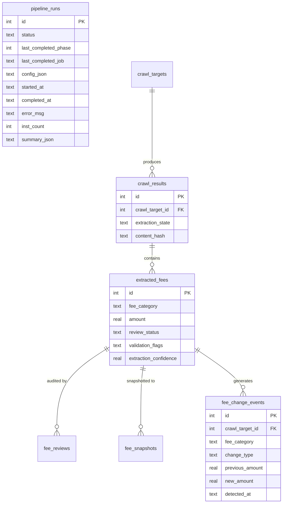

# Refactor: Atomic Pipeline Jobs

## Enhancement Summary

**Deepened on:** 2026-03-16
**Review agents used:** Architecture Strategist, Performance Oracle, Security Sentinel, Code Simplicity, Data Integrity Guardian, Data Migration Expert, Pattern Recognition, Kieran Python, Kieran TypeScript, Agent-Native Reviewer
**Learnings applied:** CU classification fix (data-hygiene-pipeline), FRED discontinued series, Docker/SQLite prerender

### Key Changes from Review

1. **Simplified orchestration**: Replaced DAG executor with simple ordered list + resume index (unanimous consensus from 5 agents that DAG is over-engineering for a linear pipeline)
2. **Fixed critical SQLite bug**: `UNIQUE(... DATE(detected_at))` is invalid as a table constraint -- use `CREATE UNIQUE INDEX` instead (no table rebuild needed)
3. **Fixed Python bugs**: Mutable default `skip=set()`, `**vars(args)` leaking argparse internals, `total_changes` vs `cursor.rowcount`
4. **Added merge-fees job**: Separated re-crawl comparison logic from LLM extraction into its own hygiene step
5. **Widened change event dedup key**: Include amounts to preserve legitimate intra-day corrections
6. **Preserved two confidence thresholds**: Stage (0.85) and approve (0.90) serve different purposes -- do not merge
7. **Added agent-native tools**: Pipeline jobs and data quality are invisible to AI agents -- add 3 tools
8. **Fixed readonly blocker**: CI stub path writes through read singleton -- must handle before setting `readonly: true`

### Critical Bugs Found in Original Plan

| Bug | Severity | Agent |
|-----|----------|-------|
| `UNIQUE(... DATE(detected_at))` invalid SQLite syntax | Critical | Migration Expert |
| Mutable default `skip=set()` in `run_dag()` | Critical | Kieran Python |
| `**vars(args)` passes argparse internal `func` attr | High | Kieran Python |
| CI stub path breaks `readonly: true` | Blocking | Kieran TypeScript |
| `total_changes` is cumulative, not per-statement | High | Architecture, Performance |
| extraction_state backfill misses failed/unchanged rows | High | Migration Expert |

---

## Overview

Restructure the data pipeline from a monolithic, tightly-coupled system into atomic, idempotent jobs organized across 4 phases: **Discovery**, **Extraction**, **Hygiene**, and **Publishing**. Each job succeeds or fails independently, tracks its own state, and can be resumed or re-run safely.

## Problem Statement

The current pipeline suffers from 10 structural issues:

1. **Monolithic crawl**: `_crawl_one()` is 357 lines handling download, extraction, categorization, validation, snapshot, and DB writes (`fee_crawler/commands/crawl.py:28-385`)
2. **Duplicated categorization**: runs in 3 places (crawl, categorize command, backfill validation)
3. **Inconsistent validation**: thresholds diverge across `validation.py` (0.90), `auto_review.py` (0.85), and `config.py` (0.85)
4. **Implicit state machine**: review status transitions scattered across 5+ files with no formal contract
5. **Incomplete orchestration**: `run-pipeline` skips enrich, validate, outlier-detect, and snapshot
6. **Brittle dispatch**: `refresh_data.py` uses a 50-line if/elif chain to route ingest commands
7. **Boilerplate**: 27 commands in `__main__.py` repeat identical config/db/try-finally patterns
8. **Worker overhead**: each worker thread runs full schema migration on connection init
9. **Missing idempotency**: `fee_change_events` has no unique constraint (duplicates on re-runs)
10. **Fragile IPC**: `##RESULT_JSON##` stdout parsing loses data on truncation

## Proposed Solution

### Architecture: 4-Phase Pipeline with 8 Jobs

> **Research Insight (Simplicity + Architecture + Patterns):** The original 12-job design was over-segmented. The pipeline is strictly linear with no fan-out/fan-in. SQLite's write lock serializes everything anyway. 8 jobs aligned to natural failure boundaries is the right granularity. The DAG executor is replaced with a simple ordered list -- topological sort of a linear list returns the same list.

```
Phase 1: Discovery          Phase 2: Extraction         Phase 3: Hygiene           Phase 4: Publishing
---------------------       ----------------------      ----------------------     ----------------------
seed + enrich               crawl (download+extract)    categorize                 snapshot
  |                           |                           |                          |
discover                    merge-fees                  validate + outlier-detect  publish-index
                                                          |
                                                        auto-review
```

> **Research Insight (Architecture Strategist):** The re-crawl comparison logic (matching new fees to existing by category, snapshotting old values, recording change events) must be separated from LLM extraction. `merge-fees` handles this -- LLM extraction produces raw fees; merge handles the comparison/reconciliation.

Each job:
- Operates on a **single institution** as the atomic unit
- Commits per-institution (crash at #47 preserves #1-46)
- Is **idempotent** (safe to re-run with identical results)
- Writes its outcome to `pipeline_runs` for tracking
- Can be triggered from CLI, admin UI, or cron independently

> **Research Insight (Simplicity):** Do NOT scope the 12 ingestion commands (ingest-fdic, ingest-ncua, etc.) or 7 utility commands into this pipeline. They are already well-separated and managed by `refresh-data`. The pipeline DAG governs only the core 8 fee-extraction jobs.

### Pipeline Run Model

```sql
CREATE TABLE IF NOT EXISTS pipeline_runs (
    id INTEGER PRIMARY KEY AUTOINCREMENT,
    status TEXT NOT NULL DEFAULT 'running',  -- running | completed | partial | failed | cancelled
    last_completed_phase INTEGER DEFAULT 0,
    last_completed_job TEXT,
    config_json TEXT,                        -- filters, limits, flags (used on resume)
    started_at TEXT NOT NULL DEFAULT (datetime('now')),
    completed_at TEXT,
    error_msg TEXT,
    inst_count INTEGER,
    summary_json TEXT                        -- per-job results, append-only
);
```

> **Research Insight (Architecture):** Added `partial` status for when some jobs succeed but others fail. `summary_json` is append-only (array of attempt records) so failed attempt data is preserved alongside successful retries. On `--resume`, the stored `config_json` is used, not the current config file -- prevents config drift between failure and resume.

> **Research Insight (Simplicity):** No `ops_jobs` FK needed. One row per run is sufficient. The admin UI can query pipeline_runs directly for "what happened last night?" without a join.

## Technical Approach

### Phase 1: Foundation (Quick Wins)

These changes ship independently, no pipeline refactor required.

#### 1A. Fix `fee_change_events` idempotency

> **Research Insight (Migration Expert - CRITICAL):** `UNIQUE(crawl_target_id, fee_category, DATE(detected_at))` is **invalid SQLite syntax** as a table constraint. SQLite UNIQUE constraints must reference column names directly, not expressions. Use a `CREATE UNIQUE INDEX` instead. This eliminates the need for a table rebuild entirely.

> **Research Insight (Data Integrity):** The dedup key `(target, category, date)` is too aggressive. If a fee changes twice in one day (e.g., correction), the second event is silently dropped. Widen the key to include amounts.

```sql
-- fee_crawler/db.py, in _create_indexes()
-- Step 1: Dedup existing duplicates (idempotent)
DELETE FROM fee_change_events WHERE id NOT IN (
    SELECT MIN(id) FROM fee_change_events
    GROUP BY crawl_target_id, fee_category, change_type,
             previous_amount, new_amount, DATE(detected_at)
);

-- Step 2: Create unique index (no table rebuild needed)
CREATE UNIQUE INDEX IF NOT EXISTS idx_fce_unique_target_cat_date
  ON fee_change_events(crawl_target_id, fee_category, change_type,
                       previous_amount, new_amount, DATE(detected_at));
```

> **Research Insight (Migration Expert):** Production has 32 rows, 22 are duplicates from target 7065. After dedup, 10 rows remain. The dedup + index should run in a single transaction to avoid inconsistent state.

**Files**: `fee_crawler/db.py:207` (index), `fee_crawler/commands/crawl.py:259`, `fee_crawler/commands/snapshot_fees.py:126`

#### 1B. Consolidate confidence thresholds

> **Research Insight (Architecture):** The 0.85 and 0.90 thresholds serve different purposes (staging vs auto-approval). Merging them into one would reduce data quality. Preserve both but source from config.

```python
# fee_crawler/config.py
class ExtractionConfig(BaseModel):
    confidence_stage_threshold: float = 0.85    # for initial staging during extraction
    confidence_approve_threshold: float = 0.90  # for auto-approval in review
```

Remove `AUTO_APPROVE_CONFIDENCE` from `validation.py:28`. Make `auto_review.py:172` reference `config.extraction.confidence_approve_threshold`. Make `validation.py` reference `config.extraction.confidence_stage_threshold`.

**Files**: `fee_crawler/config.py`, `fee_crawler/validation.py:28`, `fee_crawler/commands/auto_review.py:172`

#### 1C. Define the review status state machine

> **Research Insight (Kieran Python):** Use `StrEnum` for type safety while remaining wire-compatible with SQLite strings. A typo like `'stagged'` compiles and runs silently with bare strings. Add a `context` parameter to resolve the conflict between `MANUAL_PROTECTED` and legitimate re-crawl transitions.

```python
# fee_crawler/review_status.py (new, ~60 lines)
from enum import StrEnum

class ReviewStatus(StrEnum):
    PENDING = "pending"
    STAGED = "staged"
    FLAGGED = "flagged"
    APPROVED = "approved"
    REJECTED = "rejected"

class TransitionContext(StrEnum):
    EXTRACTION = "extraction"       # initial classification
    REVIEW = "review"               # auto-review or manual
    RECRAWL = "recrawl"             # price change detected
    OUTLIER = "outlier"             # statistical outlier
    DECIMAL_ERROR = "decimal_error" # always overrides

VALID_TRANSITIONS: dict[ReviewStatus, set[ReviewStatus]] = {
    ReviewStatus.PENDING:  {ReviewStatus.STAGED, ReviewStatus.FLAGGED,
                            ReviewStatus.APPROVED, ReviewStatus.REJECTED},
    ReviewStatus.STAGED:   {ReviewStatus.APPROVED, ReviewStatus.REJECTED,
                            ReviewStatus.FLAGGED},
    ReviewStatus.FLAGGED:  {ReviewStatus.APPROVED, ReviewStatus.REJECTED,
                            ReviewStatus.STAGED},
    ReviewStatus.APPROVED: {ReviewStatus.STAGED},
    ReviewStatus.REJECTED: {ReviewStatus.PENDING},
}

def can_transition(
    current: ReviewStatus,
    target: ReviewStatus,
    actor: str = "system",
    context: TransitionContext = TransitionContext.REVIEW,
) -> bool:
    """Check if a status transition is valid."""
    if target not in VALID_TRANSITIONS.get(current, set()):
        return False
    # Manual approvals protected from automated demotion
    # EXCEPT: re-crawl price changes and decimal errors
    if current == ReviewStatus.APPROVED and actor == "system":
        return context in (TransitionContext.RECRAWL, TransitionContext.DECIMAL_ERROR)
    return True

def transition_fee_status(db, fee_id: int, current: str, target: str,
                          actor: str, context: str, notes: str = "") -> bool:
    """Transition status and write audit trail. Returns success."""
    if not can_transition(ReviewStatus(current), ReviewStatus(target), actor,
                          TransitionContext(context)):
        return False
    db.execute("UPDATE extracted_fees SET review_status = ? WHERE id = ?",
               (target, fee_id))
    db.execute("""INSERT INTO fee_reviews
        (extracted_fee_id, action, previous_status, new_status, username, notes, created_at)
        VALUES (?, 'status_change', ?, ?, ?, ?, datetime('now'))""",
        (fee_id, current, target, actor, notes))
    return True
```

> **Research Insight (Patterns):** This centralizes the Shotgun Surgery anti-pattern -- currently review_status is mutated across 5 files with no audit guarantee. The `transition_fee_status` function handles both the UPDATE and the audit INSERT atomically.

**Files**: new `fee_crawler/review_status.py`, then update `validation.py`, `auto_review.py`, `outlier_detection.py`, `crawl.py`, `backfill_validation.py`

#### 1D. Lightweight worker DB connections

> **Research Insight (Performance):** Use `threading.local()` for persistent worker connections. Currently each `_crawl_one()` creates and destroys a Database connection per institution. For 4 workers processing 500 institutions, that is 500 connections instead of 4.

```python
# fee_crawler/db.py
import threading

_thread_local = threading.local()

class Database:
    def __init__(self, config, *, init_tables: bool = True):
        self.conn = sqlite3.connect(str(config.db_path), timeout=30)
        self.conn.row_factory = sqlite3.Row
        self._set_pragmas()
        if init_tables:
            self._init_tables()
            self._run_migrations()
            self._create_indexes()

    def __enter__(self):
        return self

    def __exit__(self, *exc):
        self.close()

    def transaction(self):
        """Context manager for BEGIN IMMEDIATE / COMMIT / ROLLBACK."""
        return _TransactionCtx(self.conn)

def get_worker_db(config) -> Database:
    """Thread-local connection for worker threads. No migration overhead."""
    if not hasattr(_thread_local, 'db'):
        _thread_local.db = Database(config, init_tables=False)
    return _thread_local.db
```

> **Research Insight (Patterns):** The manual `BEGIN IMMEDIATE / try / commit / except / ROLLBACK` pattern appears in 3+ files. A `Database.transaction()` context manager eliminates this duplication.

**Files**: `fee_crawler/db.py:426`, `fee_crawler/commands/crawl.py:47`, `fee_crawler/commands/discover_urls.py:94`

#### 1E. Replace `##RESULT_JSON##` with file-based IPC

> **Research Insight (Kieran Python):** Use `pathlib`, add directory creation, clean up temp file on failure, use `os.replace` (not `os.rename`) for cross-platform atomicity.

```python
# fee_crawler/job_result.py (new, ~20 lines)
from pathlib import Path
import json

RESULT_DIR = Path("data/logs")

def write_result(job_id: int, result: dict) -> Path:
    RESULT_DIR.mkdir(parents=True, exist_ok=True)
    target = RESULT_DIR / f"{job_id}_result.json"
    tmp = target.with_suffix(".json.tmp")
    try:
        tmp.write_text(json.dumps(result, indent=2))
        tmp.replace(target)  # atomic on POSIX, works on Windows too
    except BaseException:
        tmp.unlink(missing_ok=True)
        raise
    return target
```

> **Research Insight (Kieran TypeScript):** Use `path.join(LOGS_DIR, ...)` not template literals. Wrap `JSON.parse` in try/catch. Type the result interface.

```typescript
// src/lib/job-runner.ts - on process exit
import path from 'path';

interface JobResult {
  fees_extracted?: number;
  targets_processed?: number;
  errors?: string[];
}

const resultPath = path.join(LOGS_DIR, `${Number(jobId)}_result.json`);
let result: JobResult | null = null;
try {
  if (existsSync(resultPath)) {
    result = JSON.parse(readFileSync(resultPath, 'utf-8')) as JobResult;
  }
} catch {
  result = null;
}
// Fall back to ##RESULT_JSON## parsing for backward compat
```

**Files**: new `fee_crawler/job_result.py`, `src/lib/job-runner.ts:82-108`

#### 1F. Fix `readonly: true` on Node.js read DB

> **Research Insight (Kieran TypeScript - BLOCKING):** The CI stub path at `connection.ts:56` calls `_singleton.exec(STUB_TABLES)` which is a write operation. Setting `readonly: true` will break CI builds. Also, `PRAGMA journal_mode = WAL` is a write operation that may throw on a fresh readonly DB.

```typescript
// src/lib/crawler-db/connection.ts
export function getDb(): BetterSqlite3.Database {
  if (!_singleton) {
    const dbExists = existsSync(DB_PATH);
    if (!dbExists) {
      // CI/build: create writable connection for stubs, then reopen readonly
      const setupDb = new BetterSqlite3(DB_PATH);
      setupDb.exec(STUB_TABLES);
      setupDb.pragma('journal_mode = WAL');
      setupDb.close();
    }
    _singleton = new BetterSqlite3(DB_PATH, { readonly: true, fileMustExist: true });
    _singleton.pragma('cache_size = -32000');
    _singleton.pragma('mmap_size = 268435456');
    _singleton.pragma('temp_store = memory');
    _singleton.pragma('optimize');  // refresh query planner stats at startup
  }
  return _singleton;
}
```

> **Research Insight (Kieran TypeScript):** Update `STUB_TABLES` to include new columns: `extraction_state` on crawl_results, `pipeline_run_id` on ops_jobs, `processing_since` on crawl_targets. Update `OpsJob` TypeScript interface.

**Files**: `src/lib/crawler-db/connection.ts:45`

### Phase 2: Decompose `_crawl_one()` into Extraction + Merge

> **Research Insight (Architecture):** Store extracted text on disk at `data/documents/{target_id}/{hash}.txt`, not in a `raw_text` column on `crawl_results`. At scale (thousands of institutions, 5-50KB each), text in the DB bloats it and slows analytical queries the frontend runs.

Break the 357-line monolith into the crawl phase (download + extract + LLM) and a separate merge phase.

#### 2A. Crawl job (download + extract-text + llm-extract combined)

> **Research Insight (Simplicity):** Splitting download, extract-text, and llm-extract into 3 separate jobs creates state-tracking overhead for marginal benefit. They always run together for a given institution and share failure context. Keep as one job with clear internal stages.

The crawl job handles: download, content-hash skip, text extraction, LLM extraction. It does NOT categorize, validate, or compare against existing fees. Output: raw `extracted_fees` rows with `review_status='pending'` and `fee_category=NULL`.

#### 2B. Merge-fees job (new)

> **Research Insight (Architecture - must address):** This is the single most important structural improvement. The re-crawl comparison logic (lines 170-336 of `crawl.py`) mixes new-vs-existing fee matching, snapshot generation, and change event recording. Extracting it separates concerns cleanly.

Responsibilities:
- Compare newly extracted fees against existing by `(crawl_target_id, fee_category)`
- Snapshot old values before overwriting
- Record `fee_change_events` with idempotent `INSERT OR IGNORE`
- Transition approved fees to staged on price change via `transition_fee_status()`
- Handle "removed" fees (present in snapshot, absent in current extraction)

> **Research Insight (Data Integrity):** Snapshots should distinguish rejection from true removal. A rejected fee means "bank still charges but data unreliable." A removal means "fee no longer exists." Carry forward last known good value on rejection.

### Phase 3: Hygiene Pipeline (3 Jobs)

> **Research Insight (Simplicity):** Combine validate + outlier-detect into a single step since outlier detection is just another form of validation. This reduces from 4 hygiene jobs to 3.

#### 3A. Job: `categorize`
- Query: `SELECT * FROM extracted_fees WHERE fee_category IS NULL`
- Apply `normalize_fee_name()` from `fee_analysis.py`
- Single source of categorization (remove inline categorization from crawl)

#### 3B. Job: `validate` (includes outlier detection)
- Query: fees with `fee_category IS NOT NULL AND validation_flags IS NULL`
- Apply `validate_and_classify_fees()` with `config.extraction.confidence_stage_threshold`
- Apply IQR-based outlier detection
- Set `review_status` via `transition_fee_status()`
- Protect manually-approved fees via `can_transition()` check

#### 3C. Job: `auto-review`
- Query: `SELECT * FROM extracted_fees WHERE review_status = 'staged'`
- Apply `FEE_AMOUNT_RULES` bounds checking
- Use `config.extraction.confidence_approve_threshold` (0.90, not 0.85)
- Write `fee_reviews` audit trail via `transition_fee_status()`

### Phase 4: Publishing (2 Jobs)

#### 4A. Job: `snapshot`
- Compare current fees against previous snapshot
- Insert/upsert `fee_snapshots`
- Insert `fee_change_events` with idempotent unique index

#### 4B. Job: `publish-index`
- Compute coverage snapshot metrics
- Revalidate Next.js cache
- Run `PRAGMA optimize` and `PRAGMA wal_checkpoint(TRUNCATE)`

> **Research Insight (Performance):** Use `TRUNCATE` checkpoint at pipeline end, not `PASSIVE`. After the pipeline completes, no concurrent Python writers exist. `TRUNCATE` resets the WAL to zero bytes, recovering disk space and ensuring clean state for the next run.

### Phase 5: Orchestration

#### 5A. Simple ordered pipeline with resume

> **Research Insight (Simplicity + Architecture + Patterns -- unanimous):** A DAG executor with topological sort is over-engineering for a strictly linear pipeline. A `for` loop with a `start_from` index gives resume. The DAG becomes valuable only when stages can run in parallel, which SQLite prevents.

```python
# fee_crawler/pipeline/executor.py
from dataclasses import dataclass

@dataclass
class Stage:
    name: str
    phase: int
    timeout_s: int = 300

PIPELINE_STAGES = [
    Stage("seed-enrich",    phase=1),
    Stage("discover",       phase=1),
    Stage("crawl",          phase=2),
    Stage("merge-fees",     phase=2),
    Stage("categorize",     phase=3),
    Stage("validate",       phase=3),
    Stage("auto-review",    phase=3),
    Stage("snapshot",       phase=4),
    Stage("publish-index",  phase=4),
]

def run_pipeline(
    db: Database,
    config: Config,
    *,
    from_phase: int = 1,
    resume_run_id: int | None = None,
    skip: frozenset[str] = frozenset(),
) -> int:
    """Execute pipeline stages sequentially. Returns run_id."""
    if resume_run_id:
        run = load_pipeline_run(db, resume_run_id)
        config = Config.model_validate_json(run['config_json'])
        start_idx = next(
            i for i, s in enumerate(PIPELINE_STAGES)
            if s.name == run['last_completed_job']
        ) + 1
    else:
        run_id = create_pipeline_run(db, config)
        start_idx = next(
            (i for i, s in enumerate(PIPELINE_STAGES) if s.phase >= from_phase),
            0
        )

    for stage in PIPELINE_STAGES[start_idx:]:
        if stage.name in skip:
            continue
        try:
            execute_stage(stage.name, db, config)
            update_pipeline_run(db, run_id, last_completed_job=stage.name,
                                last_completed_phase=stage.phase)
        except Exception as e:
            update_pipeline_run(db, run_id, status='failed', error_msg=str(e))
            raise

    update_pipeline_run(db, run_id, status='completed')
    return run_id
```

#### 5B. CLI flags

```
run-pipeline
  --from-phase N        Start from phase N (1-4)
  --skip NAME           Skip specific stage(s), repeatable
  --resume RUN_ID       Resume a previous pipeline run (uses stored config)
  --dry-run             Log what would run without executing
```

#### 5C. Reduce `__main__.py` boilerplate

> **Research Insight (Architecture + Patterns):** Use a decorator to handle config/db/try-finally boilerplate while preserving explicit argument mapping. The full command registry with `**vars(args)` passthrough is fragile -- it passes argparse internal attrs like `func` to `run()`. A decorator keeps each command self-documenting.

```python
# fee_crawler/__main__.py
def with_db(func):
    """Decorator that provides config and db to a command function."""
    def wrapper(args):
        config = load_config()
        with Database(config) as db:
            func(args, db, config)
    return wrapper

@with_db
def cmd_seed(args, db, config):
    from fee_crawler.commands.seed_institutions import run
    run(db, config, source=args.source, limit=args.limit, charter=args.charter)
```

This eliminates the 6-line try/finally per command while keeping explicit argument mapping.

## Database Optimizations

### New indexes (covering + partial)

> **Research Insight (Performance):** Fixed Index 3 -- the original had `crawl_target_id` as leading column but the review queue queries filter by `review_status` first with no `crawl_target_id`. Added 3 missing indexes for dashboard queries. Dropped Index 5 (`financials_date_target`) -- the existing `idx_financials_target_date` already serves the primary access pattern.

```sql
-- 1. Covering index for national fee index (median by category)
-- Fixed: partial filter matches actual query (review_status != 'rejected')
CREATE INDEX IF NOT EXISTS idx_fees_category_amount_active
  ON extracted_fees(fee_category, amount, crawl_target_id)
  WHERE review_status != 'rejected' AND fee_category IS NOT NULL AND amount IS NOT NULL;

-- 2. Covering index for institution detail page
-- Subsumes existing idx_fees_target_id, idx_fees_target_status (drop those)
CREATE INDEX IF NOT EXISTS idx_fees_target_status_cat_amt
  ON extracted_fees(crawl_target_id, review_status, fee_category, amount);

-- 3. Review queue index (FIXED: review_status first, not crawl_target_id)
CREATE INDEX IF NOT EXISTS idx_fees_review_queue
  ON extracted_fees(review_status, created_at)
  WHERE review_status IN ('pending', 'staged', 'flagged');

-- 4. Active institutions with fee data (added fed_district)
CREATE INDEX IF NOT EXISTS idx_targets_with_fees
  ON crawl_targets(charter_type, asset_size_tier, fed_district, state_code)
  WHERE fee_schedule_url IS NOT NULL;

-- 5. MISSING: Fee change events (dashboard queries)
CREATE INDEX IF NOT EXISTS idx_fce_date_category
  ON fee_change_events(detected_at DESC, fee_category);

-- 6. MISSING: Recent crawl activity
CREATE INDEX IF NOT EXISTS idx_crawl_results_date
  ON crawl_results(crawled_at DESC, crawl_target_id);

-- 7. MISSING: Recent reviews
CREATE INDEX IF NOT EXISTS idx_reviews_date
  ON fee_reviews(created_at DESC);

-- 8. MISSING: Correlated subquery in getRecentCrawlActivity()
CREATE INDEX IF NOT EXISTS idx_fees_crawl_result
  ON extracted_fees(crawl_result_id);
```

> **Research Insight (Performance):** Drop redundant narrow indexes (`idx_fees_review_status`, `idx_fees_target_id`, `idx_fees_target_status`) once the wider indexes are in place. This reduces write overhead.

### Post-ingestion maintenance

```python
def post_ingestion_maintenance(db):
    """Run after any bulk write operation."""
    db.execute("PRAGMA optimize")
    db.execute("PRAGMA wal_checkpoint(TRUNCATE)")
```

> **Research Insight (Performance):** Run `PRAGMA optimize` after auto-review (when review_status distribution has changed) AND at pipeline end. On the Node.js side, call `db.pragma('optimize')` once when the singleton is created.

### Concurrency Protection

> **Research Insight (Simplicity):** At ~8,750 institutions on a single Fly.io instance, full concurrency locking is over-engineering. Use a PID file or advisory lock to prevent two pipeline runs, not per-institution `processing_since` columns. If you scale beyond one machine, revisit.

```python
# fee_crawler/pipeline/lock.py
from pathlib import Path
import os

LOCK_FILE = Path("data/pipeline.lock")

def acquire_pipeline_lock() -> bool:
    """Returns True if lock acquired. False if another pipeline is running."""
    if LOCK_FILE.exists():
        try:
            pid = int(LOCK_FILE.read_text().strip())
            os.kill(pid, 0)  # check if process exists
            return False      # still running
        except (ProcessLookupError, ValueError):
            pass              # stale lock
    LOCK_FILE.write_text(str(os.getpid()))
    return True

def release_pipeline_lock():
    LOCK_FILE.unlink(missing_ok=True)
```

## Migration Plan

> **Research Insight (Migration Expert):** Correct order of operations, with verification SQL.

### Migration sequence (in `_run_migrations`)

```python
# 1. New table (in _init_tables, before migrations)
_CREATE_PIPELINE_RUNS = """CREATE TABLE IF NOT EXISTS pipeline_runs (...)"""

# 2. New columns (in _run_migrations, try/except for existing)
_MIGRATE_V4 = [
    "ALTER TABLE crawl_results ADD COLUMN extraction_state TEXT DEFAULT 'pending'",
    "ALTER TABLE crawl_targets ADD COLUMN processing_since TEXT",
]

# 3. Backfill extraction_state (idempotent, runs on every startup)
_BACKFILL_EXTRACTION_STATE = """
    UPDATE crawl_results SET extraction_state = 'llm_extracted'
    WHERE status = 'success' AND extraction_state = 'pending'
    AND crawled_at < '2026-03-17T00:00:00'
"""
_BACKFILL_EXTRACTION_STATE_FAILED = """
    UPDATE crawl_results SET extraction_state = 'not_applicable'
    WHERE status IN ('failed', 'unchanged') AND extraction_state = 'pending'
"""

# 4. Dedup + unique index (in _create_indexes, wrapped in transaction)
_DEDUP_CHANGE_EVENTS = """
    DELETE FROM fee_change_events WHERE id NOT IN (
        SELECT MIN(id) FROM fee_change_events
        GROUP BY crawl_target_id, fee_category, change_type,
                 previous_amount, new_amount, DATE(detected_at)
    )
"""
_CREATE_UNIQUE_FCE_INDEX = """
    CREATE UNIQUE INDEX IF NOT EXISTS idx_fce_unique
    ON fee_change_events(crawl_target_id, fee_category, change_type,
                         previous_amount, new_amount, DATE(detected_at))
"""
```

### Post-deploy verification SQL

```sql
-- Confirm no duplicates in fee_change_events
SELECT crawl_target_id, fee_category, DATE(detected_at), COUNT(*)
FROM fee_change_events GROUP BY 1, 2, 3 HAVING COUNT(*) > 1;
-- Expected: 0 rows

-- Confirm extraction_state backfill
SELECT extraction_state, status, COUNT(*) FROM crawl_results GROUP BY 1, 2;
-- Expected: success -> llm_extracted, failed/unchanged -> not_applicable

-- Confirm pipeline_runs table exists
SELECT COUNT(*) FROM pipeline_runs;
```

### TypeScript sync checklist

- [ ] Update `STUB_TABLES` in `connection.ts` with new columns
- [ ] Add `pipeline_runs` table to stubs
- [ ] Update `OpsJob` interface (add `pipeline_run_id: number | null`)
- [ ] Add `pipeline_runs` to `_VALID_TABLES` in `db.py`

## Existing Bugs to Fix (found during review)

> **Research Insight (Security Sentinel):** Two pre-existing issues found during security review.

1. **`runDiscover` skips parameter validation** (`src/app/admin/pipeline/actions.ts:89`): The `state` parameter is passed to `spawnJob` without the `^[A-Z]{2}$` regex check that `validateJobRequest` uses.

2. **`searchInstitutions` LIKE wildcard leak** (`src/app/submit-fees/actions.ts:148`): Query escapes SQL injection via `?` parameter but does not escape LIKE wildcards (`%`, `_`). A `%` query matches all institutions.

3. **`_VALID_TABLES` staleness** (`fee_crawler/db.py:540-547`): Missing 5 tables (`branch_deposits`, `market_concentration`, `demographics`, `census_tracts`, `leads`).

4. **Schema drift** (`connection.ts` vs `db.py`): `crawl_runs` has column `trigger_type` in TypeScript stubs but `trigger` in Python schema.

5. **Pragma divergence**: `busy_timeout` is 30000 in Python, 5000 in TypeScript. Align to 5000 for the read singleton (reads are fast) and keep 30000 for Python writes.

## Agent-Native Gaps

> **Research Insight (Agent-Native Reviewer):** 12 of 30+ capabilities are agent-accessible (all read-only). 0 of 12+ write/operational actions have agent equivalents. 0 of 8+ operational observation capabilities are agent-accessible.

### Add 3 agent tools (Phase C or D)

1. **`queryJobStatus`** -- Wrap `getOpsJobSummary`, `getRecentJobs(n)`, `getOpsJob(id)`. Answers "did the last crawl succeed?" Currently invisible to agents.

2. **`queryDataQuality`** -- Wrap `getCoverageFunnel`, `getTopUncategorized`, `getStaleInstitutions`, `getDataQualityReport`. The `data-quality-audit` skill references this data but agents cannot fetch it.

3. **`triggerPipelineJob`** -- Wrap existing `spawnJob` with `validateJobRequest` safety. Gate to admin role. Enables operational agents.

### Inject operational context into system prompts

Append to `buildAnalystPrompt`: last crawl date, pending review count, job queue depth, data freshness. Lightweight addition to existing pattern.

**Files**: `src/lib/research/tools-internal.ts`, `src/lib/research/agents.ts`

## ERD: Pipeline State Model



## Acceptance Criteria

### Functional Requirements

- [ ] Each of the 8 pipeline jobs can be run independently via CLI
- [ ] Each job is idempotent: running it twice with same data produces same DB state
- [ ] `run-pipeline` executes all stages sequentially with error capture
- [ ] `run-pipeline --resume <id>` picks up from the last completed stage
- [ ] `run-pipeline --from-phase 3` starts from hygiene phase
- [ ] Pipeline run state persists in `pipeline_runs` table
- [ ] Admin UI `/admin/ops` can trigger any individual job
- [ ] `fee_change_events` has no duplicates on re-run
- [ ] Review status transitions enforced by `transition_fee_status()`
- [ ] Confidence thresholds sourced from config (two distinct values)
- [ ] Worker threads do not run migrations (use `get_worker_db()`)
- [ ] Snapshot distinguishes rejection from true removal

### Non-Functional Requirements

- [ ] Pipeline crash at any point leaves DB in consistent state
- [ ] DB `PRAGMA optimize` runs after auto-review and at pipeline end
- [ ] WAL checkpoint (TRUNCATE) at pipeline end keeps WAL file bounded
- [ ] PID-file lock prevents concurrent pipeline runs

### Quality Gates

- [ ] All existing tests pass (`npx vitest run` + `python -m pytest fee_crawler/tests/`)
- [ ] New tests for: state machine transitions, pipeline executor, job idempotency
- [ ] No regression in admin UI job triggering
- [ ] `crawl.py` `_crawl_one()` reduced to crawl-only (no categorize/validate/snapshot)

## Implementation Phases

### Phase A: Quick Wins (no pipeline refactor needed)

| Task | File(s) | Effort |
|------|---------|--------|
| ~~Fix `fee_change_events` dedup + unique index~~ | `db.py`, `crawl.py:259`, `snapshot_fees.py:126` | Done |
| ~~Consolidate confidence thresholds (keep both)~~ | `config.py`, `validation.py:28`, `auto_review.py:172` | Done |
| ~~Create `review_status.py` with StrEnum + transition fn~~ | New file + 5 updates | Done |
| ~~Add `Database.__enter__/__exit__` + `transaction()` ctx mgr~~ | `db.py` | Done |
| ~~Add `get_worker_db()` with `threading.local()`~~ | `db.py`, `crawl.py:47`, `discover_urls.py:94` | Done |
| ~~Replace `##RESULT_JSON##` with file IPC~~ | New `job_result.py` + `job-runner.ts` | Done |
| ~~Fix `readonly: true` with CI stub handling~~ | `connection.ts:45` | Done |
| ~~Add covering/partial indexes (8 new, drop 3 old)~~ | `db.py` | Done |
| ~~Add `PRAGMA optimize` + TRUNCATE checkpoint~~ | `db.py`, `connection.ts` | Done |
| ~~Fix existing bugs (LIKE wildcard, runDiscover, _VALID_TABLES, schema drift)~~ | 4 files | Done |

### Phase B: Extraction + Merge Decomposition

| Task | File(s) | Effort |
|------|---------|--------|
| Add `extraction_state` column + backfill | `db.py` migration | Small |
| Simplify `_crawl_one()` to crawl-only (no categorize/validate) | `crawl.py` | Medium |
| Extract `merge-fees` job from crawl re-crawl logic | New `fee_crawler/jobs/merge_fees.py` | Medium |
| Update STUB_TABLES in connection.ts | `connection.ts` | Small |

### Phase C: Hygiene + Publishing + Agent Tools

| Task | File(s) | Effort |
|------|---------|--------|
| Make `categorize` operate on uncategorized only | `categorize_fees.py` | Small |
| Merge validate + outlier-detect into single job | `backfill_validation.py` + `outlier_detection.py` | Medium |
| Make `auto-review` use `transition_fee_status()` | `auto_review.py` | Medium |
| Create `publish-index` job | New `fee_crawler/jobs/publish_index.py` | Small |
| Add `queryJobStatus` agent tool | `tools-internal.ts` | Small |
| Add `queryDataQuality` agent tool | `tools-internal.ts` | Small |

### Phase D: Orchestration

| Task | File(s) | Effort |
|------|---------|--------|
| Create `pipeline_runs` table | `db.py` | Small |
| Build ordered pipeline executor with resume | New `fee_crawler/pipeline/executor.py` | Medium |
| Rewrite `run-pipeline` with executor | `run_pipeline.py` | Medium |
| Add `--from-phase`, `--resume`, `--skip` flags | `__main__.py` | Small |
| Add `with_db` decorator to reduce boilerplate | `__main__.py` | Medium |
| Add PID-file pipeline lock | New `fee_crawler/pipeline/lock.py` | Small |
| Update GitHub Actions workflows | `.github/workflows/*.yml` | Small |
| Add `triggerPipelineJob` agent tool | `tools-internal.ts` | Small |

## Risk Analysis

| Risk | Likelihood | Impact | Mitigation |
|------|-----------|--------|------------|
| Regression in fee extraction quality | Medium | High | Keep `_crawl_one()` as fallback behind `--legacy` flag during Phase B |
| Migration breaks older DBs | Low | High | Idempotent backfills with date guards; `ALTER TABLE ... ADD COLUMN` with try/except |
| LLM non-determinism creates phantom changes | Medium | Medium | Content-hash gating prevents re-extraction of unchanged docs |
| Admin UI breaks with new job structure | Low | Medium | Phase A changes are backward-compatible; UI changes come last |
| Snapshot records rejection as removal | Medium | Medium | `merge-fees` distinguishes rejection from true removal; carries forward last known good value |

## Dependencies

- No new Python packages required
- No new Node.js packages required
- SQLite 3.24+ for UPSERT syntax (already satisfied: 3.43.2)
- SQLite 3.35+ for DROP COLUMN rollback (verify on production)

## References

### Internal
- `fee_crawler/commands/crawl.py:28-385` - The monolith to decompose
- `fee_crawler/commands/run_pipeline.py` - Current orchestrator
- `fee_crawler/db.py:207-217` - `fee_change_events` schema
- `fee_crawler/validation.py:28` - `AUTO_APPROVE_CONFIDENCE` constant
- `fee_crawler/__main__.py:17-387` - Boilerplate command wrappers
- `src/lib/job-runner.ts:82-108` - `##RESULT_JSON##` parsing
- `src/lib/crawler-db/connection.ts:45` - Node.js read singleton
- `src/lib/research/tools-internal.ts` - Agent tool definitions

### External
- [SQLite WAL Mode](https://sqlite.org/wal.html)
- [SQLite UPSERT](https://sqlite.org/lang_upsert.html)
- [SQLite Partial Indexes](https://sqlite.org/partialindex.html)
- [SQLite Performance (PowerSync)](https://www.powersync.com/blog/sqlite-optimizations-for-ultra-high-performance)
- [Idempotent Pipelines](https://www.startdataengineering.com/post/why-how-idempotent-data-pipeline/)
- [Write-Audit-Publish Pattern](https://dagster.io/blog/python-write-audit-publish)

### Learnings Applied
- [CU Classification Fix](docs/solutions/data-quality/data-hygiene-pipeline-cu-classification-research-studio-20260315.md) - Double-division bug in NCUA asset units; enrich must sync from `institution_financials` as authoritative source
- [FRED Discontinued Series](docs/solutions/integration-issues/fred-discontinued-series-DataPipeline-20260315.md) - External API series can be discontinued; check `observation_end` date before adding
- [Docker/SQLite Prerender](docs/solutions/build-errors/docker-sqlite-prerender-FlyDeploy-20260315.md) - Next.js 16 with `cacheComponents:true` requires real DB during build; schema changes must be compatible with build-time DB
